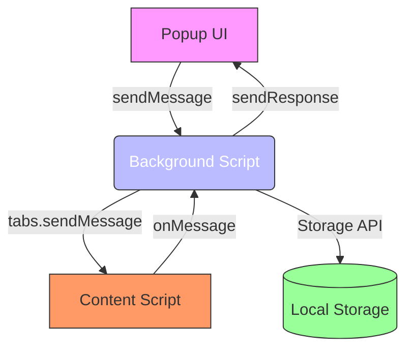
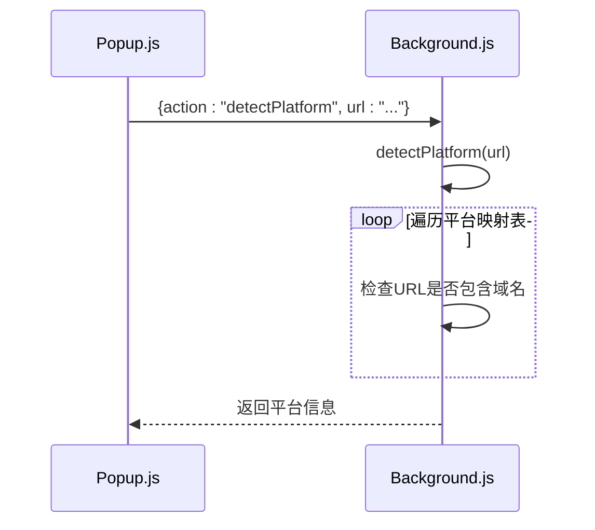
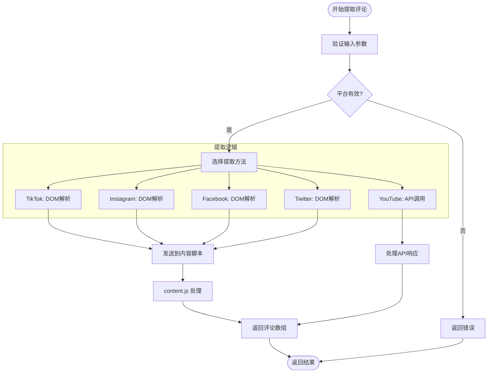
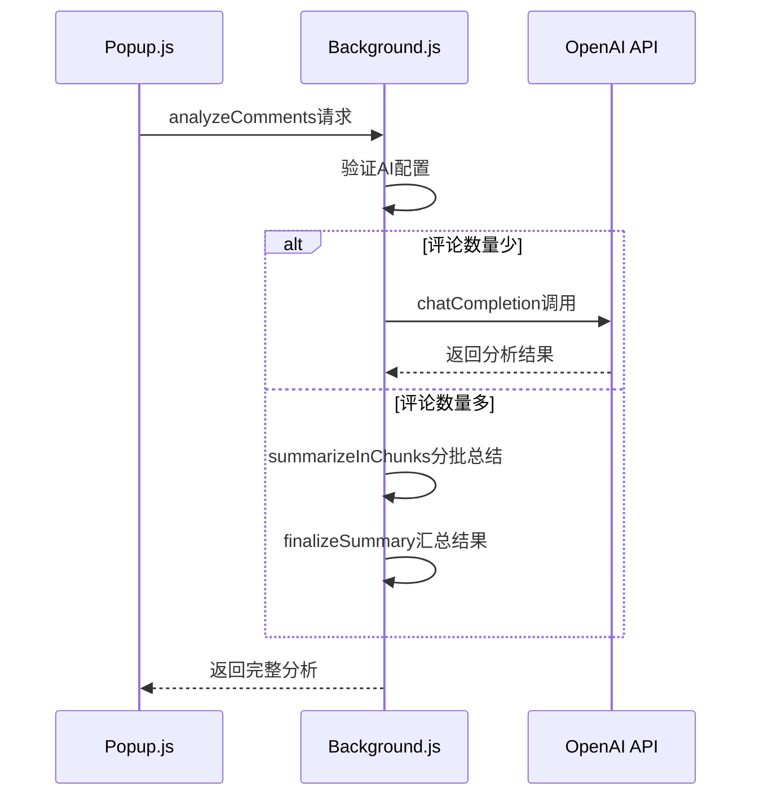
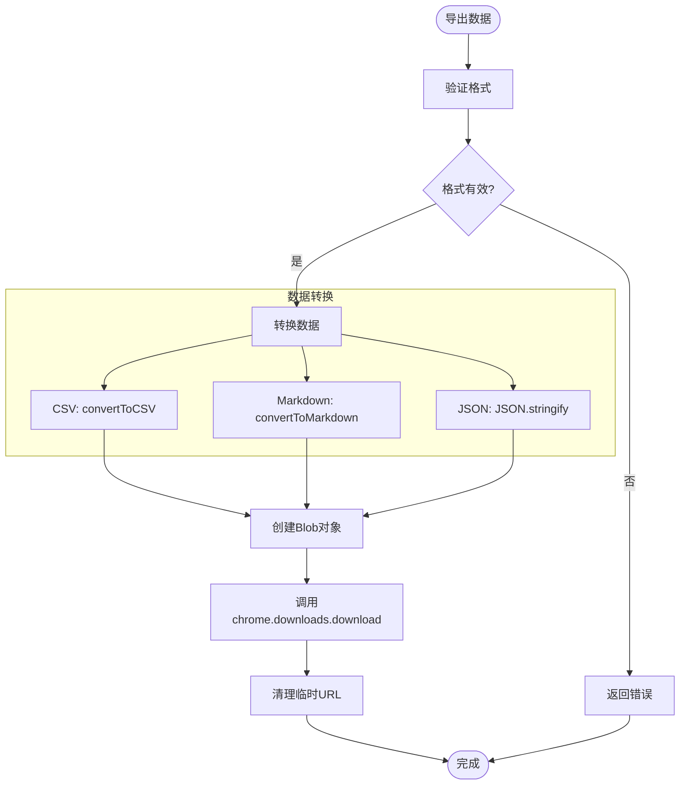

# API参考

<cite>
**本文档引用的文件**
- [background.js](file://background.js)
- [content.js](file://content.js)
- [popup.js](file://popup.js)
</cite>

## 目录
1. [消息通信协议概述](#消息通信协议概述)
2. [核心消息类型](#核心消息类型)
3. [错误处理与状态码](#错误处理与状态码)
4. [跨上下文通信机制](#跨上下文通信机制)
5. [前端调用示例](#前端调用示例)

## 消息通信协议概述

CommentInsight扩展采用基于Chrome扩展API的消息传递系统，实现后台脚本、内容脚本和弹出窗口之间的内部通信。该系统通过`chrome.runtime.onMessage.addListener`监听器接收消息，并使用`switch-case`结构根据`message.action`字段路由到相应的处理函数。

整个通信架构包含三个主要组件：
- **后台脚本 (background.js)**：作为中央消息处理器，协调所有异步操作
- **内容脚本 (content.js)**：在目标网页上下文中运行，负责DOM解析和数据提取
- **弹出窗口 (popup.js)**：用户界面层，发起请求并展示结果

**关键安全特性**包括：
- 所有消息都经过类型验证和参数检查
- 敏感操作（如AI分析）需要有效的API密钥
- 使用Promise封装确保异步响应的可靠性
- 输入数据进行转义处理防止XSS攻击



**Diagram sources**
- [background.js](file://background.js#L13-L15)
- [content.js](file://content.js#L35-L37)
- [popup.js](file://popup.js#L497-L503)

**Section sources**
- [background.js](file://background.js#L1-L686)
- [content.js](file://content.js#L1-L559)
- [popup.js](file://popup.js#L1-L545)

## 核心消息类型

### detectPlatform 消息

用于检测当前页面所属的社交媒体平台。

**HTTP类方法模拟**: `POST /api/detect-platform`

**请求参数**

| 参数名 | 类型 | 必需 | 描述 |
|-------|------|------|------|
| action | string | 是 | 固定值 "detectPlatform" |
| url | string | 是 | 要检测的页面URL |

**请求示例**
```json
{
  "action": "detectPlatform",
  "url": "https://www.youtube.com/watch?v=dQw4w9WgXcQ"
}
```

**响应格式**

成功响应：
```json
{
  "success": true,
  "platform": {
    "name": "youtube",
    "domain": "youtube.com",
    "supported": true
  }
}
```

失败响应：
```json
{
  "success": false,
  "error": "未知的操作类型"
}
```

**处理流程**


**Diagram sources**
- [background.js](file://background.js#L139-L166)
- [popup.js](file://popup.js#L113-L129)

**Section sources**
- [background.js](file://background.js#L139-L166)
- [popup.js](file://popup.js#L113-L129)

### extractComments 消息

从指定平台提取评论数据。

**HTTP类方法模拟**: `POST /api/extract-comments`

**请求参数**

| 参数名 | 类型 | 必需 | 描述 |
|-------|------|------|------|
| action | string | 是 | 固定值 "extractComments" |
| platform | string | 是 | 平台名称 (youtube/tiktok/instagram/facebook/twitter) |
| url | string | 是 | 目标页面URL |
| config | object | 是 | 配置对象，包含各平台API密钥等 |
| tabId | number | 是 | Chrome标签页ID |

**请求示例**
```json
{
  "action": "extractComments",
  "platform": "youtube",
  "url": "https://www.youtube.com/watch?v=dQw4w9WgXcQ",
  "config": {
    "platforms": {
      "youtube": {
        "apiKey": "your_api_key_here"
      }
    }
  },
  "tabId": 123
}
```

**响应格式**

成功响应：
```json
{
  "success": true,
  "comments": [
    {
      "id": "string",
      "author": "string",
      "text": "string",
      "timestamp": "ISO8601",
      "likes": "number",
      "replies": "number"
    }
  ]
}
```

失败响应：
```json
{
  "success": false,
  "error": "YouTube API密钥未配置"
}
```

**处理流程**


**Diagram sources**
- [background.js](file://background.js#L168-L190)
- [popup.js](file://popup.js#L198-L237)

**Section sources**
- [background.js](file://background.js#L168-L190)
- [popup.js](file://popup.js#L198-L237)

### analyzeComments 消息

使用AI模型分析评论数据。

**HTTP类方法模拟**: `POST /api/analyze-comments`

**请求参数**

| 参数名 | 类型 | 必需 | 描述 |
|-------|------|------|------|
| action | string | 是 | 固定值 "analyzeComments" |
| comments | array | 是 | 评论对象数组 |
| config | object | 是 | AI配置，包含endpoint、apiKey等 |

**请求示例**
```json
{
  "action": "analyzeComments",
  "comments": [
    {
      "author": "用户1",
      "text": "这个视频很棒！"
    }
  ],
  "config": {
    "ai": {
      "apiKey": "your_openai_key",
      "model": "gpt-3.5-turbo"
    }
  }
}
```

**响应格式**

成功响应：
```json
{
  "success": true,
  "analysis": {
    "rawAnalysis": "完整的分析文本",
    "timestamp": "ISO8601",
    "commentCount": 100,
    "model": "gpt-3.5-turbo",
    "summary": {
      "insights": [],
      "sentiment": {},
      "topics": [],
      "trends": []
    }
  }
}
```

失败响应：
```json
{
  "success": false,
  "error": "AI API密钥未配置"
}
```

**处理流程**


**Diagram sources**
- [background.js](file://background.js#L354-L402)
- [popup.js](file://popup.js#L239-L275)

**Section sources**
- [background.js](file://background.js#L354-L402)
- [popup.js](file://popup.js#L239-L275)

### exportData 消息

导出数据为不同格式。

**HTTP类方法模拟**: `POST /api/export-data`

**请求参数**

| 参数名 | 类型 | 必需 | 描述 |
|-------|------|------|------|
| action | string | 是 | 固定值 "exportData" |
| data | object | 是 | 要导出的数据对象 |
| format | string | 是 | 导出格式 (csv/markdown/json) |
| filename | string | 是 | 文件名 |

**请求示例**
```json
{
  "action": "exportData",
  "data": {
    "comments": [...],
    "analysis": {...}
  },
  "format": "csv",
  "filename": "comments_2023.csv"
}
```

**响应格式**

成功响应：
```json
{
  "success": true
}
```

失败响应：
```json
{
  "success": false,
  "error": "不支持的导出格式"
}
```

**处理流程**


**Diagram sources**
- [background.js](file://background.js#L577-L616)
- [popup.js](file://popup.js#L425-L480)

**Section sources**
- [background.js](file://background.js#L577-L616)
- [popup.js](file://popup.js#L425-L480)

## 错误处理与状态码

系统采用统一的错误响应格式，所有错误都会返回带有`success: false`的响应对象。

### 常见错误码

| 错误码 | 含义 | 处理建议 |
|-------|------|---------|
| AUTH_001 | 认证失败 | 检查相关平台的API密钥配置 |
| RATE_001 | 请求频率过高 | 降低请求频率或等待一段时间后重试 |
| PLATFORM_001 | 不支持的平台 | 确认URL是否指向支持的社交媒体平台 |
| CONFIG_001 | 配置缺失 | 在设置页面完成必要的配置 |
| NETWORK_001 | 网络连接失败 | 检查网络连接状态 |

### 错误处理策略

1. **前端预验证**：在发送请求前验证必要参数
2. **后端异常捕获**：使用try-catch包裹所有异步操作
3. **详细错误日志**：记录错误堆栈便于调试
4. **用户友好提示**：将技术性错误转换为可理解的提示

```javascript
// 示例错误处理模式
async handleMessage(message, sender, sendResponse) {
    try {
        // 业务逻辑
    } catch (error) {
        console.error('处理消息时出错:', error);
        sendResponse({ 
            success: false, 
            error: error.message 
        });
    }
}
```

**Section sources**
- [background.js](file://background.js#L73-L129)

## 跨上下文通信机制

### 异步响应机制

所有消息处理器都返回`true`以保持消息通道开放，支持异步响应：

```javascript
chrome.runtime.onMessage.addListener((message, sender, sendResponse) => {
    this.handleMessage(message, sender, sendResponse);
    return true; // 保持通道开放
});
```

这种设计允许在异步操作完成后调用`sendResponse`，确保复杂操作（如网络请求）能够正确返回结果。

### 上下文隔离

不同执行环境之间的通信遵循严格的安全边界：

- **背景页** ↔ **弹出窗口**：直接通信，用于UI交互
- **背景页** ↔ **内容脚本**：通过`chrome.tabs.sendMessage`间接通信
- **弹出窗口** ↔ **内容脚本**：必须通过背景页中转

### 安全措施

1. **输入验证**：检查所有传入参数的有效性
2. **作用域限制**：内容脚本只能访问其注入的页面
3. **权限最小化**：仅请求必要的Chrome API权限
4. **数据转义**：对输出内容进行HTML转义防止XSS

**Section sources**
- [background.js](file://background.js#L13-L15)
- [content.js](file://content.js#L35-L37)

## 前端调用示例

### 基础调用模式

```javascript
// 发送消息并等待响应
async function sendMessage(message) {
    return new Promise((resolve) => {
        chrome.runtime.sendMessage(message, (response) => {
            resolve(response || { success: false, error: 'No response' });
        });
    });
}

// 使用示例
const response = await sendMessage({
    action: 'detectPlatform',
    url: currentTab.url
});

if (response.success) {
    console.log('检测到平台:', response.platform);
} else {
    console.error('检测失败:', response.error);
}
```

### 完整工作流示例

```javascript
// 1. 检测平台
const detectResponse = await sendMessage({
    action: 'detectPlatform',
    url: tab.url
});

if (!detectResponse.success) throw new Error(detectResponse.error);

// 2. 提取评论
const extractResponse = await sendMessage({
    action: 'extractComments',
    platform: detectResponse.platform.name,
    url: tab.url,
    config: appConfig,
    tabId: tab.id
});

if (!extractResponse.success) throw new Error(extractResponse.error);

// 3. 分析评论
const analyzeResponse = await sendMessage({
    action: 'analyzeComments',
    comments: extractResponse.comments,
    config: appConfig
});

if (!analyzeResponse.success) throw new Error(analyzeResponse.error);

// 4. 导出结果
await sendMessage({
    action: 'exportData',
    data: {
        comments: extractResponse.comments,
        analysis: analyzeResponse.analysis
    },
    format: 'markdown',
    filename: 'analysis_report.md'
});
```

**Section sources**
- [popup.js](file://popup.js#L497-L503)