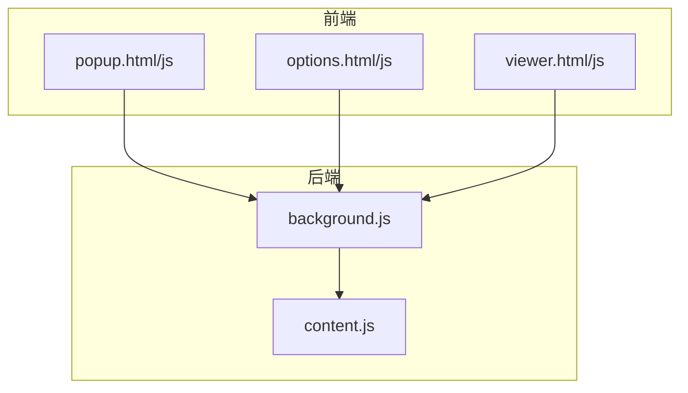
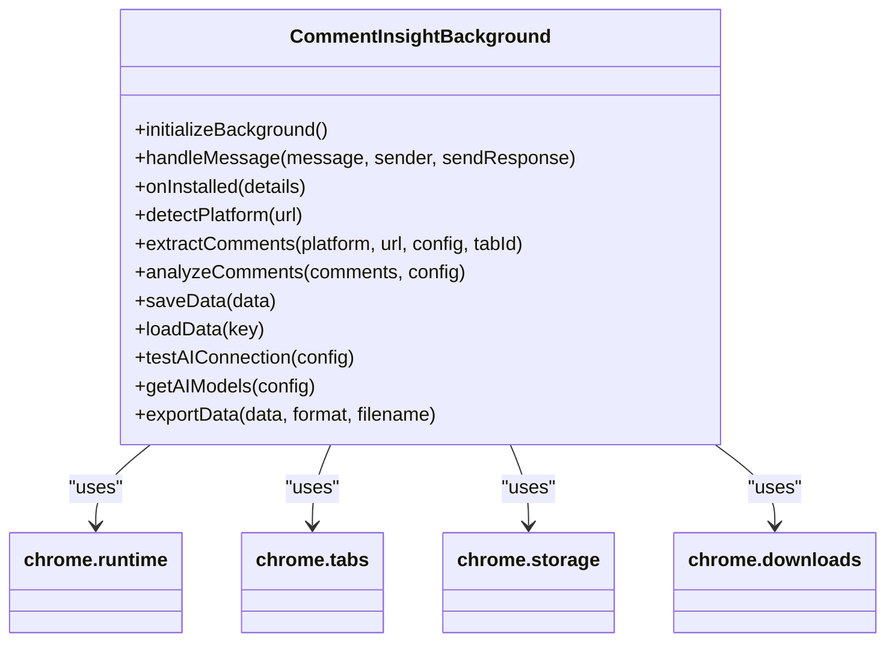
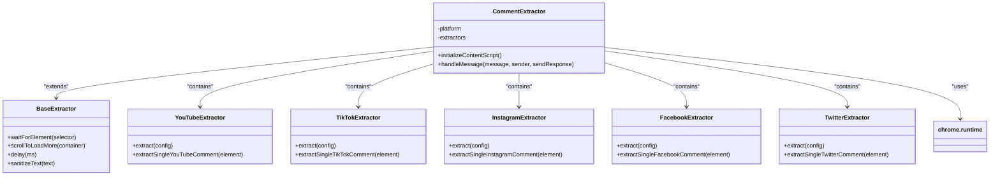
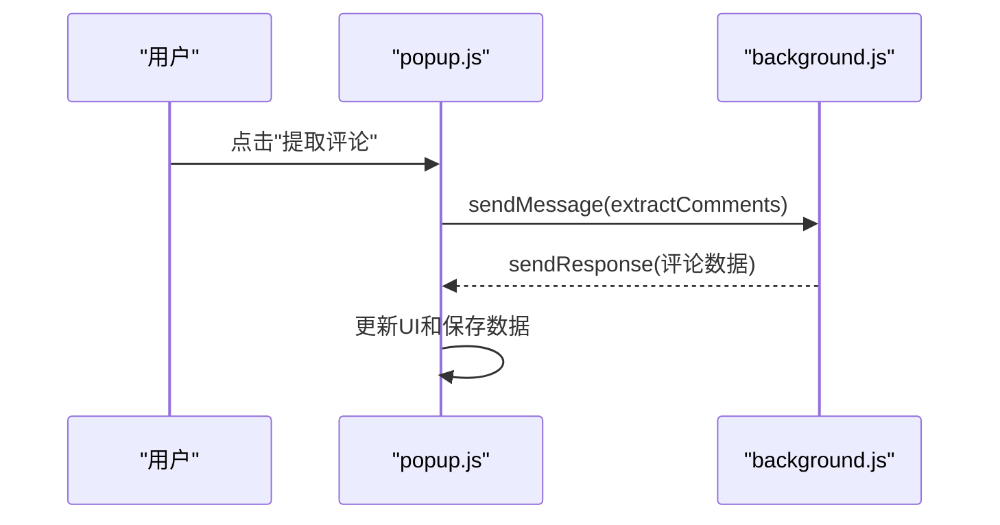

<docs>
# API参考

<cite>
**本文档中引用的文件**
- [background.js](file://background.js)
- [content.js](file://content.js)
- [popup.js](file://popup.js)
- [options.js](file://options.js)
- [viewer.js](file://viewer.js)
- [manifest.json](file://manifest.json)
</cite>

## 目录
1. [简介](#简介)
2. [项目结构](#项目结构)
3. [核心组件](#核心组件)
4. [架构概述](#架构概述)
5. [详细组件分析](#详细组件分析)
6. [依赖分析](#依赖分析)
7. [性能考虑](#性能考虑)
8. [故障排除指南](#故障排除指南)
9. [结论](#结论)

## 简介
“评论洞察”是一款功能强大的Chrome浏览器扩展，能够从主流社交媒体平台提取评论并通过AI进行深度分析，生成结构化的洞察报告。该扩展支持YouTube、TikTok、Instagram、Facebook和Twitter/X等平台的评论提取，并使用OpenAI兼容的API进行智能分析。用户可以导出多种格式的数据（CSV、Markdown、JSON），并管理分析历史记录。本API参考文档旨在全面介绍其目的、实现细节、接口定义及集成模式。

## 项目结构
该项目采用模块化设计，包含多个JavaScript文件分别处理不同功能。主要文件包括`background.js`作为后台服务工作脚本，`content.js`在目标网页上下文中运行以解析DOM，`popup.js`控制弹出窗口界面，`options.js`驱动配置页面，以及`viewer.js`负责渲染查看器页面。此外还有HTML文件用于UI展示，如`popup.html`、`options.html`和`viewer.html`。这种清晰的分层结构使得代码易于维护和扩展。

**Diagram sources**
- [popup.js](file://popup.js#L1-L546)
- [options.js](file://options.js#L1-L569)
- [viewer.js](file://viewer.js#L1-L800)
- [background.js](file://background.js#L1-L686)
- [content.js](file://content.js#L1-L559)

**Section sources**
- [popup.js](file://popup.js#L1-L546)
- [options.js](file://options.js#L1-L569)
- [viewer.js](file://viewer.js#L1-L800)
- [background.js](file://background.js#L1-L686)
- [content.js](file://content.js#L1-L559)

## 核心组件
核心组件主要包括`CommentInsightBackground`类，它作为单例模式运行，负责初始化、消息路由、业务逻辑执行、数据持久化等功能。`CommentExtractor`类则是在目标网页上下文中运行的探针，通过解析页面DOM结构来提取评论。`CommentInsightPopup`类为用户提供简洁的操作面板，而`CommentInsightOptions`类允许用户进行深度配置。最后，`CommentInsightViewer`类提供了一个功能丰富的数据查看器，支持多视图切换和历史记录管理。

**Section sources**
- [background.js](file://background.js#L1-L686)
- [content.js](file://content.js#L1-L559)
- [popup.js](file://popup.js#L1-L546)
- [options.js](file://options.js#L1-L569)
- [viewer.js](file://viewer.js#L1-L800)

## 架构概述
系统架构由五个主要部分组成：后台服务、内容脚本、弹出窗口、配置页面和查看器页面。后台服务`background.js`是整个扩展的大脑，负责协调所有操作；内容脚本`content.js`直接与社交媒体平台交互，提取所需数据；弹出窗口`popup.js`提供用户友好的界面；配置页面`options.js`允许用户自定义设置；查看器页面`viewer.js`则用于展示分析结果。这些组件通过Chrome的消息传递机制相互通信，确保了系统的灵活性和可扩展性。

**Diagram sources**
- [background.js](file://background.js#L1-L686)

**Section sources**
- [background.js](file://background.js#L1-L686)

## 详细组件分析

### 后台服务分析
`background.js`中的`CommentInsightBackground`类实现了扩展的核心功能。它监听安装事件、标签页更新和来自其他组件的消息，根据接收到的动作类型调用相应的处理函数。例如，当收到`extractComments`消息时，会根据指定平台调用对应的提取方法；对于`analyzeComments`请求，则使用AI服务对评论进行分析。

#### 类图

**Diagram sources**
- [background.js](file://background.js#L1-L686)

**Section sources**
- [background.js](file://background.js#L1-L686)

### 内容脚本分析
`content.js`中的`CommentExtractor`类负责在各个社交媒体平台上提取评论。它首先检测当前平台，然后初始化内容脚本并监听来自后台脚本的消息。根据不同平台的特点，使用特定的选择器和提取逻辑获取评论信息。

#### 类图

**Diagram sources**
- [content.js](file://content.js#L1-L559)

**Section sources**
- [content.js](file://content.js#L1-L559)

### 弹出窗口分析
`popup.js`中的`CommentInsightPopup`类控制着扩展的弹出窗口，为用户提供一个简洁的操作面板。它显示当前检测到的平台、已提取的评论数量和最后分析时间，并通过按钮触发各种操作。

#### 序列图

**Diagram sources**
- [popup.js](file://popup.js#L1-L546)

**Section sources**
- [popup.js](file://popup.js#L1-L546)

### 配置页面分析
`options.js`中的`CommentInsightOptions`类驱动配置页面，允许用户输入AI服务和社交媒体平台的API密钥，测试连接状态，并刷新可用模型列表。

**Section sources**
- [options.js](file://options.js#L1-L569)

### 查看器页面分析
`viewer.js`中的`CommentInsightViewer`类负责渲染查看器页面，支持在“评论”、“分析”和“历史”三个视图间切换，提供搜索、排序和分页功能。

**Section sources**
- [viewer.js](file://viewer.js#L1-L800)

## 依赖分析
各组件之间通过Chrome