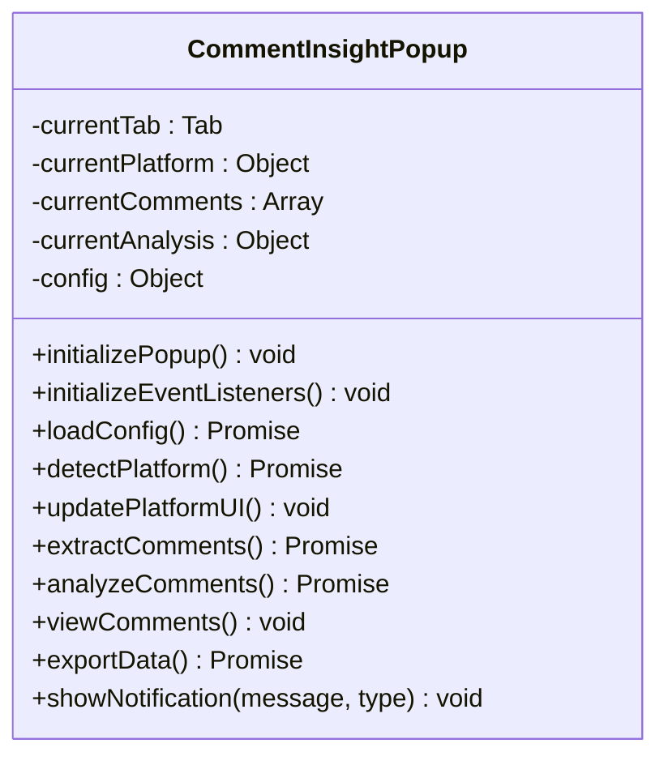

<docs>
# UI组件架构

<cite>
**本文档中引用的文件**
- [popup.html](file://popup.html) - *在最近的提交中更新*
- [popup.js](file://popup.js) - *在最近的提交中更新，包含平台检测和历史记录逻辑*
- [options.html](file://options.html) - *在最近的提交中更新*
- [options.js](file://options.js) - *在最近的提交中更新，包含配置管理和验证*
- [viewer.html](file://viewer.html) - *在最近的提交中更新*
- [viewer.js](file://viewer.js) - *在最近的提交中更新，修复了导出数据完整性问题*
</cite>

## 更新摘要
**已做更改**
- 根据代码变更更新了弹出窗口、配置页面和查看器页面的文档
- 修正了历史记录去重逻辑和导出数据完整性的关键问题
- 增强了源码追踪系统，为所有相关部分添加了详细的文件来源信息
- 更新了类图以反映最新的代码结构

## 目录
1. [弹出窗口（Popup）](#弹出窗口popup)
2. [配置页面（Options）](#配置页面options)
3. [查看器页面（Viewer）](#查看器页面viewer)

## 弹出窗口（Popup）

弹出窗口是CommentInsight扩展的主要交互入口，为用户提供评论提取、AI分析和数据导出等核心功能。该界面采用Tailwind CSS进行样式设计，具有清晰的视觉层次和直观的操作流程。

### 界面结构与平台检测

弹出窗口包含三个主要区域：头部信息区、操作按钮区和状态信息区。头部显示应用名称和设置入口，操作按钮区提供主要功能入口，状态区则展示当前任务的执行情况。

平台检测功能在初始化时自动执行，通过向后台脚本发送`detectPlatform`消息来识别当前标签页所属的社交媒体平台。检测结果会实时更新UI，包括平台图标、名称和页面标题，并根据平台支持情况调整"提取评论"按钮的状态。

**