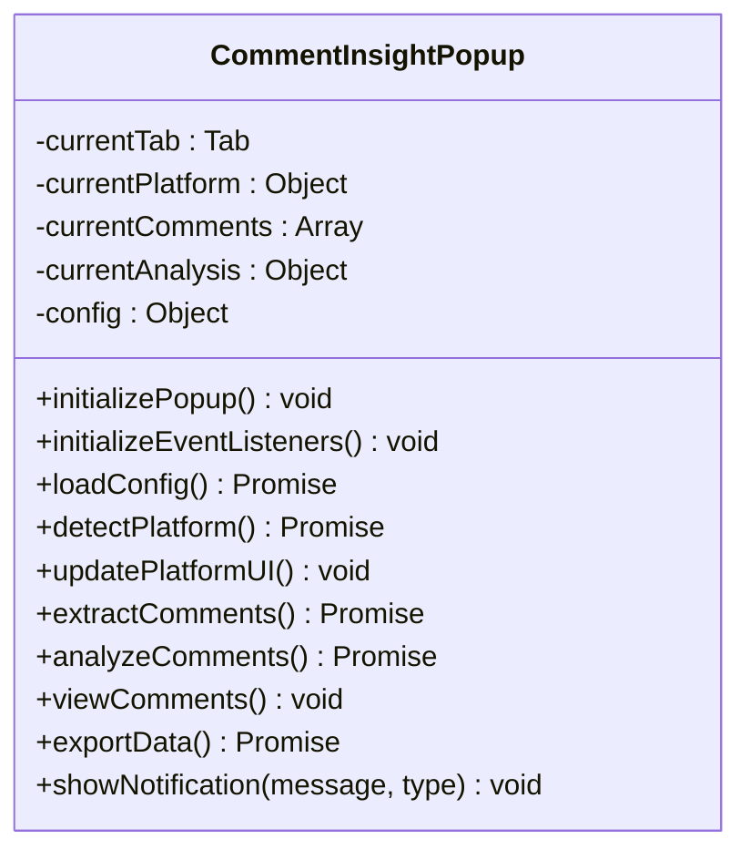
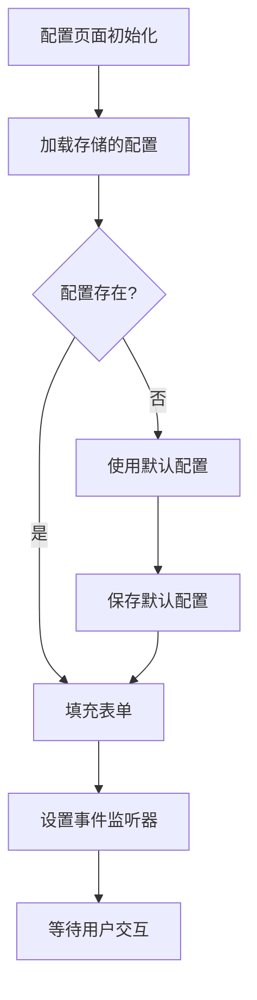
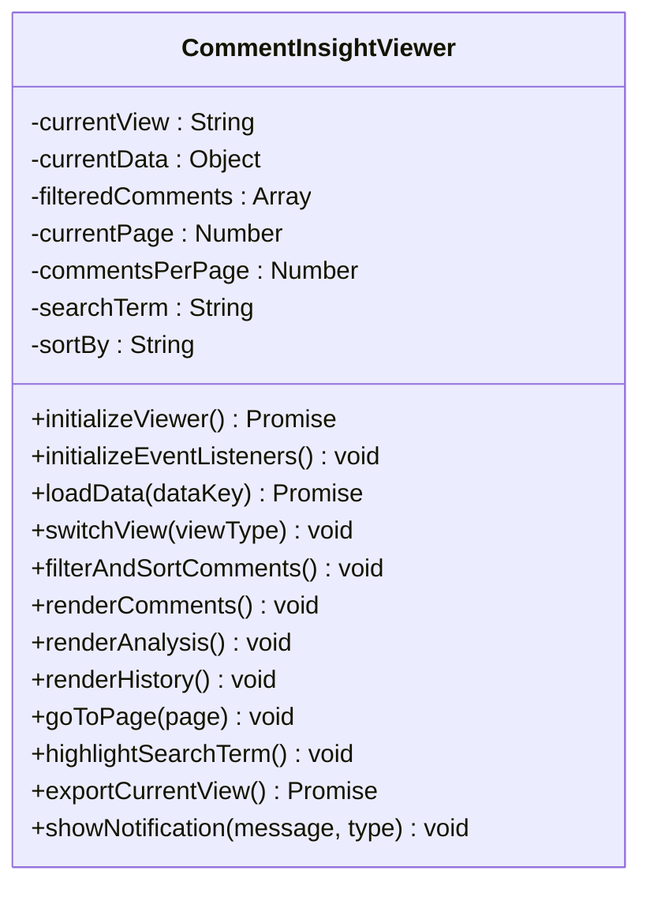

# UI组件架构

<cite>
**Referenced Files in This Document **   
- [popup.html](file://popup.html)
- [popup.js](file://popup.js)
- [options.html](file://options.html)
- [options.js](file://options.js)
- [viewer.html](file://viewer.html)
- [viewer.js](file://viewer.js)
</cite>

## 目录
1. [弹出窗口（Popup）](#弹出窗口popup)
2. [配置页面（Options）](#配置页面options)
3. [查看器页面（Viewer）](#查看器页面viewer)

## 弹出窗口（Popup）

弹出窗口是CommentInsight扩展的主要交互入口，为用户提供评论提取、AI分析和数据导出等核心功能。该界面采用Tailwind CSS进行样式设计，具有清晰的视觉层次和直观的操作流程。

### 界面结构与平台检测

弹出窗口包含三个主要区域：头部信息区、操作按钮区和状态信息区。头部显示应用名称和设置入口，操作按钮区提供主要功能入口，状态区则展示当前任务的执行情况。

平台检测功能在初始化时自动执行，通过向后台脚本发送`detectPlatform`消息来识别当前标签页所属的社交媒体平台。检测结果会实时更新UI，包括平台图标、名称和页面标题，并根据平台支持情况调整"提取评论"按钮的状态。

**Diagram sources **
- [popup.js](file://popup.js#L1-L540)

**Section sources**
- [popup.html](file://popup.html#L1-L117)
- [popup.js](file://popup.js#L1-L540)

### 按钮事件绑定与功能实现

弹出窗口实现了完整的事件监听系统，将用户操作与相应功能关联：

- **提取评论**：触发`extractComments()`方法，验证平台支持性和API密钥配置后，向后台发送`extractComments`消息
- **AI分析**：调用`analyzeComments()`方法，检查是否存在评论数据和AI API密钥，然后发送`analyzeComments`消息
- **查看/导出**：通过`openViewerPage()`方法打开查看器页面，传递视图类型和数据键
- **设置**：使用`chrome.runtime.openOptionsPage()`打开配置页面

所有异步操作都实现了加载状态管理，通过`setLoadingState()`方法切换按钮的文本和禁用状态，提升用户体验。

### 状态更新与通知系统

弹出窗口维护了多个状态变量，包括当前标签页、平台信息、评论数据和分析结果。这些状态通过`updateUI()`方法同步到界面元素：

- 评论数量动态显示在状态区
- 最后分析时间根据分析结果的时间戳格式化显示
- 功能按钮的启用状态根据数据可用性自动调整

通知系统通过`showNotification()`方法实现，支持四种类型（成功、警告、错误、信息），采用滑入滑出动画效果，在3秒后自动隐藏，确保不干扰用户操作。

## 配置页面（Options）

配置页面提供了对CommentInsight各项参数的集中管理，分为AI配置、平台配置和导出设置三个主要部分，支持配置的导入导出和实时保存。

### UI布局与表单验证

配置页面采用卡片式布局，每个配置类别独立成块，便于用户快速定位所需设置。表单元素包括输入框、下拉选择、复选框和滑块，针对不同类型的配置提供合适的输入方式。

**Diagram sources **
- [options.js](file://options.js#L1-L569)

**Section sources**
- [options.html](file://options.html#L1-L269)
- [options.js](file://options.js#L1-L569)

表单验证在多个层面实施：
- **前端验证**：通过`validateConfig()`方法检查数值范围（如温度值0-2，最大令牌数100-100000）
- **实时验证**：关键字段变更时立即验证并提示错误
- **提交验证**：保存配置前进行完整验证

### 测试连接功能

AI配置部分提供了测试连接功能，允许用户验证API密钥的有效性。点击"测试AI连接"按钮后，系统会使用当前填写的端点和密钥发起测试请求，结果显示在按钮下方，包含连接状态和返回的模型信息。

刷新模型列表功能通过`refreshAIModels()`方法实现，向后台发送`getAIModels`消息获取可用模型列表，动态更新下拉菜单选项，确保用户能选择最新的AI模型。

### 配置导入导出机制

配置页面支持完整的配置导入导出功能，便于用户在不同设备间迁移设置或备份配置：

- **导出**：点击"导出配置"按钮生成JSON文件，包含所有配置但可选择性排除敏感信息（如API密钥）
- **导入**：通过隐藏的文件输入控件选择JSON文件，解析后验证结构完整性，合并到现有配置中

配置还支持自动保存功能，通过`setupAutoSave()`方法为所有输入元素添加变更监听器，在用户修改后1秒延迟保存，避免频繁写入存储。

## 查看器页面（Viewer）

查看器页面用于展示大量评论数据，提供搜索、排序、分页等功能，并管理分析历史记录，是数据可视化的核心组件。

### 数据展示与交互功能

查看器页面采用标签页设计，支持三种视图模式：评论、分析和历史记录。每种视图都有专门的数据渲染逻辑：

- **评论视图**：以卡片形式展示每条评论，包含作者头像、内容、时间戳和互动数据
- **分析视图**：渲染Markdown格式的AI分析报告，支持基本的标题、列表和强调格式
- **历史视图**：显示过往分析记录的摘要卡片，包含平台、标题、时间和统计信息

**Diagram sources **
- [viewer.js](file://viewer.js#L1-L808)

**Section sources**
- [viewer.html](file://viewer.html#L1-L202)
- [viewer.js](file://viewer.js#L1-L808)

### 搜索、排序与分页

评论视图提供了完整的数据筛选功能：
- **搜索**：实时过滤评论内容和作者名称，匹配项在结果中高亮显示
- **排序**：支持按时间（新旧）、点赞数等多种方式排序
- **分页**：可选择每页显示10、25、50或100条评论，提供标准的分页控件

这些功能通过`filterAndSortComments()`方法统一处理，先根据搜索词过滤，再按指定规则排序，最后计算分页范围并渲染结果。

### 历史记录管理逻辑

历史记录功能通过`analysis_history`键在浏览器存储中维护一个有序列表，最新记录排在最前面，最多保留100条。查看器页面从存储加载历史数据后，提供以下管理功能：

- **过滤**：按平台类型和关键词搜索筛选历史记录
- **操作**：支持查看特定历史记录或将其删除
- **清空**：提供确认对话框防止误操作，一次性清除所有历史记录

历史记录卡片包含足够的元数据帮助用户识别，包括平台图标、视频标题、评论数量和分析时间，点击"查看"按钮可重新打开对应的评论或分析页面。