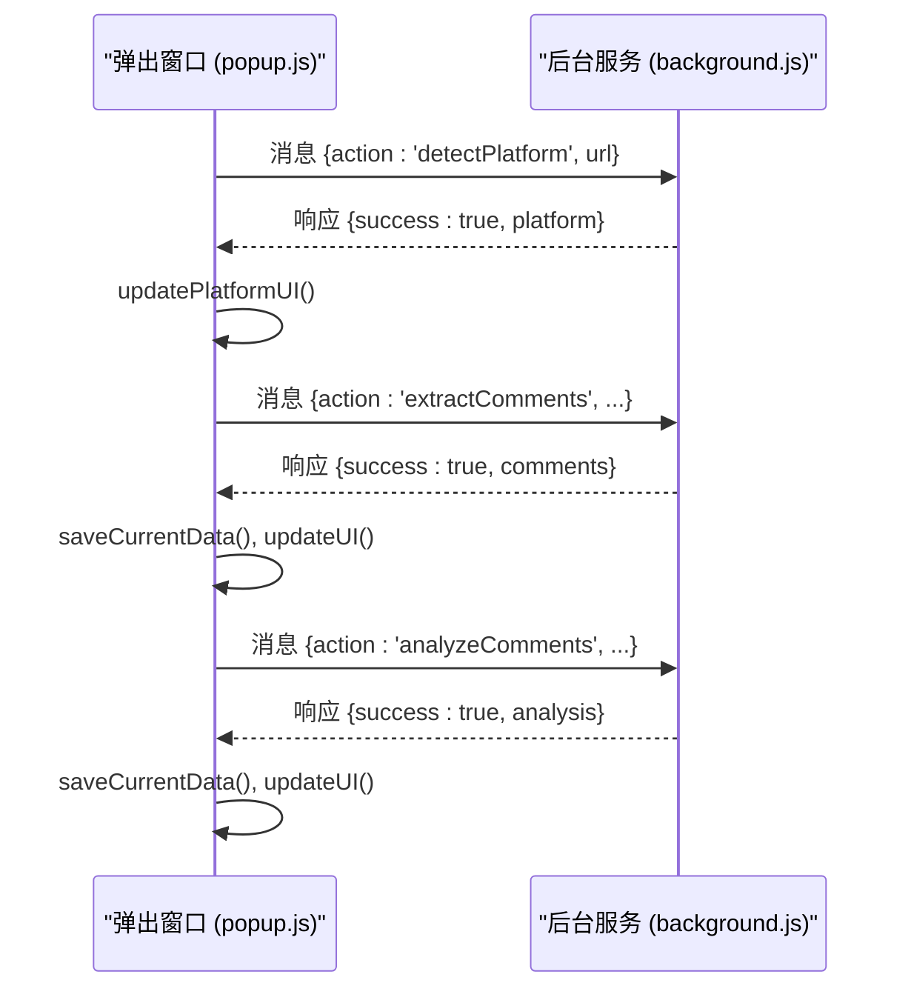
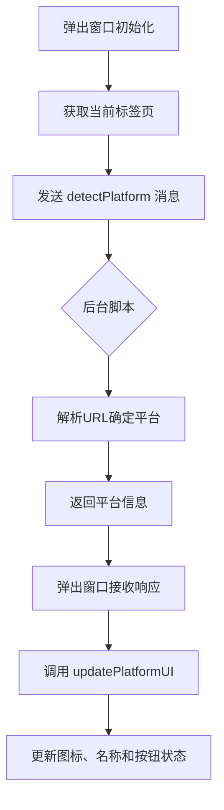
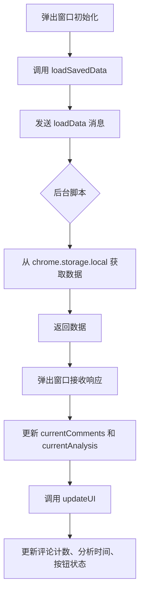
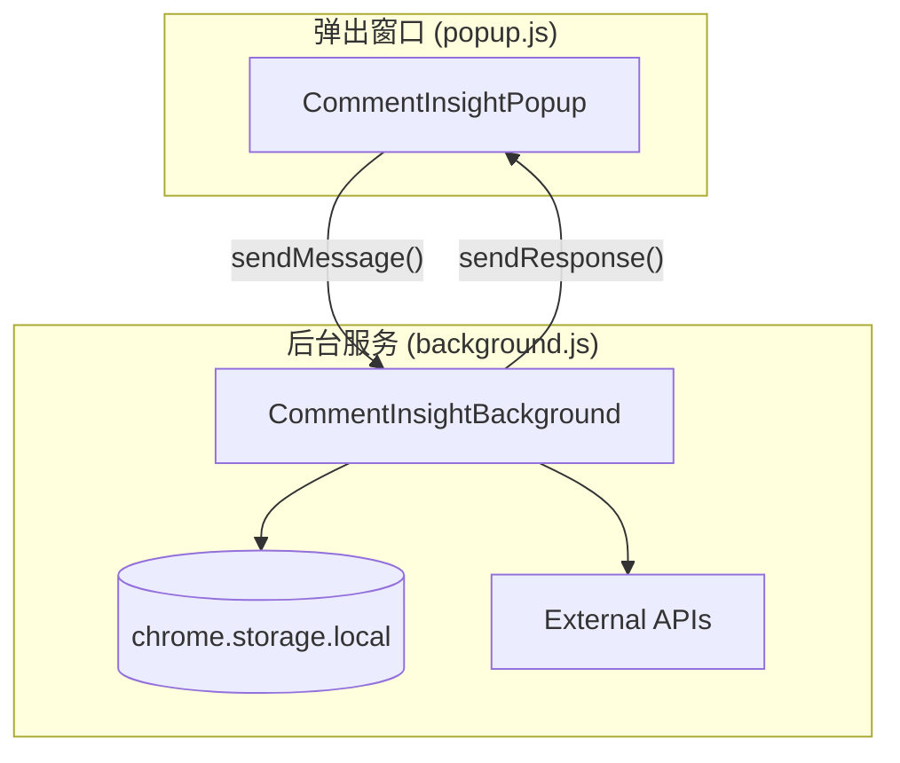

# 弹出窗口界面

<cite>
**Referenced Files in This Document **   
- [popup.html](file://popup.html)
- [popup.js](file://popup.js)
- [background.js](file://background.js)
- [manifest.json](file://manifest.json)
</cite>

## 目录
1. [简介](#简介)
2. [项目结构](#项目结构)
3. [核心组件](#核心组件)
4. [架构概览](#架构概览)
5. [详细组件分析](#详细组件分析)
6. [依赖分析](#依赖分析)
7. [性能考虑](#性能考虑)
8. [故障排除指南](#故障排除指南)
9. [结论](#结论)

## 简介
`CommentInsight` 是一款Chrome浏览器扩展，旨在从社交媒体平台提取评论并进行AI分析。本文档详细记录了其弹出窗口（popup）的设计与行为，作为用户的主要交互入口。该弹出窗口负责平台检测、按钮事件绑定、状态更新和通知系统，并通过Chrome的消息系统与后台服务通信。

## 项目结构
该项目遵循典型的Chrome扩展结构，包含以下主要文件：
- `manifest.json`: 扩展的配置文件，定义权限、内容脚本和弹出页面。
- `popup.html` 和 `popup.js`: 弹出窗口的UI和逻辑。
- `background.js`: 后台服务工作脚本，处理API调用、数据存储和消息传递。
- `content.js`: 内容脚本，用于在特定网页上执行DOM操作。
- `options.html` 和 `options.js`: 扩展的设置页面。
- `viewer.html` 和 `viewer.js`: 用于查看评论、分析结果和历史记录的独立页面。

**Section sources**
- [manifest.json](file://manifest.json#L1-L49)

## 核心组件
弹出窗口的核心是 `CommentInsightPopup` 类，它管理着整个用户界面的状态和交互。该类在DOM加载完成后初始化，负责获取当前标签页信息、加载配置、检测平台、绑定事件监听器以及加载已保存的数据。

**Section sources**
- [popup.js](file://popup.js#L1-L50)

## 架构概览
弹出窗口的架构基于事件驱动模型，通过Chrome的运行时消息系统与后台脚本进行异步通信。当用户与UI交互时，事件被触发，弹出窗口向后台脚本发送消息请求执行特定任务（如提取评论或进行AI分析），后台脚本完成任务后将结果返回给弹出窗口以更新UI。



**Diagram sources **
- [popup.js](file://popup.js#L1-L545)
- [background.js](file://background.js#L68-L102)

## 详细组件分析

### 主要功能分析
`CommentInsightPopup` 类实现了弹出窗口的所有核心功能，包括平台检测、评论提取、AI分析、数据导出等。

#### 平台检测与UI初始化
弹出窗口在初始化时会自动检测当前活动标签页所属的社交媒体平台。此过程通过向后台脚本发送 `detectPlatform` 消息来实现。后台脚本根据URL判断平台，并返回平台信息。弹出窗口收到响应后，调用 `updatePlatformUI` 方法更新UI，显示相应的平台图标和名称，并根据平台支持情况启用或禁用“提取评论”按钮。



**Diagram sources **
- [popup.js](file://popup.js#L113-L129)
- [popup.js](file://popup.js#L131-L171)

**Section sources**
- [popup.js](file://popup.js#L113-L171)

#### 功能按钮事件绑定
弹出窗口通过 `initializeEventListeners` 方法为所有UI按钮绑定点击事件。这些事件监听器将用户的操作转换为对类方法的调用，从而触发相应的业务逻辑。

```mermaid
classDiagram
class CommentInsightPopup {
+currentTab : Tab
+currentPlatform : Object
+currentComments : Array
+currentAnalysis : Object
+config : Object
+initializePopup() void
+initializeEventListeners() void
+detectPlatform() Promise~Object~
+extractComments() Promise~void~
+analyzeComments() Promise~void~
+updateUI() void
+setLoadingState(action, loading) void
+showNotification(message, type) void
}
CommentInsightPopup --> "settings-btn" : 绑定 click -> openOptionsPage
CommentInsightPopup --> "extract-btn" : 绑定 click -> extractComments
CommentInsightPopup --> "analyze-btn" : 绑定 click -> analyzeComments
CommentInsightPopup --> "view-comments-btn" : 绑定 click -> viewComments
CommentInsightPopup --> "view-analysis-btn" : 绑定 click -> viewAnalysis
CommentInsightPopup --> "export-btn" : 绑定 click -> exportData
CommentInsightPopup --> "history-btn" : 绑定 click -> viewHistory
```

**Diagram sources **
- [popup.js](file://popup.js#L36-L71)

**Section sources**
- [popup.js](file://popup.js#L36-L71)

#### 数据加载与状态管理
弹出窗口在启动时会尝试从本地存储中加载与当前页面相关的已保存数据（评论和分析结果）。这通过向后台脚本发送 `loadData` 消息实现。一旦数据加载成功，`updateUI` 方法会被调用来同步UI状态，例如更新评论数量、最后分析时间，并根据数据的可用性动态启用或禁用相关功能按钮。



**Diagram sources **
- [popup.js](file://popup.js#L173-L189)
- [popup.js](file://popup.js#L357-L380)

**Section sources**
- [popup.js](file://popup.js#L173-L380)

#### 加载状态与用户反馈
为了提供良好的用户体验，弹出窗口实现了加载状态指示器和通知系统。当执行耗时操作（如提取或分析评论）时，`setLoadingState` 方法会被调用，它会切换按钮上的文本和旋转动画，并禁用按钮以防止重复提交。同时，`showNotification` 方法用于向用户展示操作结果（成功、警告或错误），该通知会在3秒后自动消失。

```mermaid
flowchart TD
A["用户点击 '提取评论'"] --> B[调用 extractComments]
B --> C[调用 setLoadingState('extract', true)]
C --> D[显示 '提取中...' 和旋转动画]
D --> E[禁用 '提取评论' 按钮]
E --> F[发送 extractComments 消息]
F --> G{后台脚本}
G --> H[执行提取逻辑]
H --> I[返回结果]
I --> J[弹出窗口接收响应]
J --> K{成功?}
K --> |是| L[调用 showNotification('成功...')]
K --> |否| M[调用 showNotification('失败...', 'error')]
L & M --> N[调用 setLoadingState('extract', false)]
N --> O[恢复原始按钮文本]
O --> P[隐藏旋转动画]
P --> Q[重新启用按钮]
```

**Diagram sources **
- [popup.js](file://popup.js#L382-L403)
- [popup.js](file://popup.js#L505-L539)

**Section sources**
- [popup.js](file://popup.js#L198-L275)
- [popup.js](file://popup.js#L382-L539)

### 快速操作与导航
弹出窗口还提供了多个快速操作按钮，允许用户跳转到不同的视图页面。

#### 查看与导出功能
`viewComments`, `viewAnalysis`, 和 `viewHistory` 方法都通过调用 `openViewerPage` 来创建新的浏览器标签页，打开 `viewer.html` 页面，并传递相应的类型参数（`comments`, `analysis`, `history`）和一个由 `generatePageKey` 生成的唯一页面键。`exportData` 方法则负责将当前数据按照用户配置的格式（CSV, Markdown, JSON）导出，它会向后台脚本发送 `exportData` 消息，利用Chrome的下载API完成文件保存。

```mermaid
classDiagram
class CommentInsightPopup {
+viewComments() void
+viewAnalysis() void
+viewHistory() void
+openViewerPage(type) void
+exportData() Promise~void~
+generateFilename() string
}
CommentInsightPopup --> "view-comments-btn" : 调用 viewComments
CommentInsightPopup --> "view-analysis-btn" : 调用 viewAnalysis
CommentInsightPopup --> "history-btn" : 调用 viewHistory
CommentInsightPopup --> "export-btn" : 调用 exportData
CommentInsightPopup --> "viewer.html" : 通过 openViewerPage 导航
CommentInsightPopup --> "background.js" : 发送 exportData 消息
```

**Diagram sources **
- [popup.js](file://popup.js#L420-L423)
- [popup.js](file://popup.js#L482-L491)

**Section sources**
- [popup.js](file://popup.js#L420-L491)

## 依赖分析
弹出窗口与后台脚本之间存在紧密的依赖关系，它们通过 `chrome.runtime.sendMessage` API 进行通信。弹出窗口不直接访问持久化存储或外部API，而是将这些任务委托给拥有更高权限的后台脚本。



**Diagram sources **
- [popup.js](file://popup.js#L497-L503)
- [background.js](file://background.js#L70-L102)

**Section sources**
- [popup.js](file://popup.js#L497-L503)
- [background.js](file://background.js#L68-L102)

## 性能考虑
弹出窗口的设计注重响应性和用户体验。通过使用异步操作和Promise，避免了UI线程的阻塞。加载状态指示器和通知系统确保了用户始终了解应用的状态。此外，通过在后台脚本中处理繁重的任务（如网络请求和AI分析），保证了弹出窗口本身的轻量化和快速响应。

## 故障排除指南
如果弹出窗口无法正常工作，请检查以下几点：
1.  **平台支持**: 确保您正在访问受支持的社交媒体平台（YouTube, TikTok, Instagram, Facebook, Twitter/X）。
2.  **配置**: 在设置页面中检查是否已正确配置了相关平台的API密钥（如YouTube）和AI服务密钥。
3.  **权限**: 确认扩展已获得必要的权限（如 `storage`, `activeTab`, `downloads`）。
4.  **控制台日志**: 打开弹出窗口的开发者工具控制台，查看是否有任何JavaScript错误或来自 `console.error` 的日志信息。

**Section sources**
- [popup.js](file://popup.js#L198-L275)
- [popup.js](file://popup.js#L505-L539)

## 结论
`CommentInsight` 的弹出窗口是一个设计精良的用户交互中心。它通过清晰的UI、有效的状态管理和健壮的通信机制，为用户提供了一个无缝的体验，使其能够轻松地从社交媒体平台提取评论、进行AI分析并导出洞察结果。其模块化的代码结构和明确的职责划分使得维护和扩展变得相对简单。