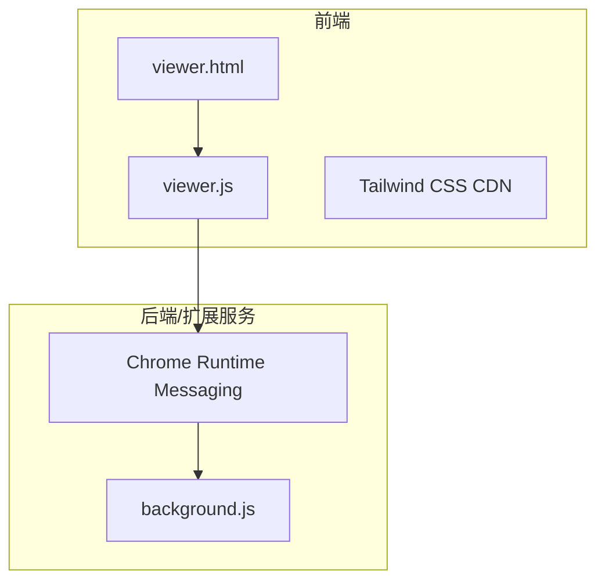
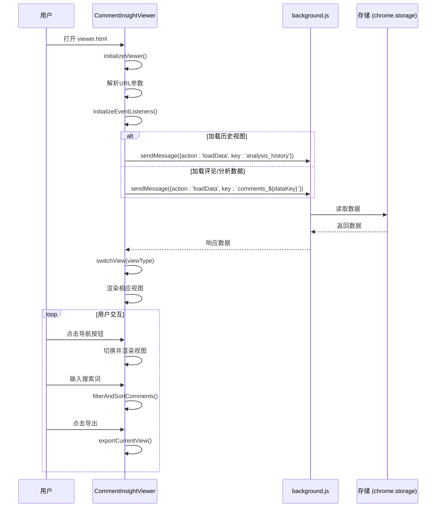
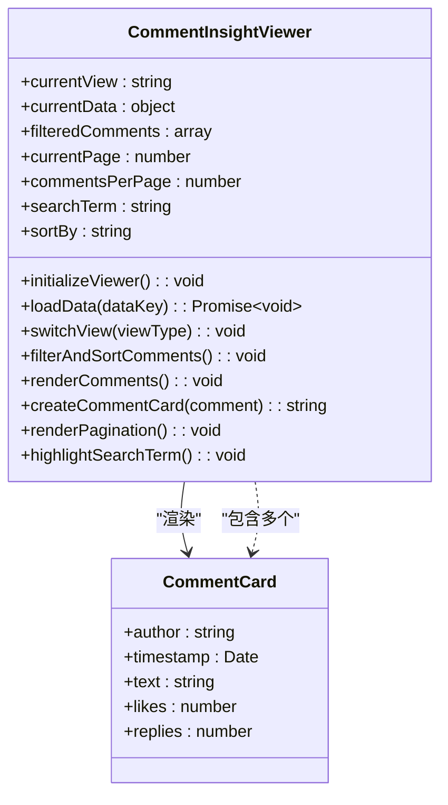
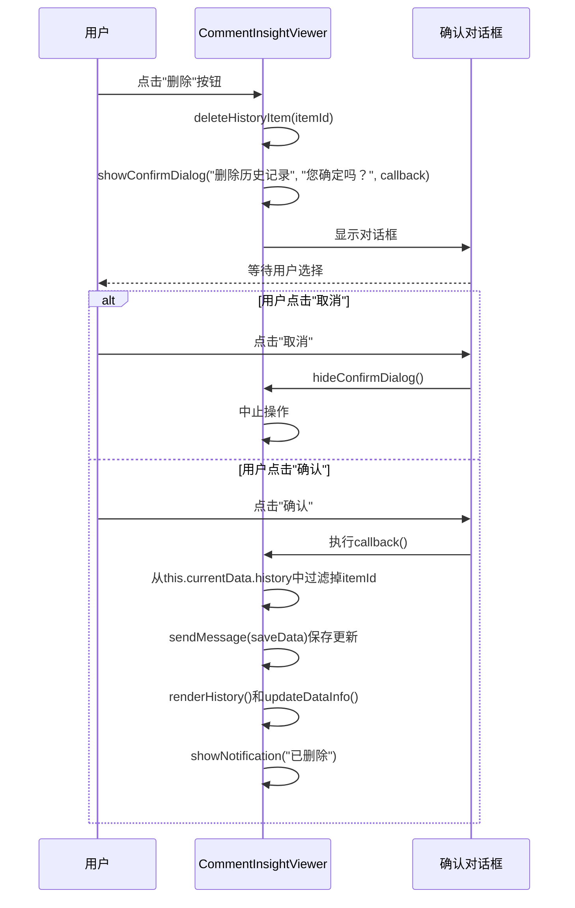

# 查看器页面界面

<cite>
**本文档中引用的文件**
- [viewer.html](file://viewer.html)
- [viewer.js](file://viewer.js)
</cite>

## 目录
1. [简介](#简介)
2. [项目结构](#项目结构)
3. [核心组件](#核心组件)
4. [架构概述](#架构概述)
5. [详细组件分析](#详细组件分析)
6. [依赖分析](#依赖分析)
7. [性能考虑](#性能考虑)
8. [故障排除指南](#故障排除指南)
9. [结论](#结论)

## 简介
本技术文档详细记录了CommentInsight查看器页面（viewer.html/js）的设计与行为。该页面是评论洞察扩展的核心功能模块，提供了一个完整的用户界面来展示、搜索、排序和分析大量评论数据。文档将深入解析其三大视图（评论、分析、历史）的切换机制，阐述数据渲染流程，包括安全的Markdown解析和高亮显示功能，并说明分页控件、搜索过滤和导出功能的具体实现。

## 项目结构
查看器页面由一个HTML文件和一个JavaScript文件构成，采用轻量级的Tailwind CSS进行样式设计，实现了现代化且响应式的用户界面。`viewer.html` 文件定义了整个页面的静态结构和UI元素，而 `viewer.js` 文件则通过 `CommentInsightViewer` 类封装了所有动态行为和业务逻辑。



**Diagram sources**
- [viewer.html](file://viewer.html#L1-L200)
- [viewer.js](file://viewer.js#L1-L800)

**Section sources**
- [viewer.html](file://viewer.html#L1-L200)
- [viewer.js](file://viewer.js#L1-L800)

## 核心组件
查看器页面的核心是一个名为 `CommentInsightViewer` 的JavaScript类，它管理着页面的状态、数据流和用户交互。该类负责初始化页面、加载数据、处理视图切换、执行搜索和排序操作，并渲染相应的UI内容。其主要状态变量包括当前视图 (`currentView`)、当前数据 (`currentData`)、过滤后的评论列表 (`filteredComments`)、分页信息以及搜索和排序条件。

**Section sources**
- [viewer.js](file://viewer.js#L1-L800)

## 架构概述
查看器页面遵循一个清晰的MVC（模型-视图-控制器）模式变体。`viewer.html` 充当视图层，定义了所有UI元素；`CommentInsightViewer` 类作为控制器，处理用户输入和业务逻辑；而数据模型则由从扩展后台服务获取的JSON数据构成。页面通过Chrome运行时消息传递API与 `background.js` 进行通信，以加载和保存数据。



**Diagram sources**
- [viewer.js](file://viewer.js#L29-L51)
- [viewer.js](file://viewer.js#L125-L164)
- [viewer.js](file://viewer.js#L166-L199)

## 详细组件分析
本节将对查看器页面的关键功能组件进行深入分析，揭示其内部实现细节。

### 视图切换机制
查看器页面提供了三种主要视图：评论、分析和历史。视图切换由 `switchView(viewType)` 方法统一管理。当用户点击顶部导航栏的任一按钮时，会触发相应的事件监听器，调用此方法。

该方法首先更新导航按钮的视觉状态，通过修改CSS类名来高亮当前选中的标签。接着，它会隐藏所有带有 `.view-container` 类的容器，并仅显示与目标视图ID匹配的容器（例如 `comments-view`）。最后，根据新的视图类型，调用对应的渲染函数（`renderComments`, `renderAnalysis`, 或 `renderHistory`），并更新全局的数据统计信息。

```mermaid
flowchart TD
Start([用户点击导航按钮]) --> UpdateNav["更新导航按钮状态<br/>移除所有.nav-btn的高亮<br/>为当前按钮添加bg-blue-100"])
UpdateNav --> HideViews["隐藏所有.view-container"]
HideViews --> ShowView["显示目标视图<br/>${viewType}-view.classList.remove('hidden')"]
ShowView --> SetState["设置this.currentView = ${viewType}"]
SetState --> Render["根据viewType调用渲染函数"]
Render --> |comments| CallRenderComments["renderComments()"]
Render --> |analysis| CallRenderAnalysis["renderAnalysis()"]
Render --> |history| CallRenderHistory["renderHistory()"]
CallRenderComments --> UpdateInfo["updateDataInfo()"]
CallRenderAnalysis --> UpdateInfo
CallRenderHistory --> UpdateInfo
UpdateInfo --> End([视图切换完成])
```

**Diagram sources**
- [viewer.js](file://viewer.js#L166-L199)
- [viewer.js](file://viewer.js#L53-L123)

**Section sources**
- [viewer.html](file://viewer.html#L25-L45)
- [viewer.js](file://viewer.js#L166-L199)

### 数据渲染流程
数据渲染是查看器页面的核心功能，尤其在“评论”视图中表现得最为复杂，涉及数据过滤、排序、分页和安全渲染。

#### 评论数据渲染
评论数据的渲染流程始于 `filterAndSortComments()` 方法。该方法接收原始评论数据，根据当前的 `searchTerm` 和 `sortBy` 条件进行过滤和排序。搜索支持对评论文本和作者名称的模糊匹配，排序则支持按时间戳或点赞数的升序/降序排列。处理后的结果存储在 `filteredComments` 数组中。

随后，`renderComments()` 方法被调用。它计算当前页码对应的数据切片，然后使用 `createCommentCard(comment)` 方法为每条评论生成一个HTML字符串。这些卡片通过 `innerHTML` 批量插入到DOM中，以提高性能。最后，`renderPagination()` 方法生成分页控件，`highlightSearchTerm()` 方法则负责将搜索关键词在评论文本中高亮显示。



**Diagram sources**
- [viewer.js](file://viewer.js#L201-L241)
- [viewer.js](file://viewer.js#L243-L274)
- [viewer.js](file://viewer.js#L276-L322)

**Section sources**
- [viewer.html](file://viewer.html#L60-L150)
- [viewer.js](file://viewer.js#L201-L394)

#### Markdown解析与高亮显示
在“分析”视图中，系统需要将AI生成的分析报告（纯文本）转换为格式化的HTML。这由 `markdownToHtml(markdown)` 方法实现。为了防止XSS攻击，该方法首先调用 `escapeHtml()` 对原始文本进行转义。之后，它应用一系列正则表达式替换，将有限的Markdown语法（如标题、粗体、斜体、列表）转换为对应的HTML标签。这种实现方式简单高效，避免了引入大型第三方库。

对于搜索高亮，`highlightSearchTerm()` 方法使用 `TreeWalker` API 遍历评论容器内的所有文本节点。它找到包含搜索词的文本，将其包裹在带有 `highlight` CSS类的 `<span>` 标签中，从而实现精确的高亮效果。

**Section sources**
- [viewer.js](file://viewer.js#L452-L470)
- [viewer.js](file://viewer.js#L396-L424)

### 功能实现细节
#### 分页控件
分页控件由 `renderPagination()` 方法动态生成。它根据 `totalPages` 和 `currentPage` 计算出要显示的页码范围（通常为当前页前后各两页）。生成的HTML包含上一页、下一页按钮和一组页码按钮。页码按钮使用内联 `onclick="viewer.goToPage(${i})"` 事件，直接调用 `goToPage(page)` 方法。该方法会验证页码的有效性，更新 `currentPage`，重新渲染评论列表，并平滑滚动到评论容器的顶部。

#### 搜索过滤
搜索过滤功能实时响应用户的输入。`search-comments` 输入框的 `input` 事件监听器会持续更新 `this.searchTerm` 变量，并立即触发 `filterAndSortComments()` 方法。这确保了用户在键入时就能看到过滤后的结果。过滤逻辑不区分大小写，并同时检查评论文本和作者字段。

#### 导出功能
导出功能由 `exportCurrentView()` 方法协调。它根据当前视图调用不同的导出子方法（`exportComments`, `exportAnalysis`, `exportHistory`）。这些方法会构造一个包含当前视图数据的对象，并通过 `sendMessage` 发送一个 `exportData` 消息给 `background.js`。后台脚本负责将数据序列化为指定格式（CSV、Markdown、JSON）并触发浏览器下载。

**Section sources**
- [viewer.js](file://viewer.js#L324-L394)
- [viewer.js](file://viewer.js#L201-L241)
- [viewer.js](file://viewer.js#L622-L717)

### 交互式组件实现
#### 评论卡片生成
评论卡片的生成完全在 `createCommentCard(comment)` 方法中完成。该方法接收一个评论对象，提取其属性（作者、时间戳、文本、点赞数等），并使用模板字符串构建一个结构化的HTML片段。在插入DOM之前，所有用户生成的内容都通过 `escapeHtml()` 方法进行转义，以防止跨站脚本攻击。卡片还包含了响应式设计和悬停动画效果。

#### 历史记录删除确认对话框
删除历史记录的操作是不可逆的，因此需要二次确认。`deleteHistoryItem(itemId)` 方法在执行删除前，会调用 `showConfirmDialog(title, message, callback)`。该方法会填充预定义的确认对话框（`confirm-dialog`）的标题和消息，并将删除操作本身作为一个回调函数传入。当用户点击“确认”按钮时，这个回调函数才会被执行，从而安全地删除指定的历史记录项。



**Diagram sources**
- [viewer.js](file://viewer.js#L560-L586)
- [viewer.js](file://viewer.js#L727-L732)
- [viewer.html](file://viewer.html#L180-L195)

**Section sources**
- [viewer.html](file://viewer.html#L180-L195)
- [viewer.js](file://viewer.js#L560-L586)

#### 跨视图数据统计更新
页面右上角的“数据信息”区域（`data-info`）会根据当前视图动态更新显示的条目数量。这一功能由 `updateDataInfo()` 方法实现。每当视图切换、数据加载完成或历史记录被修改时，该方法都会被调用。它根据 `currentView` 的值，查询相应数据源的长度（`filteredComments.length`、`history.length` 或简单的1代表分析报告存在），并将结果更新到 `total-count` 元素的文本内容中，为用户提供即时的反馈。

**Section sources**
- [viewer.js](file://viewer.js#L606-L620)
- [viewer.html](file://viewer.html#L40-L43)

## 依赖分析
查看器页面的主要外部依赖是通过CDN引入的Tailwind CSS框架，用于快速构建美观的UI。在代码层面，它严重依赖于Chrome扩展的 `chrome.runtime.sendMessage` API 与后台脚本进行异步通信，这是其数据持久化和导出功能的基础。此外，页面利用了现代浏览器的 `URLSearchParams` API 来解析URL参数，以确定初始视图和数据键。

```mermaid
erDiagram
USER_VIEWER ||--o{ COMMENTS : "显示"
USER_VIEWER ||--o{ ANALYSIS_REPORT : "显示"
USER_VIEWER ||--o{ HISTORY_RECORDS : "管理"
USER_VIEWER }|--|| CHROME_RUNTIME : "通信"
CHROME_RUNTIME }|--|| STORAGE_LOCAL : "数据持久化"
class USER_VIEWER {
CommentInsightViewer
}
class COMMENTS {
id
author
text
timestamp
likes
replies
}
class ANALYSIS_REPORT {
rawAnalysis
model
commentCount
timestamp
}
class HISTORY_RECORDS {
id
title
platform
commentCount
timestamp
hasAnalysis
dataKey
}
```

**Diagram sources**
- [viewer.js](file://viewer.js#L774-L780)
- [viewer.html](file://viewer.html#L5)

**Section sources**
- [viewer.js](file://viewer.js#L774-L780)

## 性能考虑
查看器页面在设计时考虑了性能因素。例如，评论卡片的渲染采用批量 `innerHTML` 操作而非逐个DOM操作，显著提升了渲染速度。分页机制有效限制了单次渲染的DOM节点数量，避免了长列表导致的页面卡顿。搜索和排序操作在内存中进行，响应迅速。然而，对于超大规模的评论数据集，未来可以考虑实现虚拟滚动（Virtual Scrolling）以进一步优化性能。

## 故障排除指南
*   **问题：页面空白，无任何数据显示。**
    *   **可能原因**：URL参数错误或数据未正确保存。
    *   **解决方案**：检查 `viewer.html` 的URL是否包含有效的 `type` 和 `key` 参数。确认 `background.js` 是否成功保存了对应 `key` 的数据。

*   **问题：搜索功能无反应。**
    *   **可能原因**：`filterAndSortComments()` 方法未被正确调用。
    *   **解决方案**：检查 `search-comments` 输入框的事件监听器是否正常工作，确认 `this.searchTerm` 变量是否被更新。

*   **问题：Markdown内容未正确渲染。**
    *   **可能原因**：分析报告文本中包含特殊字符或复杂的Markdown语法。
    *   **解决方案**：`markdownToHtml` 方法仅支持有限的Markdown语法。确保分析文本符合预期格式，或增强该方法的解析能力。

*   **问题：导出功能失败。**
    *   **可能原因**：与 `background.js` 的消息通信失败。
    *   **解决方案**：检查浏览器控制台是否有错误日志，确认 `background.js` 中的 `chrome.runtime.onMessage` 监听器是否正常注册。

**Section sources**
- [viewer.js](file://viewer.js#L29-L51)
- [viewer.js](file://viewer.js#L125-L164)
- [viewer.js](file://viewer.js#L718-L725)

## 结论
CommentInsight查看器页面是一个功能完整、结构清晰的单页应用。它通过 `CommentInsightViewer` 类有效地管理了复杂的UI状态和数据流，实现了评论浏览、数据分析和历史管理三大核心功能。其代码组织良好，职责分明，利用了现代Web API和设计模式，为用户提供了一个直观、高效的数据探索界面。通过深入理解其视图切换、数据渲染和交互逻辑，可以为进一步的功能扩展和性能优化奠定坚实基础。