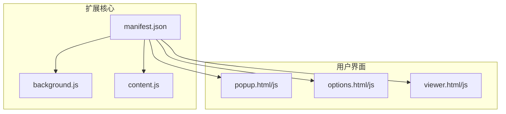
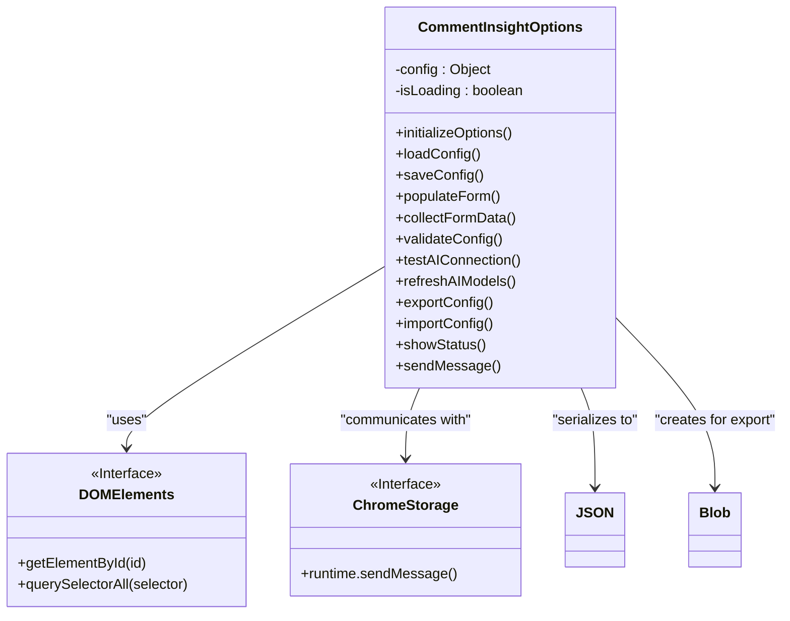
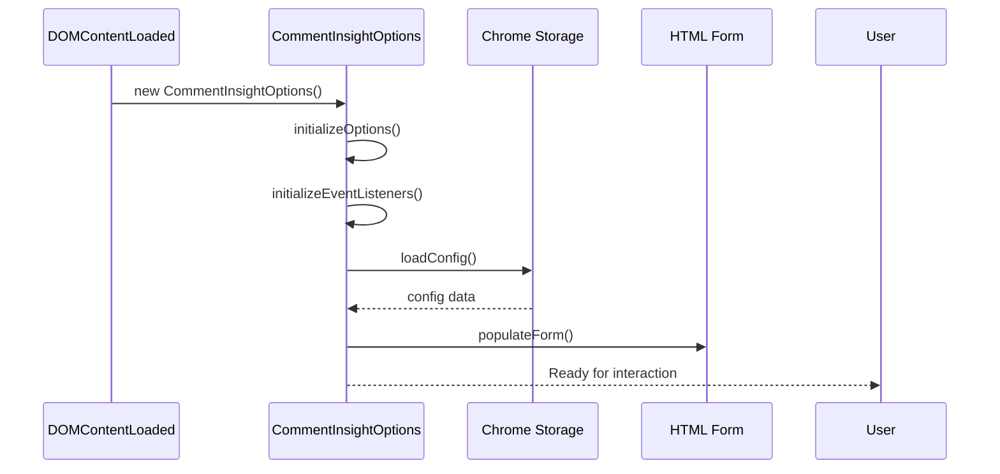
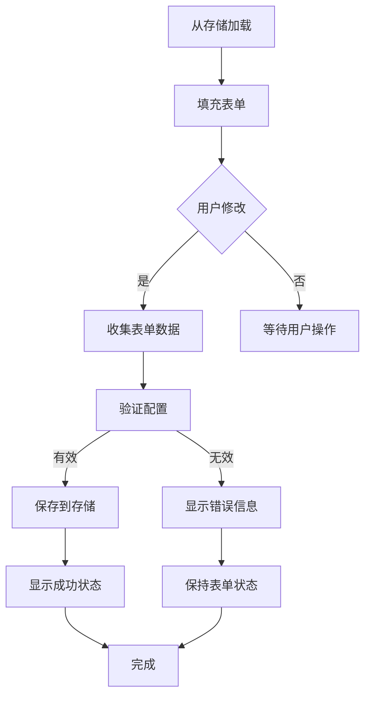
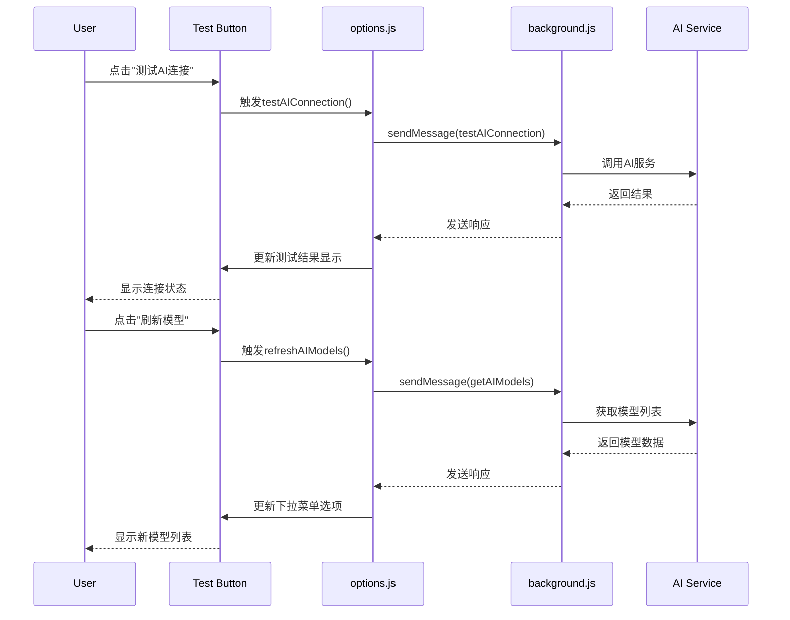
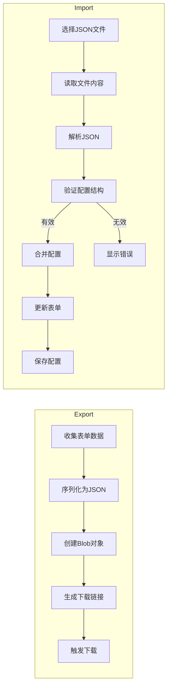
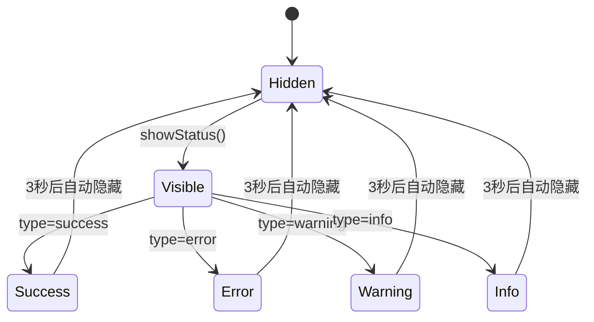
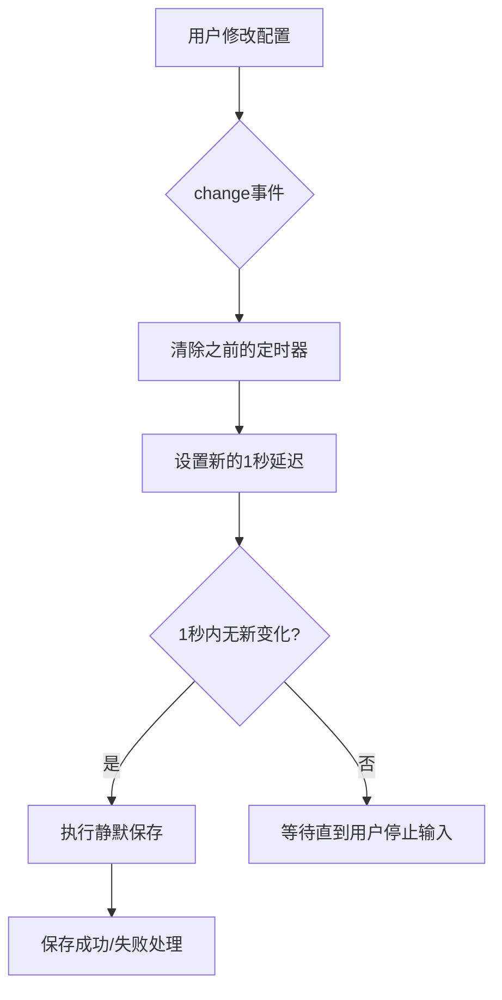
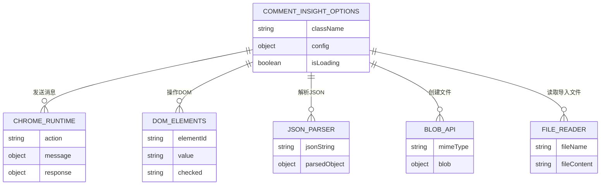

# 配置页面界面

<cite>
**Referenced Files in This Document **   
- [options.html](file://options.html)
- [options.js](file://options.js)
</cite>

## 目录
1. [简介](#简介)
2. [项目结构](#项目结构)
3. [核心组件](#核心组件)
4. [架构概述](#架构概述)
5. [详细组件分析](#详细组件分析)
6. [依赖分析](#依赖分析)
7. [性能考虑](#性能考虑)
8. [故障排除指南](#故障排除指南)
9. [结论](#结论)

## 简介
本文档详细记录了CommentInsight扩展程序的配置页面（options.html/js）的设计与行为。该配置页面为用户提供了一个直观的界面来管理AI参数、平台密钥和导出设置，是整个扩展程序的核心控制中心。

配置页面采用现代化的Web技术栈构建，结合HTML5语义化标签、Tailwind CSS框架和JavaScript面向对象编程范式，实现了功能丰富且用户友好的配置体验。通过分析`options.html`和`options.js`两个核心文件，我们可以深入了解其UI布局设计、表单验证机制、测试连接功能以及配置导入导出流程。

页面主要包含三大配置区域：AI分析配置、多平台API密钥管理和导出设置。每个区域都经过精心设计，既保证了功能完整性，又注重用户体验。JavaScript部分通过`CommentInsightOptions`类实现了配置数据的收集、验证、持久化和动态更新，确保了配置管理的可靠性和实时性。

## 项目结构
CommentInsight项目是一个典型的浏览器扩展程序结构，包含多个核心文件协同工作。配置页面作为用户自定义设置的主要入口，由`options.html`和`options.js`两个文件构成，与其他组件如背景脚本、内容脚本和弹出窗口共同构成了完整的扩展功能体系。

**Diagram sources **
- [manifest.json](file://manifest.json)

**Section sources**
- [manifest.json](file://manifest.json)

## 核心组件
配置页面的核心组件围绕`CommentInsightOptions`类展开，该类负责管理整个配置页面的生命周期和功能实现。从页面初始化到事件监听，从数据持久化到用户反馈，所有关键操作都封装在这个单一职责的类中。

主要功能模块包括：
- **配置加载与保存**：通过Chrome存储API实现配置的持久化
- **表单数据收集与验证**：确保用户输入的数据符合预期格式和范围
- **AI连接测试**：提供即时反馈验证API密钥的有效性
- **模型动态刷新**：根据当前API配置获取可用的AI模型列表
- **配置导入导出**：支持配置的备份、迁移和共享

这些功能模块相互协作，共同构成了一个完整、可靠的配置管理系统，为用户提供无缝的配置体验。

**Section sources**
- [options.js](file://options.js#L1-L569)

## 架构概述
配置页面采用经典的MVC（Model-View-Controller）架构模式，将数据模型、视图展示和业务逻辑清晰分离。HTML文件作为视图层，定义了用户界面的结构和样式；JavaScript类作为控制器层，处理用户交互和业务逻辑；而配置数据本身则构成了模型层。

**Diagram sources **
- [options.js](file://options.js#L1-L569)
- [options.html](file://options.html)

## 详细组件分析

### 配置管理类分析
`CommentInsightOptions`类是配置页面的核心，采用面向对象的设计模式，将所有相关功能封装在一个独立的实体中。这种设计提高了代码的可维护性和可测试性，同时也便于未来的功能扩展。

#### 类初始化与生命周期
当DOM加载完成后，会立即实例化`CommentInsightOptions`类，触发初始化流程。初始化过程遵循严格的顺序：首先设置事件监听器，然后加载存储的配置数据，最后将配置数据填充到表单中。

**Diagram sources **
- [options.js](file://options.js#L9-L25)
- [options.js](file://options.js#L82-L97)
- [options.js](file://options.js#L140-L182)

**Section sources**
- [options.js](file://options.js#L1-L569)

#### 配置数据流分析
配置数据在页面中的流动遵循清晰的路径：从存储中加载 → 填充表单 → 用户修改 → 收集数据 → 验证 → 保存回存储。这个双向数据绑定过程确保了用户界面与底层数据的一致性。

**Diagram sources **
- [options.js](file://options.js#L184-L223)
- [options.js](file://options.js#L257-L280)
- [options.js](file://options.js#L225-L255)

**Section sources**
- [options.js](file://options.js#L1-L569)

### 功能模块分析

#### AI连接测试与模型刷新
AI配置区域提供了两个重要的辅助功能：测试连接和刷新模型。这两个功能都依赖于后端服务的通信，通过异步请求验证配置的有效性并获取动态数据。

**Diagram sources **
- [options.js](file://options.js#L282-L331)
- [options.js](file://options.js#L333-L389)

**Section sources**
- [options.js](file://options.js#L1-L569)

#### 配置导入导出机制
配置的导入导出功能为用户提供了数据备份和迁移的能力。导出时，系统将当前配置序列化为JSON格式并生成下载链接；导入时，则解析上传的JSON文件，验证结构后合并到现有配置中。

**Diagram sources **
- [options.js](file://options.js#L391-L419)
- [options.js](file://options.js#L421-L459)
- [options.js](file://options.js#L461-L511)
- [options.js](file://options.js#L513-L530)

**Section sources**
- [options.js](file://options.js#L1-L569)

### 用户交互与反馈
为了提升用户体验，配置页面实现了丰富的用户反馈机制。无论是成功的操作还是出现的错误，系统都会通过状态栏及时通知用户，确保用户始终了解当前操作的状态。

#### 状态反馈系统
状态反馈系统采用统一的接口设计，支持多种类型的消息展示（成功、错误、警告、信息），并通过视觉元素（颜色、图标）增强信息的传达效果。

**Diagram sources **
- [options.js](file://options.js#L540-L568)

**Section sources**
- [options.js](file://options.js#L1-L569)

#### 实时保存机制
为了防止用户意外丢失配置更改，系统实现了智能的实时保存功能。该功能监听所有配置输入元素的变化，在用户停止输入1秒后自动保存，既保证了数据安全，又避免了过于频繁的存储操作。

**Diagram sources **
- [options.js](file://options.js#L67-L80)

**Section sources**
- [options.js](file://options.js#L1-L569)

## 依赖分析
配置页面的正常运行依赖于多个外部系统和内部组件的协同工作。通过分析`options.js`中的方法调用和数据流，我们可以清晰地看到这些依赖关系。

**Diagram sources **
- [options.js](file://options.js#L532-L538)

**Section sources**
- [options.js](file://options.js#L1-L569)

## 性能考虑
配置页面在设计时充分考虑了性能因素，特别是在事件处理和存储操作方面采取了优化措施。实时保存功能通过防抖技术（debounce）避免了频繁的存储写入，提升了整体性能和用户体验。

此外，配置数据的序列化和反序列化操作都经过优化，确保在处理大型配置文件时仍能保持流畅的响应速度。导入导出功能采用流式处理方式，不会阻塞主线程，保证了界面的响应性。

对于网络请求，系统采用了异步处理模式，所有与后台脚本的通信都不会阻塞用户界面，即使在等待API响应时，用户也可以继续其他操作。

## 故障排除指南
当配置页面出现问题时，可以参考以下常见问题及其解决方案：

**Section sources**
- [options.js](file://options.js#L540-L568)
- [options.js](file://options.js#L257-L280)
- [options.js](file://options.js#L461-L511)

## 结论
CommentInsight的配置页面通过精心设计的HTML结构和功能完备的JavaScript实现，为用户提供了一个强大而易用的配置管理界面。`CommentInsightOptions`类作为核心控制器，成功地将复杂的配置管理逻辑封装在简洁的API背后，实现了关注点分离和代码复用。

页面的三大功能区域——AI参数、平台密钥和导出设置——都经过深思熟虑的设计，既满足了功能需求，又保证了良好的用户体验。特别是实时保存、连接测试、模型刷新和配置导入导出等高级功能，大大增强了配置管理的便利性和可靠性。

整体架构清晰，依赖关系明确，代码组织合理，为未来的功能扩展和维护奠定了坚实的基础。通过本文档的分析，我们可以全面理解配置页面的工作原理和设计思路，为后续的开发和优化提供有价值的参考。