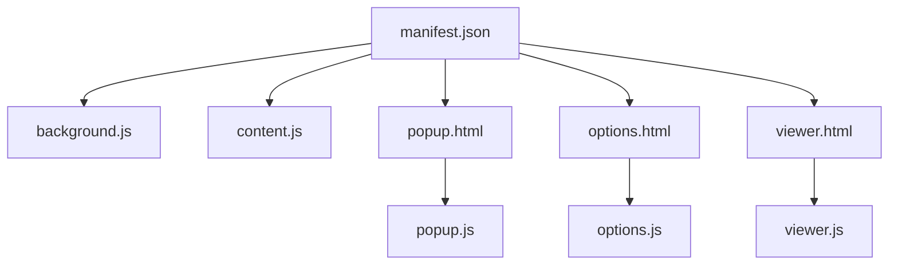
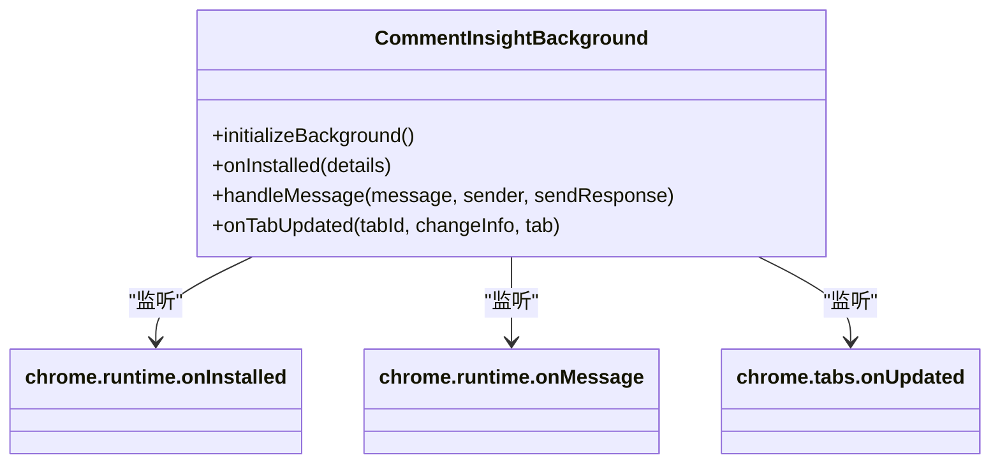
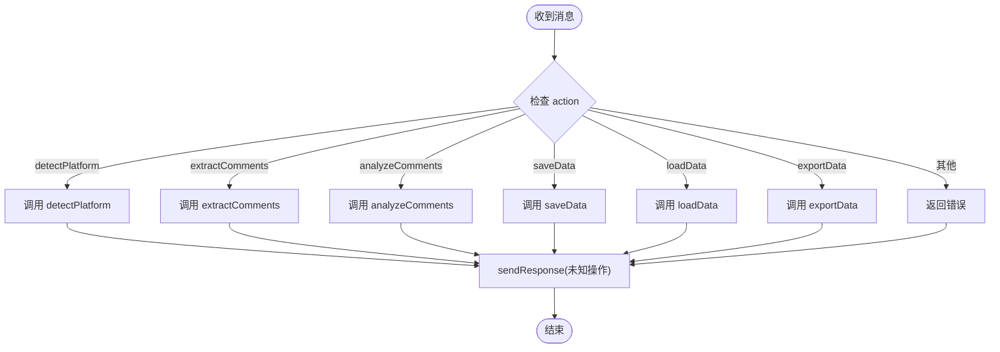
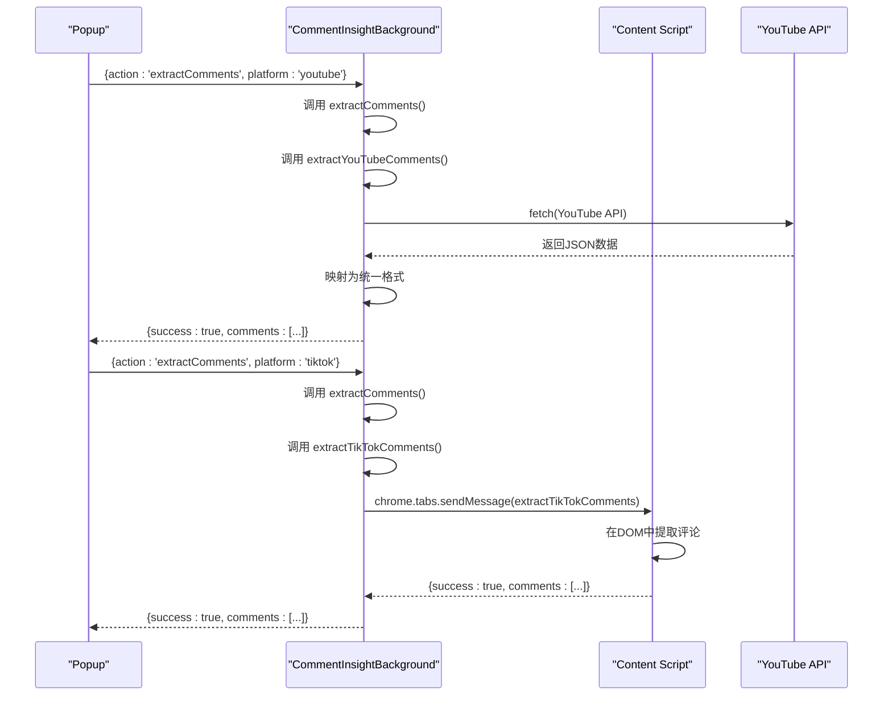
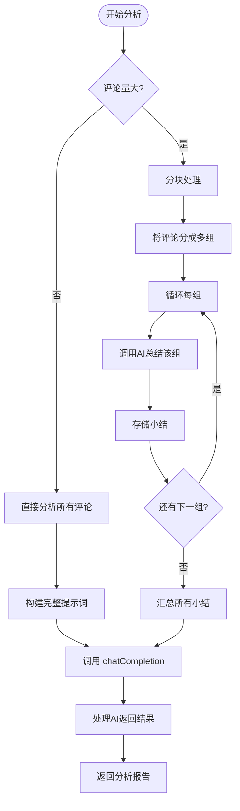
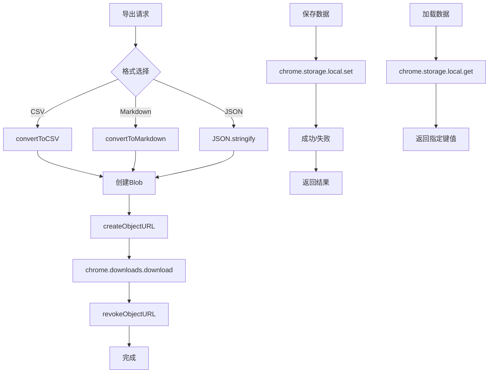
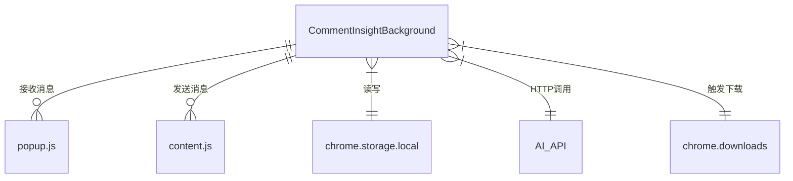

# 后台服务架构

<cite>
**本文档引用的文件**   
- [background.js](file://background.js)
- [popup.js](file://popup.js)
- [content.js](file://content.js)
- [manifest.json](file://manifest.json)
</cite>

## 目录
1. [简介](#简介)
2. [项目结构](#项目结构)
3. [核心组件](#核心组件)
4. [架构概述](#架构概述)
5. [详细组件分析](#详细组件分析)
6. [依赖分析](#依赖分析)
7. [性能考虑](#性能考虑)
8. [故障排除指南](#故障排除指南)
9. [结论](#结论)

## 简介
“评论洞察”是一款浏览器扩展，旨在从多个社交媒体平台（如YouTube、TikTok、Instagram、Facebook和Twitter）提取用户评论，并利用AI技术对这些评论进行深度分析。该扩展通过自动化的方式生成结构化的洞察报告，包括关键洞察、情感分析、主要主题和显著趋势，帮助用户快速理解社交媒体内容的公众反馈。

本架构文档重点描述`CommentInsightBackground`类作为整个系统中央协调器的角色。它负责初始化事件监听、处理消息通信、协调数据流，并与AI API及本地存储进行交互。文档将详细阐述其如何作为后台服务，连接弹出窗口（Popup）、内容脚本（Content Script）和外部API，实现一个高效、可靠的数据处理管道。

## 项目结构
该项目遵循典型的Chrome扩展结构，各文件职责分明，模块化程度高。



**Diagram sources**
- [manifest.json](file://manifest.json#L1-L49)

**Section sources**
- [manifest.json](file://manifest.json#L1-L49)

## 核心组件
`CommentInsightBackground`类是整个扩展的核心，扮演着单例中央协调器的角色。它在扩展安装时被实例化，并通过`initializeBackground`方法注册所有必要的事件监听器。

该类的主要职责包括：
- **生命周期管理**：响应扩展的安装和更新事件。
- **消息路由**：作为消息中心，接收来自不同来源的消息并分发到相应的处理函数。
- **平台检测**：识别当前标签页所属的社交媒体平台。
- **数据协调**：协调评论提取、AI分析和数据导出等复杂操作。
- **状态持久化**：使用`chrome.storage.local`管理配置和分析结果。

**Section sources**
- [background.js](file://background.js#L1-L686)

## 架构概述
`CommentInsightBackground`类构成了扩展的后端逻辑中枢，与前端UI（Popup）和页面级脚本（Content Script）紧密协作。

```mermaid
graph LR
subgraph "前端"
P[Popup UI] --> |发送消息| BG
end
subgraph "后台"
BG[CommentInsightBackground] --> |调用API| AI[(AI API)]
BG --> |读写数据| LS[(chrome.storage.local)]
BG --> |发送消息| CS[Content Script]
end
subgraph "页面层"
CS --> |DOM解析| SP[社交媒体平台]
end
P < --> BG
BG < --> CS
```

**Diagram sources**
- [background.js](file://background.js#L1-L686)
- [popup.js](file://popup.js#L1-L540)
- [content.js](file://content.js#L1-L99)

## 详细组件分析

### CommentInsightBackground 类分析

#### 初始化与事件监听
`CommentInsightBackground`类在构造函数中调用`initializeBackground`方法，一次性设置好所有全局事件监听器。



**Diagram sources**
- [background.js](file://background.js#L6-L22)
- [background.js](file://background.js#L24-L71)
- [background.js](file://background.js#L73-L129)
- [background.js](file://background.js#L131-L137)

**Section sources**
- [background.js](file://background.js#L6-L22)

#### 消息处理机制
`handleMessage`方法是整个系统的消息路由中心。它采用`switch-case`语句根据消息的`action`字段，将请求分发到不同的处理函数。



**Diagram sources**
- [background.js](file://background.js#L73-L129)

**Section sources**
- [background.js](file://background.js#L73-L129)

#### 平台检测与评论提取
`detectPlatform`方法通过检查URL中的域名来判断当前页面属于哪个社交媒体平台。`extractComments`方法则根据平台类型，调用相应的专用提取函数。



**Diagram sources**
- [background.js](file://background.js#L139-L166)
- [background.js](file://background.js#L168-L190)
- [background.js](file://background.js#L192-L245)
- [background.js](file://background.js#L261-L283)
- [content.js](file://content.js#L1-L99)

**Section sources**
- [background.js](file://background.js#L139-L166)
- [background.js](file://background.js#L168-L190)

#### AI分析流程
当评论数量较多时，系统会自动采用分块处理策略，以避免超出AI模型的上下文长度限制。



**Diagram sources**
- [background.js](file://background.js#L354-L402)
- [background.js](file://background.js#L404-L433)
- [background.js](file://background.js#L435-L443)
- [background.js](file://background.js#L445-L468)

**Section sources**
- [background.js](file://background.js#L354-L402)

#### 数据导出与持久化
系统支持多种格式的数据导出，并通过Chrome的下载API实现文件保存。同时，所有配置和分析结果都通过`chrome.storage.local`进行持久化。



**Diagram sources**
- [background.js](file://background.js#L557-L565)
- [background.js](file://background.js#L567-L575)
- [background.js](file://background.js#L577-L616)
- [background.js](file://background.js#L618-L636)
- [background.js](file://background.js#L649-L675)

**Section sources**
- [background.js](file://background.js#L557-L575)
- [background.js](file://background.js#L577-L616)

## 依赖分析
`CommentInsightBackground`类与其他组件的集成方式清晰且松耦合，主要通过Chrome扩展的消息传递API进行通信。



**Diagram sources**
- [background.js](file://background.js#L1-L686)
- [popup.js](file://popup.js#L1-L540)
- [content.js](file://content.js#L1-L99)

**Section sources**
- [background.js](file://background.js#L1-L686)
- [popup.js](file://popup.js#L1-L540)
- [content.js](file://content.js#L1-L99)

## 性能考虑
- **异步处理**：所有I/O操作（网络请求、存储读写）均使用`async/await`，确保不会阻塞主线程。
- **分批处理**：对于大量评论，采用分块分析策略，有效管理AI API的上下文长度和成本。
- **错误处理**：每个关键操作都包裹在`try-catch`块中，确保错误被捕获并以结构化方式返回给调用者。
- **资源清理**：在导出数据后，及时调用`URL.revokeObjectURL`释放内存。

## 故障排除指南
- **无法提取评论**：检查对应平台的API密钥是否已正确配置，或确认目标平台是否受支持。
- **AI分析失败**：验证AI API密钥的有效性，并检查网络连接。
- **数据未保存**：确认`chrome.storage.local`权限已在`manifest.json`中声明。
- **消息通道关闭**：在`chrome.runtime.onMessage`监听器中，务必返回`true`以保持异步响应通道开放。

**Section sources**
- [background.js](file://background.js#L73-L129)
- [background.js](file://background.js#L485-L530)

## 结论
`CommentInsightBackground`类设计精良，有效地充当了扩展的中央枢纽。它通过清晰的职责划分和健壮的错误处理机制，实现了从用户界面到数据处理再到外部服务的无缝集成。其模块化的代码结构和可扩展的设计使得未来添加新的社交媒体平台或分析功能变得相对简单。整体架构体现了Chrome扩展开发的最佳实践，是一个稳定、高效且易于维护的解决方案。