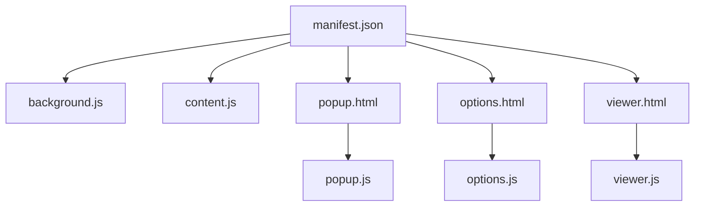
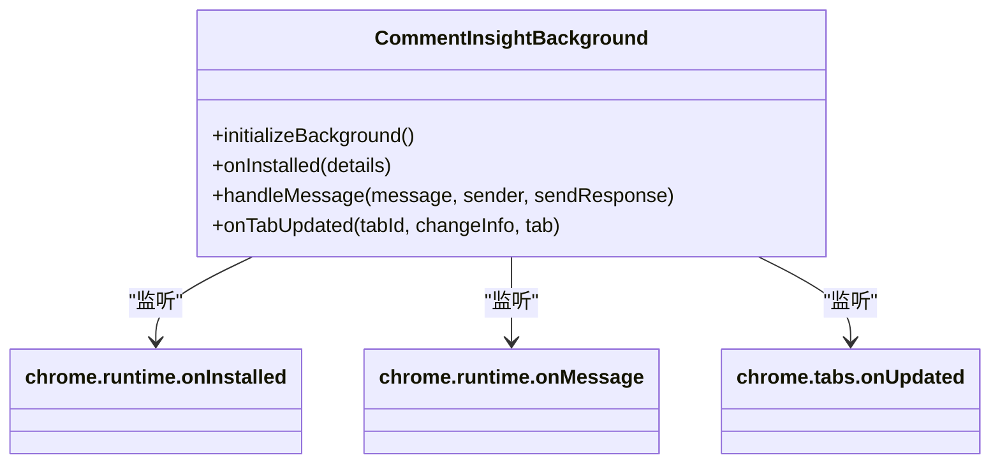

# 后台服务架构

<cite>
**本文档引用的文件**   
- [background.js](file://background.js)
- [content.js](file://content.js)
- [manifest.json](file://manifest.json)
</cite>

## 更新摘要
**变更内容**   
- 在`CommentInsightBackground`类中新增了对哔哩哔哩（Bilibili）平台的支持，包括平台检测、评论提取和默认配置。
- 更新了`handleMessage`方法以支持`bilibili`平台的`extractComments`操作。
- 扩展了`detectPlatform`方法以识别`bilibili.com`和`b23.tv`域名。
- 在`onInstalled`方法中为Bilibili平台添加了默认配置项。
- 增强了`content.js`中的`BilibiliExtractor`类，支持Shadow DOM结构下的评论提取。

**文档更新范围**
- 更新了“核心组件”、“架构概述”、“详细组件分析”等章节，以反映新增的Bilibili平台支持。
- 新增了关于Bilibili评论提取机制的详细说明。
- 更新了相关图表以包含新的数据流路径。

## 目录
1. [简介](#简介)
2. [项目结构](#项目结构)
3. [核心组件](#核心组件)
4. [架构概述](#架构概述)
5. [详细组件分析](#详细组件分析)
6. [依赖分析](#依赖分析)
7. [性能考虑](#性能考虑)
8. [故障排除指南](#故障排除指南)
9. [结论](#结论)

## 简介
“评论洞察”是一款浏览器扩展，旨在从多个社交媒体平台（如YouTube、TikTok、Instagram、Facebook、Twitter和哔哩哔哩）提取用户评论，并利用AI技术对这些评论进行深度分析。该扩展通过自动化的方式生成结构化的洞察报告，包括关键洞察、情感分析、主要主题和显著趋势，帮助用户快速理解社交媒体内容的公众反馈。

本架构文档重点描述`CommentInsightBackground`类作为整个系统中央协调器的角色。它负责初始化事件监听、处理消息通信、协调数据流，并与AI API及本地存储进行交互。文档将详细阐述其如何作为后台服务，连接弹出窗口（Popup）、内容脚本（Content Script）和外部API，实现一个高效、可靠的数据处理管道。

## 项目结构
该项目遵循典型的Chrome扩展结构，各文件职责分明，模块化程度高。



**Diagram sources**
- [manifest.json](file://manifest.json#L1-L53)

**Section sources**
- [manifest.json](file://manifest.json#L1-L53)

## 核心组件
`CommentInsightBackground`类是整个扩展的核心，扮演着单例中央协调器的角色。它在扩展安装时被实例化，并通过`initializeBackground`方法注册所有必要的事件监听器。

该类的主要职责包括：
- **生命周期管理**：响应扩展的安装和更新事件。
- **消息路由**：作为消息中心，接收来自不同来源的消息并分发到相应的处理函数。
- **平台检测**：识别当前标签页所属的社交媒体平台，现已支持哔哩哔哩（Bilibili）平台。
- **数据协调**：协调评论提取、AI分析和数据导出等复杂操作。
- **状态持久化**：使用`chrome.storage.local`管理配置和分析结果。

**Section sources**
- [background.js](file://background.js#L1-L788)

## 架构概述
`CommentInsightBackground`类构成了扩展的后端逻辑中枢，与前端UI（Popup）和页面级脚本（Content Script）紧密协作。

```mermaid
graph LR
subgraph "前端"
P[Popup UI] --> |发送消息| BG
end
subgraph "后台"
BG[CommentInsightBackground] --> |调用API| AI[(AI API)]
BG --> |读写数据| LS[(chrome.storage.local)]
BG --> |发送消息| CS[Content Script]
end
subgraph "页面层"
CS --> |DOM解析| SP[社交媒体平台]
SP --> |Bilibili| BL[哔哩哔哩]
end
P < --> BG
BG < --> CS
```

**Diagram sources**
- [background.js](file://background.js#L1-L788)
- [content.js](file://content.js#L1-L1278)

## 详细组件分析

### CommentInsightBackground 类分析

#### 初始化与事件监听
`CommentInsightBackground`类在构造函数中调用`initializeBackground`方法，一次性设置好所有全局事件监听器。



**Diagram sources**
- [background.js](file://background.js#L6-L22)
- [background.js](file://background.js#L24-L76)
- [background.js](file://background.js#L78-L134)
- [background.js](file://background.js#L136-L142)

**Section sources**
- [background.js](file://background.js#L6-L22)

#### 消息处理机制
`handleMessage`方法是整个系统的消息路由中心。它采用`switch-case`语句根据消息的`action`字段，将请求分发到不同的处理函数。现已支持`bilibili`平台的评论提取请求。

```mermaid
flowchart TD
Start([收到消息]) --> CheckAction{检查 action}
CheckAction --> |detectPlatform| Detect[调用 detectPlatform]
CheckAction --> |extractComments| Extract[调用 extractComments]
CheckAction --> |analyzeComments| Analyze[调用 analyzeComments]
CheckAction --> |saveData| Save[调用 save