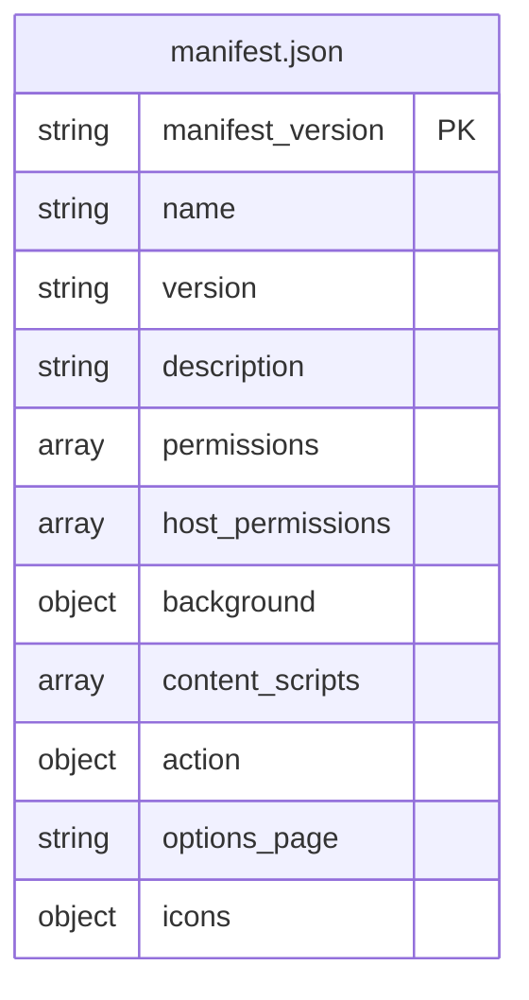
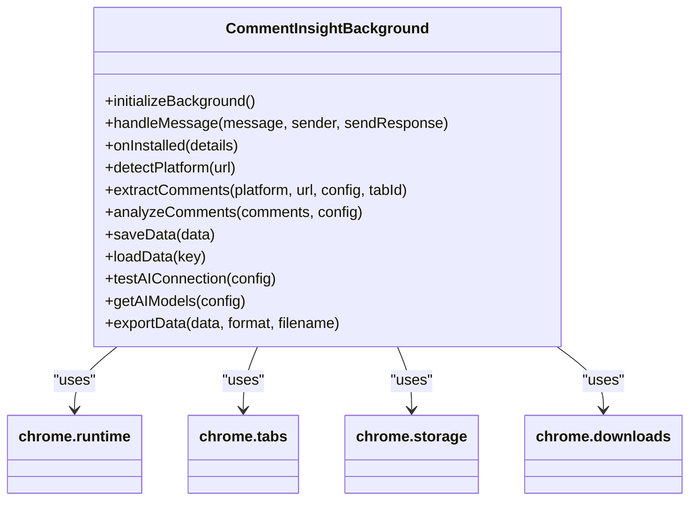
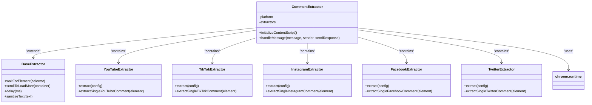
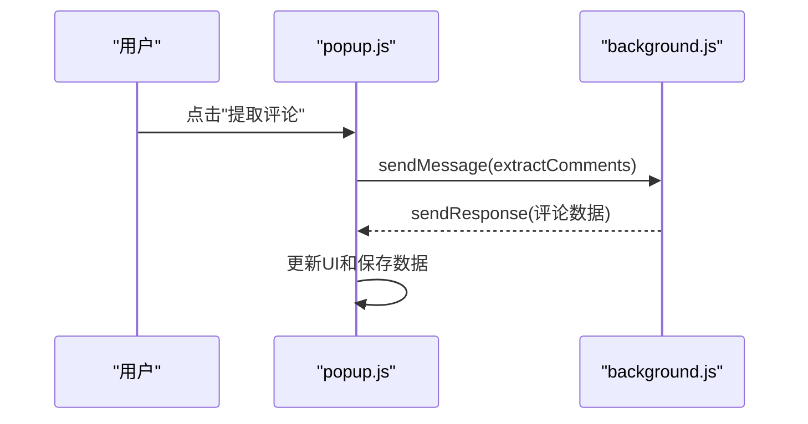

# 开发与贡献

<cite>
**Referenced Files in This Document**   
- [README.md](file://README.md)
- [manifest.json](file://manifest.json)
- [background.js](file://background.js)
- [content.js](file://content.js)
- [popup.html](file://popup.html)
- [popup.js](file://popup.js)
- [options.html](file://options.html)
- [options.js](file://options.js)
- [viewer.html](file://viewer.html)
- [viewer.js](file://viewer.js)
</cite>

## 目录
1. [开发环境要求](#开发环境要求)
2. [项目代码结构](#项目代码结构)
3. [代码提交规范](#代码提交规范)
4. [扩展开发指南](#扩展开发指南)
5. [问题报告与功能建议](#问题报告与功能建议)

## 开发环境要求

根据项目的 `README.md` 文件，开发和贡献 CommentInsight 项目需要满足以下环境要求：

*   **Chrome 浏览器**: 版本 88 或更高版本。这是运行和测试此 Chrome 扩展的必要条件。
*   **Node.js (可选)**: 版本 16 或更高版本。虽然不是强制要求，但 Node.js 可用于运行一些开发工具或脚本。

这些信息直接来源于 `README.md` 文件中的“贡献指南”部分。

**Section sources**
- [README.md](file://README.md#L207-L209)

## 项目代码结构

CommentInsight 项目遵循典型的 Chrome 扩展架构，其核心文件各司其职，通过消息传递机制进行通信。以下是主要文件的职责说明：

### 核心配置文件

#### manifest.json
`manifest.json` 是整个扩展的配置中心，定义了扩展的基本信息、权限、资源和入口点。它指定了：
*   **后台服务工作脚本 (background.js)**: 负责处理长期运行的任务，如监听事件、管理数据存储和协调消息。
*   **内容脚本 (content.js)**: 在用户访问的社交媒体页面中注入并执行，负责 DOM 操作和提取评论。
*   **弹出窗口 (popup.html/js)**: 用户点击扩展图标时显示的界面，提供主要操作按钮。
*   **选项页面 (options.html/js)**: 用户配置 AI 和平台 API 密钥等设置的界面。
*   **查看器页面 (viewer.html/js)**: 用于展示评论列表、分析结果和历史记录的独立页面。
*   **权限声明**: 声明了扩展所需的权限，如 `storage`（本地存储）、`activeTab`（访问当前标签页）和 `scripting`（注入脚本）。

**Diagram sources**
- [manifest.json](file://manifest.json#L1-L49)

**Section sources**
- [manifest.json](file://manifest.json#L1-L49)

### 核心逻辑文件

#### background.js
`background.js` 是扩展的“大脑”，以一个名为 `CommentInsightBackground` 的类实现。它作为单例模式运行，负责：
*   **初始化**: 监听扩展安装、标签页更新和来自其他组件的消息。
*   **消息路由**: 接收来自 `popup.js` 和 `content.js` 的消息，并调用相应的处理函数。
*   **业务逻辑**: 实现核心功能，包括检测当前平台、提取评论（调用 YouTube API 或向 `content.js` 发送指令）、使用 AI 分析评论、保存和加载数据、测试 AI 连接以及导出数据。
*   **数据持久化**: 使用 `chrome.storage.local` API 来存储配置、评论数据和分析结果。

**Diagram sources**
- [background.js](file://background.js#L1-L686)

**Section sources**
- [background.js](file://background.js#L1-L686)

#### content.js
`content.js` 是在目标网页上下文中运行的“探针”，以 `CommentExtractor` 类为核心。它的主要职责是：
*   **DOM 解析**: 对于不提供官方 API 的平台（如 TikTok、Instagram），通过解析页面的 DOM 结构来提取评论。
*   **消息响应**: 监听来自 `background.js` 的消息（例如 `extractTikTokComments`），执行提取任务后将结果返回。
*   **平台适配**: 包含多个特定平台的提取器（`YouTubeExtractor`, `TikTokExtractor` 等），每个都实现了针对该平台的 DOM 选择器和提取逻辑。

**Diagram sources**
- [content.js](file://content.js#L1-L99)

**Section sources**
- [content.js](file://content.js#L1-L559)

### 用户界面 (UI) 组件

#### popup.js
`popup.js` 控制着扩展的弹出窗口，以 `CommentInsightPopup` 类实现。它为用户提供了一个简洁的操作面板：
*   **状态显示**: 显示当前检测到的平台、已提取的评论数量和最后分析时间。
*   **操作控制**: 提供“提取评论”、“AI分析”、“查看评论”等按钮，通过 `chrome.runtime.sendMessage` 与 `background.js` 交互。
*   **数据同步**: 加载和保存当前页面的评论及分析数据。

**Diagram sources**
- [popup.js](file://popup.js#L1-L540)

**Section sources**
- [popup.js](file://popup.js#L1-L546)

#### options.js
`options.js` 驱动着配置页面，以 `CommentInsightOptions` 类为核心。它允许用户进行深度配置：
*   **配置管理**: 提供表单让用户输入 AI 服务（OpenAI、Azure 等）和各个社交媒体平台（YouTube、TikTok 等）的 API 密钥。
*   **实时验证**: 支持测试 AI 连接是否正常，并能刷新获取可用的 AI 模型列表。
*   **导入/导出**: 允许用户将配置导出为 JSON 文件，或从文件导入配置，方便迁移。

**Section sources**
- [options.js](file://options.js#L1-L569)

#### viewer.js
`viewer.js` 负责渲染 `viewer.html` 页面，以 `CommentInsightViewer` 类实现。它是一个功能丰富的数据查看器：
*   **多视图切换**: 支持在“评论”、“分析”和“历史”三个视图间切换。
*   **数据展示**: 在“评论”视图中支持搜索、排序和分页；在“分析”视图中渲染 Markdown 格式的 AI 报告。
*   **历史管理**: 允许用户查看、删除或清空所有分析历史记录。

**Section sources**
- [viewer.js](file://viewer.js#L1-L800)

## 代码提交规范

为了保持代码库的整洁和一致性，请遵守以下提交规范：

1.  **清晰的提交信息**: 提交信息应简洁明了地描述本次更改的目的。例如：`feat: 添加对Twitter平台的支持` 或 `fix: 修复TikTok评论提取失败的问题`。
2.  **代码风格一致性**: 新增或修改的代码必须遵循项目现有的编码风格。请参考现有文件的缩进、命名约定和注释方式。
3.  **适当的注释**: 对于复杂的逻辑、算法或非显而易见的代码段，应添加必要的注释，解释其工作原理和目的。
4.  **测试验证流程**: 在提交代码前，请务必在本地环境中进行充分测试，确保新功能按预期工作，且不会破坏现有功能。特别是对于涉及 API 调用或 DOM 解析的变更，需要在真实平台上进行验证。

**Section sources**
- [README.md](file://README.md#L214-L217)

## 扩展开发指南

当您希望为 CommentInsight 项目添加新功能或修复问题时，请遵循以下最佳实践：

*   **遵循现有设计模式**: 项目广泛使用了**单例模式**（如 `CommentInsightBackground`、`CommentInsightPopup` 等类的实例化）和**观察者模式**（通过 `chrome.runtime.onMessage.addListener` 监听消息）。在扩展开发时，应优先考虑复用这些模式，以保证架构的一致性。
*   **注意安全实践**:
    *   **API密钥保护**: 所有 API 密钥都应在 `options.js` 中通过密码输入框收集，并在 `background.js` 中通过 `chrome.storage.local` 安全存储。切勿在代码中硬编码任何密钥。
    *   **输入转义**: 在将用户生成的内容（如评论文本）插入到 HTML 中时，必须进行转义，以防止跨站脚本（XSS）攻击。`viewer.js` 中的 `escapeHtml()` 方法就是一个很好的例子，应被推广使用。

## 问题报告与功能建议

如果您在使用过程中遇到问题，或有关于新功能的想法，欢迎积极反馈：
1.  首先，请查阅文档中的“故障排除”部分，看是否已有解决方案。
2.  如果问题依然存在，请创建一个新的 Issue 来报告问题。请尽可能提供详细的错误信息、复现步骤和您的环境信息（Chrome 版本等）。
3.  对于新功能的建议，同样可以通过创建 Issue 来提出。清晰地描述您期望的功能及其用途，有助于开发者评估和实现。