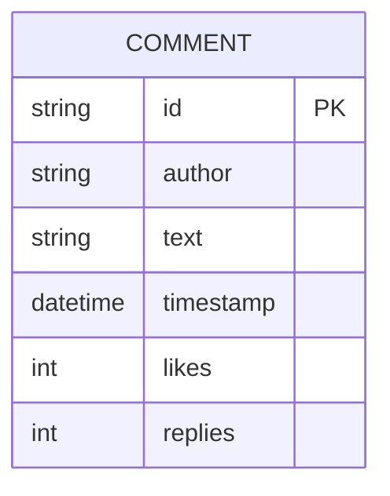
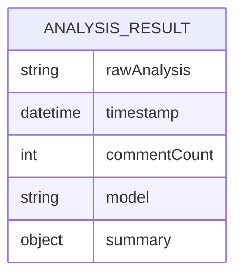
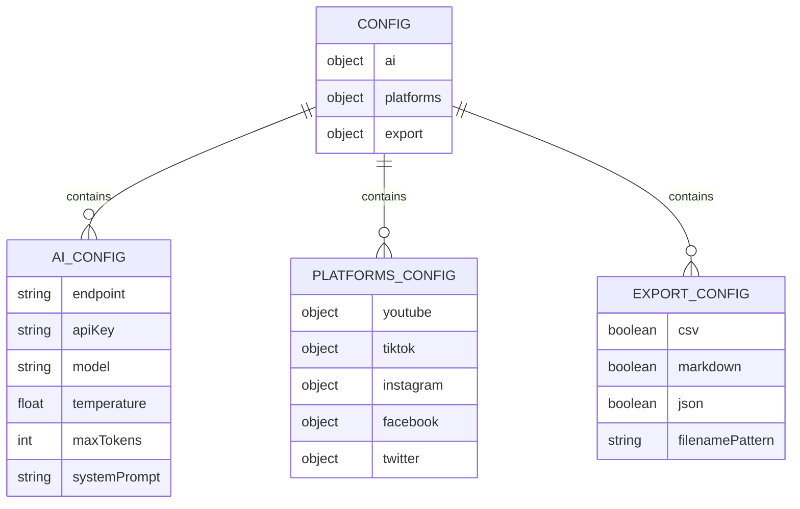
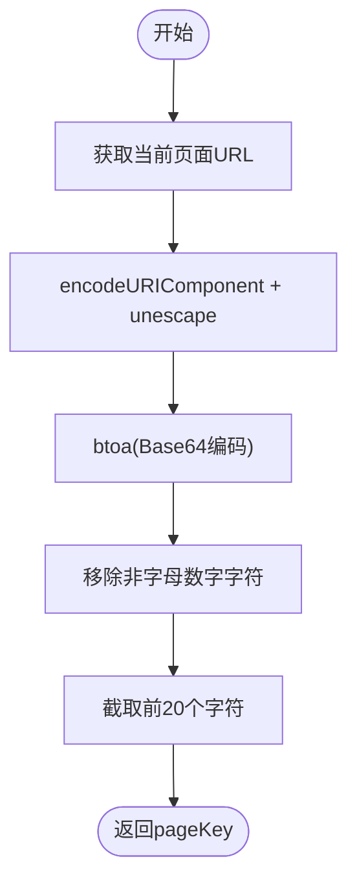
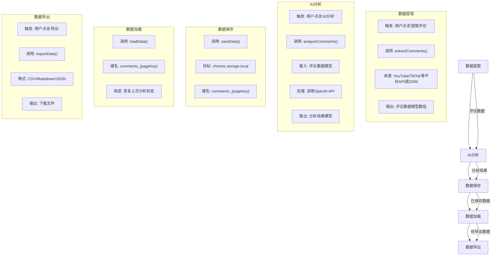
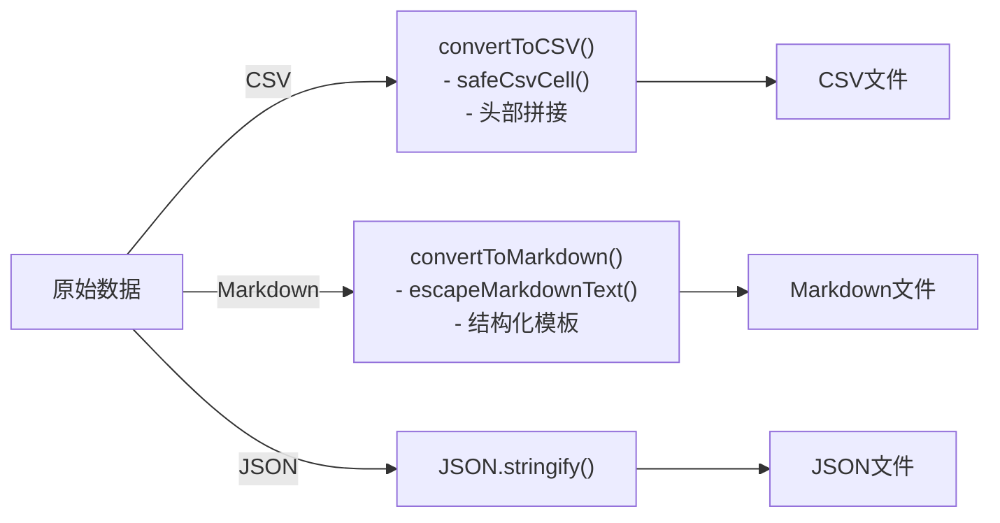

# 数据模型

<cite>
**Referenced Files in This Document**   
- [background.js](file://background.js)
- [popup.js](file://popup.js)
</cite>

## 目录
1. [引言](#引言)
2. [核心数据模型](#核心数据模型)
3. [配置数据模型](#配置数据模型)
4. [数据存储与键名约定](#数据存储与键名约定)
5. [数据生命周期](#数据生命周期)
6. [数据验证与业务约束](#数据验证与业务约束)
7. [数据导出格式转换](#数据导出格式转换)
8. [示例数据](#示例数据)

## 引言

CommentInsight系统是一个用于分析社交媒体评论的浏览器扩展，其核心功能依赖于一套精心设计的数据模型。本文档旨在全面阐述系统的三大核心实体：评论数据模型、分析结果模型和配置数据模型。我们将详细说明这些模型的结构、在`chrome.storage.local`中的存储方式、完整的数据生命周期（从提取到导出），以及相关的数据验证规则和格式转换逻辑。

该系统通过后台脚本(`background.js`)处理核心逻辑，包括API调用、数据存储和消息传递；通过弹出窗口脚本(`popup.js`)管理用户界面交互。数据模型的设计贯穿整个应用，确保了从数据采集、AI分析到最终导出的流程一致性。

**Section sources**
- [background.js](file://background.js#L1-L700)
- [popup.js](file://popup.js#L1-L550)

## 核心数据模型

### 评论数据模型

评论数据模型是系统的基础，用于存储从各个社交媒体平台（如YouTube, TikTok等）提取的原始评论信息。该模型以数组形式组织，每个评论对象包含以下关键属性：

- **id**: 评论的唯一标识符。
- **author**: 发表评论的用户名。
- **text**: 评论的文本内容。
- **timestamp**: 评论发布的时间戳。
- **likes**: 评论获得的点赞数。
- **replies**: 评论收到的回复数。

此模型在代码中被广泛使用，例如在`extractYouTubeComments`方法中，从YouTube API响应中映射出符合此结构的评论数组。



**Diagram sources**
- [background.js](file://background.js#L298-L348)

### 分析结果模型

分析结果模型封装了由AI服务生成的对评论数据的深度洞察。它不仅包含原始的分析文本，还包含了元数据，以便于后续的展示和处理。

- **rawAnalysis**: AI生成的完整分析报告，通常为Markdown格式的字符串。
- **timestamp**: 分析完成的时间戳。
- **commentCount**: 被分析的评论总数。
- **model**: 执行分析所使用的AI模型名称。
- **summary**: 从`rawAnalysis`中提取的关键摘要信息（在当前实现中，此字段的解析逻辑较为简单）。

该模型在`analyzeComments`方法中被创建，当AI分析完成后，会将结果包装成此结构并返回给前端。



**Diagram sources**
- [background.js](file://background.js#L354-L402)

## 配置数据模型

配置数据模型是一个复杂的嵌套对象，定义了系统的各项运行参数，主要分为三个部分：`ai`、`platforms`和`export`。

### AI配置 (ai)
定义了与AI服务通信的参数：
- `endpoint`: AI服务的API端点。
- `apiKey`: 访问AI服务所需的密钥。
- `model`: 使用的AI模型名称。
- `temperature`: 控制生成文本随机性的参数。
- `maxTokens`: 生成响应的最大令牌数。
- `systemPrompt`: 发送给AI的系统提示词。

### 平台配置 (platforms)
针对不同社交媒体平台的特定设置：
- **youtube**: 包含`apiKey`（用于YouTube Data API）和`maxComments`（最大提取评论数）。
- **tiktok**: 包含`mode`（提取模式）和`delay`（延迟时间）。
- **instagram**, **facebook**, **twitter**: 各自包含相应的认证凭据（如token, appId, bearerToken等）。

### 导出配置 (export)
控制数据导出的行为：
- `csv`, `markdown`, `json`: 布尔值，决定是否启用相应格式的导出。
- `filenamePattern`: 导出文件名的模板，支持变量替换（如`{platform}`, `{title}`）。

此配置模型在扩展首次安装时通过`onInstalled`方法初始化，并存储在`chrome.storage.local`中。



**Diagram sources**
- [background.js](file://background.js#L24-L71)

## 数据存储与键名约定

系统利用Chrome扩展的`chrome.storage.local` API来持久化存储数据。为了有效组织和检索不同页面的数据，系统采用了一套基于URL哈希的键名约定。

### 存储键名
- **评论与分析数据**: 使用`comments_{pageKey}`作为键名，其中`{pageKey}`是根据当前页面URL生成的唯一标识符。这种设计确保了不同网页的评论数据可以独立存储和访问。
- **配置数据**: 使用`config`作为键名，存储全局的配置信息。
- **历史记录**: 使用`analysis_history`作为键名，存储用户的分析历史。

### 页面键生成
`generatePageKey`方法负责生成`{pageKey}`。其工作流程如下：
1. 获取当前标签页的URL。
2. 使用`encodeURIComponent`和`unescape`处理Unicode字符。
3. 将结果进行Base64编码。
4. 移除所有非字母数字字符，并截取前20个字符作为最终的`pageKey`。

这种机制保证了即使URL很长或包含特殊字符，也能生成一个安全且唯一的键名。



**Diagram sources**
- [popup.js](file://popup.js#L191-L196)

## 数据生命周期

CommentInsight系统的数据遵循一个清晰的生命周期，从提取到最终导出，各阶段紧密衔接。

### 生命周期流程图


**Diagram sources**
- [background.js](file://background.js#L73-L129)
- [background.js](file://background.js#L557-L575)

### 关键方法
- **saveData(data)**: 接收一个数据对象（如`{ comments: [...], analysis: {...} }`），并将其存储到`chrome.storage.local`中。
- **loadData(key)**: 根据指定的键名（如`comments_abc123...`）从存储中检索数据。

这两个方法构成了数据持久化的基础，确保了用户在关闭弹出窗口后仍能恢复其工作进度。

## 数据验证与业务约束

系统在多个环节实施了严格的数据验证和业务约束，以保证数据的完整性和用户体验。

### 业务约束
- **最大评论数限制**: 在YouTube平台配置中，`maxComments`字段默认为100。在`extractYouTubeComments`方法中，提取过程会在达到此数量后停止，防止一次性请求过多数据导致性能问题或API配额耗尽。
- **API密钥校验**: 在执行任何需要AI分析的操作前，系统会检查`config.ai.apiKey`是否为空。如果为空，会抛出"AI API密钥未配置"的错误，并阻止分析流程继续。

### 数据验证
- **配置完整性**: 在`validatePlatformConfig`方法中，系统会根据当前平台检查必要的API密钥是否存在。例如，对于YouTube平台，必须配置`apiKey`才能进行评论提取。
- **导出数据有效性**: 在`convertToCSV`方法中，会首先检查`data.comments`是否存在且为数组，若不符合条件则抛出"无效的评论数据"错误。

这些约束和验证机制共同作用，确保了系统在各种边界条件下都能稳定运行。

**Section sources**
- [background.js](file://background.js#L354-L357)
- [popup.js](file://popup.js#L245-L275)

## 数据导出格式转换

当用户选择导出数据时，系统会根据配置的格式要求，将内部数据模型转换为相应的文件格式。这一过程涉及特定的转义和格式化逻辑。

### 转换逻辑
#### CSV格式转换
- **CSV转义**: `safeCsvCell`方法负责处理CSV注入攻击和格式问题。
  - 将单元格内的双引号`"`替换为两个双引号`""`。
  - 对以`=`, `+`, `-`, `@`开头的单元格，在前面添加单引号`'`以防止公式注入。
  - 将换行符统一替换为空格。
  - 最终将整个单元格内容用双引号包围。
- **标题行**: 使用中文标题（如"作者", "内容"）生成第一行。

#### Markdown格式转换
- **标题生成**: `convertToMarkdown`方法会生成一个标准的Markdown标题`# 评论分析报告`。
- **元数据插入**: 报告中会包含生成时间、评论数量和平台信息。
- **文本转义**: `escapeMarkdownText`方法会转义Markdown的特殊字符（如`*`, `_`, `<`, `>`），防止它们被错误地解析为格式标记。
- **结构化输出**: 分析结果和评论详情会被分别放入不同的章节中，使用`##`和`###`等标题进行组织。



**Diagram sources**
- [background.js](file://background.js#L618-L675)

## 示例数据

以下是根据上述模型构建的示例数据，展示了实际应用中数据的可能形态。

### 评论数据示例
```json
[
  {
    "id": "UCkA51v2eX8_T0IeTxsrYfVg",
    "author": "科技爱好者",
    "text": "这个视频太棒了！学到了很多新知识。",
    "timestamp": "2023-10-15T14:30:00Z",
    "likes": 15,
    "replies": 2
  },
  {
    "id": "UCkA51v2eX8_T0IeTxsrYfVh",
    "author": "普通用户",
    "text": "不错，期待下一期。",
    "timestamp": "2023-10-15T14:32:15Z",
    "likes": 8,
    "replies": 0
  }
]
```

### 分析结果示例
```json
{
  "rawAnalysis": "## 关键洞察\n- 观众对视频内容表现出高度认可...\n\n## 情感分析\n- 正面情感: 85%\n- 中性情感: 10%\n- 负面情感: 5%",
  "timestamp": "2023-10-15T15:00:00Z",
  "commentCount": 50,
  "model": "gpt-3.5-turbo",
  "summary": {}
}
```

### 配置数据示例
```json
{
  "ai": {
    "endpoint": "https://api.openai.com/v1",
    "apiKey": "sk-...",
    "model": "gpt-3.5-turbo",
    "maxTokens": 2000
  },
  "platforms": {
    "youtube": {
      "apiKey": "AIza...",
      "maxComments": 100
    }
  },
  "export": {
    "csv": true,
    "markdown": true,
    "filenamePattern": "youtube_video_title_2023-10-15"
  }
}
```