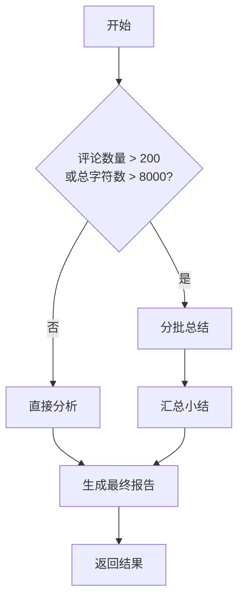
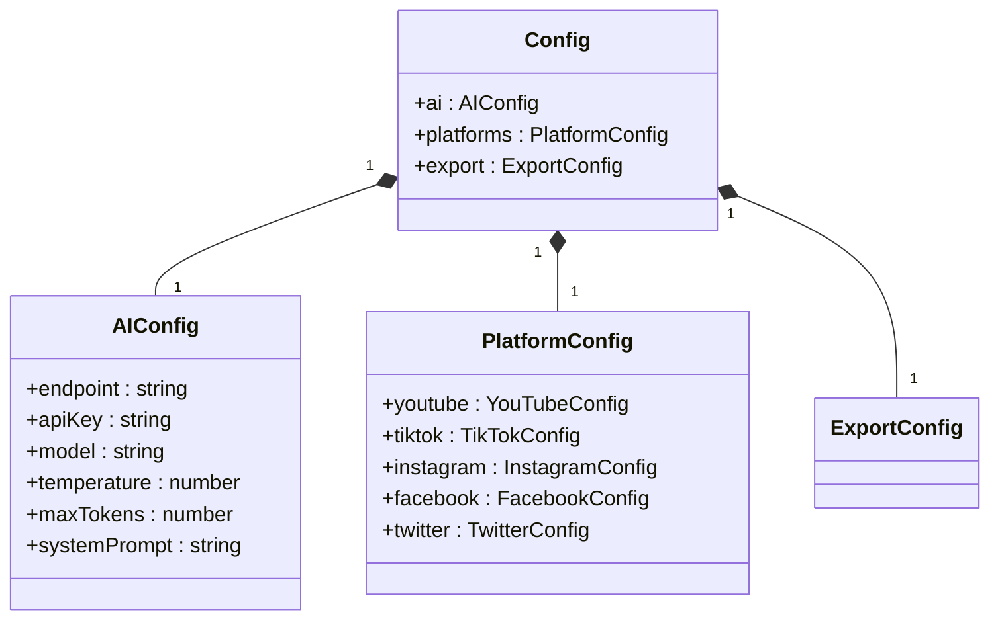
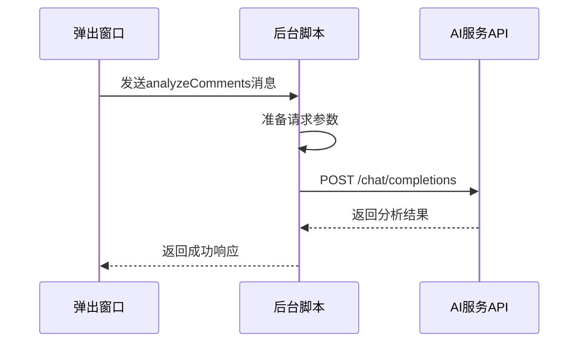
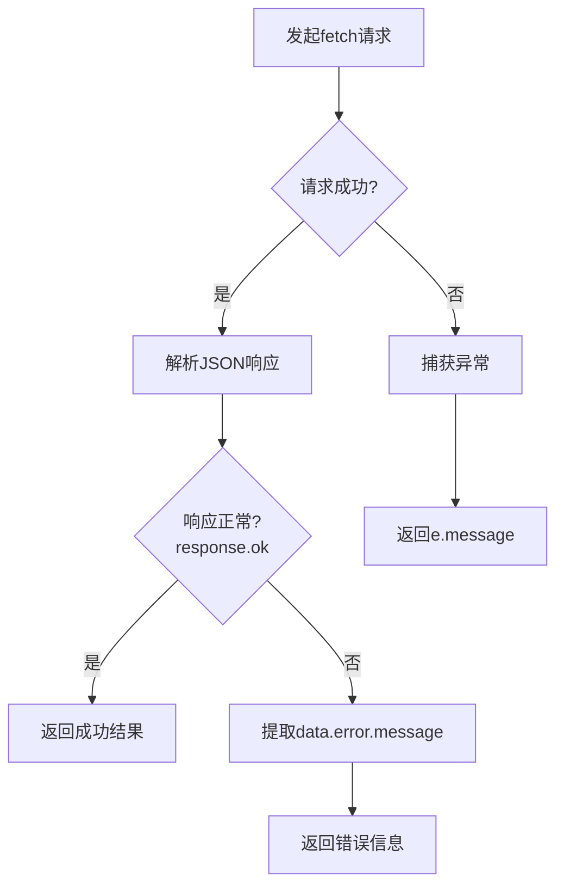
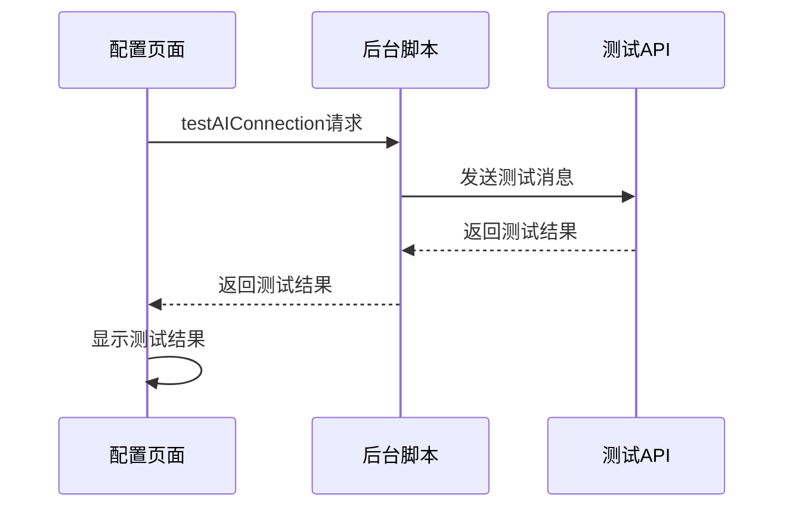

# AI API集成与请求封装

<cite>
**本文档引用的文件**
- [background.js](file://background.js)
- [options.js](file://options.js)
</cite>

## 目录
1. [简介](#简介)
2. [核心功能分析](#核心功能分析)
3. [chatCompletion函数实现细节](#chatcompletion函数实现细节)
4. [错误处理机制](#错误处理机制)
5. [超时与网络异常处理](#超时与网络异常处理)
6. [多平台适配策略](#多平台适配策略)
7. [安全建议与最佳实践](#安全建议与最佳实践)
8. [调试技巧与日志记录](#调试技巧与日志记录)
9. [未来扩展路径](#未来扩展路径)

## 简介
本项目是一个Chrome浏览器扩展，名为"评论洞察"，旨在从主流社交媒体平台提取评论并通过AI进行深度分析。该扩展支持YouTube、TikTok、Instagram、Facebook和Twitter/X等多个平台的评论提取，并使用OpenAI兼容的API进行智能分析，生成结构化的洞察报告。

系统架构采用典型的浏览器扩展模式，包含后台脚本(background.js)、内容脚本(content.js)、弹出窗口(popup.js)、配置页面(options.js)和查看器页面(viewer.js)等组件。其中，AI API通信的核心功能主要集中在后台脚本中，通过`chatCompletion`函数实现与各种AI服务提供商的兼容性通信。

**Section sources**
- [background.js](file://background.js#L1-L686)
- [options.js](file://options.js#L1-L569)

## 核心功能分析
### 评论提取与AI分析流程
系统的主工作流始于用户在社交媒体页面上激活扩展，随后执行以下步骤：首先检测当前所在平台，然后提取相关评论数据，最后通过AI服务对评论进行分析。整个过程由后台脚本统一协调管理。

当用户点击"AI分析"按钮时，系统会调用`analyzeComments`方法，该方法根据评论数量决定是否需要分批处理。对于少量评论（少于200条且总字符数不超过8000），直接进行一次性分析；而对于大量评论，则采用分块总结再汇总的策略，以确保分析质量和性能平衡。

**Diagram sources**
- [background.js](file://background.js#L354-L402)

### 配置管理系统
系统提供了完善的配置管理功能，允许用户自定义AI服务参数和各平台的API设置。配置信息包括AI服务的端点地址、API密钥、模型名称、温度值、最大令牌数以及系统提示词等关键参数。

**Diagram sources**
- [background.js](file://background.js#L1-L686)

## chatCompletion函数实现细节
### 请求构建过程
`chatCompletion`函数是整个系统与AI服务通信的核心，负责构建并发送符合OpenAI API规范的HTTP请求。该函数接收AI配置、消息数组和最大令牌数作为参数，构造出标准的聊天补全请求。

请求的URL由配置中的端点(endpoint)与"/chat/completions"路径拼接而成。例如，默认配置使用"https://api.openai.com/v1"作为端点，最终请求地址为"https://api.openai.com/v1/chat/completions"。

**Diagram sources**
- [background.js](file://background.js#L445-L468)

### 认证与头部设置
在请求头部中，系统设置了两个关键字段：Content-Type和Authorization。Content-Type被设置为"application/json"，表明请求体为JSON格式。Authorization头部采用Bearer Token认证方式，将用户的API密钥以"Bearer {apiKey}"的形式包含在内。

这种认证方式符合OpenAI API的安全规范，确保了每次请求的身份验证。API密钥在配置界面输入后，会被安全地存储在Chrome的本地存储中，并在需要时取出用于构建认证头部。

### JSON请求体结构
请求体包含四个主要参数：model、messages、temperature和max_tokens。其中，model指定使用的AI模型，如"gpt-3.5-turbo"；messages是一个消息数组，包含系统角色(system)和用户角色(user)的消息对象；temperature控制输出的随机性，值越低输出越确定；max_tokens限制生成文本的最大长度。

消息数组的设计遵循对话式AI的标准模式，系统消息用于设定AI的行为准则和角色定位，用户消息则包含实际的分析请求内容。这种结构使得AI能够更好地理解上下文并提供一致的响应。

**Section sources**
- [background.js](file://background.js#L445-L468)

## 错误处理机制
### HTTP状态码解析
系统对HTTP响应的状态码进行了细致的处理。当响应不正常（!response.ok）时，会从响应的JSON数据中提取错误信息。优先使用data.error?.message作为错误描述，若不存在则使用默认的"请求失败"提示。

这种分层的错误信息提取策略确保了用户能够获得尽可能详细的错误原因，有助于快速定位和解决问题。例如，当API密钥无效时，服务器通常会返回具体的错误消息，系统会直接展示这些信息而非笼统的"请求失败"。

### 响应JSON错误字段解析
除了HTTP状态码外，系统还专门处理API返回的JSON格式错误信息。通过解析response.json()得到的数据结构，提取其中的error对象及其message属性，实现了对API层面错误的精准捕获。

对于网络异常等无法获取有效响应的情况，系统通过catch块捕获JavaScript异常，并将其message属性作为错误信息返回。这种全面的错误处理覆盖了从网络层到应用层的各种可能故障。

**Diagram sources**
- [background.js](file://background.js#L445-L468)

## 超时与网络异常处理
### 网络异常捕获
系统通过try-catch结构完整地捕获了fetch请求可能抛出的各种异常。由于fetch API在某些情况下（如网络中断）会返回Promise rejection，这些异常会被catch块捕获并转化为结构化的错误响应。

返回的错误响应包含success:false标识和具体的错误消息，这种统一的响应格式简化了上层调用者的错误处理逻辑。无论错误来自网络层还是API层，调用者都可以通过检查success属性来判断请求是否成功。

### 超时处理现状
值得注意的是，当前实现中并未显式设置请求超时。这意味着请求可能会无限期等待，直到网络层产生超时或连接被中断。这是一个潜在的改进点，可以通过AbortController API来实现可控的请求超时。

虽然缺少主动超时机制，但现代浏览器和网络基础设施通常会有自己的超时策略，因此在实践中不会造成永久挂起的问题。不过，为了提升用户体验和资源利用率，建议在未来版本中添加明确的超时控制。

**Section sources**
- [background.js](file://background.js#L445-L468)

## 多平台适配策略
### OpenAI兼容API支持
系统设计时充分考虑了与多种AI服务提供商的兼容性。通过配置中的endpoint参数，用户可以轻松切换到不同的服务，如Azure OpenAI、Anthropic或其他兼容OpenAI API格式的服务。

对于Azure OpenAI，用户只需将endpoint设置为类似"https://your-resource.openai.azure.com/openai/deployments/your-deployment"的URL，并相应调整模型名称即可。这种灵活性使用户可以根据成本、性能或地域等因素选择最适合的AI服务。

### 本地部署模型适配
支持本地部署的AI模型是另一个重要特性。用户可以将endpoint指向本地运行的API服务，如通过Ollama、LocalAI或其他开源框架部署的模型服务。只要这些服务实现了与OpenAI API兼容的接口，就可以无缝集成到本系统中。

这种架构设计体现了良好的抽象层次，将AI服务的具体实现细节与业务逻辑分离，使得系统具有很强的可扩展性和适应性。用户无需修改代码，仅通过配置即可使用不同来源的AI能力。

**Section sources**
- [background.js](file://background.js#L445-L468)
- [options.js](file://options.js#L282-L389)

## 安全建议与最佳实践
### 密钥隔离策略
API密钥的安全存储是系统的重要考量。本扩展利用Chrome的storage.local API来保存配置信息，这比在前端JavaScript中硬编码密钥要安全得多。storage.local提供了沙箱化的存储空间，防止其他网站访问敏感信息。

尽管如此，仍建议用户遵循最小权限原则，为本扩展创建专用的API密钥，并定期轮换密钥。同时，避免在公共计算机上使用此扩展，以防密钥被恶意软件窃取。

### 速率限制应对
系统目前没有内置的重试退避机制，这可能在遇到速率限制时导致请求失败。建议用户合理配置请求频率，避免短时间内发送过多请求。对于商业用途，可以考虑在后台脚本中实现指数退避重试算法。

此外，通过分析不同服务提供商的速率限制策略，用户可以调整maxTokens等参数来优化请求大小，从而在限额内获得更好的使用体验。监控API使用情况并设置预警也是推荐的做法。

**Section sources**
- [background.js](file://background.js#L445-L468)
- [options.js](file://options.js#L282-L389)

## 调试技巧与日志记录
### 请求日志记录
系统在关键位置添加了console.log语句，用于记录重要的操作和状态变化。例如，在开始AI分析时会输出"开始AI分析评论"，在处理消息时会记录收到的消息内容。这些日志对于诊断问题非常有帮助。

开发者可以通过打开Chrome的开发者工具，切换到Console面板来查看这些日志信息。结合Network面板，可以全面了解请求的发送和响应过程，包括请求头、请求体和响应数据等详细信息。

### 连接测试功能
配置页面提供了"测试AI连接"功能，允许用户验证当前配置的有效性。该功能发送一个简单的测试请求到AI服务，如果成功则返回连接成功的确认信息，否则显示具体的错误原因。

这个功能极大地简化了故障排除过程，用户无需进行完整的分析流程就能确认基本连接是否正常。它也是配置新AI服务时的必要验证步骤，确保所有参数都正确无误。

**Diagram sources**
- [background.js](file://background.js#L485-L530)
- [options.js](file://options.js#L282-L331)

## 未来扩展路径
### SSE流式传输支持
虽然当前实现未启用流式响应，但架构上已为未来支持SSE(Server-Sent Events)流式传输预留了可能性。通过修改fetch请求的处理方式，监听response.body的ReadableStream，可以实现实时的文本生成效果。

流式传输不仅能提供更好的用户体验（即时看到部分结果），还能减少内存占用，因为不需要等待整个响应完成就可以开始处理。这对于长篇分析报告尤其有价值，用户可以在AI写作的同时就开始阅读已生成的部分。

### 增强的错误恢复机制
未来的改进方向还包括增强的错误恢复机制，如自动重试、断点续传等。特别是在处理大量评论的分批分析时，如果某个批次失败，系统应该能够只重试失败的部分而不是重新开始整个过程。

此外，可以引入更智能的降级策略，当首选AI服务不可用时自动切换到备用服务，提高系统的可靠性和可用性。这些高级功能将进一步提升产品的专业性和用户体验。

**Section sources**
- [background.js](file://background.js#L445-L468)
- [options.js](file://options.js#L282-L389)