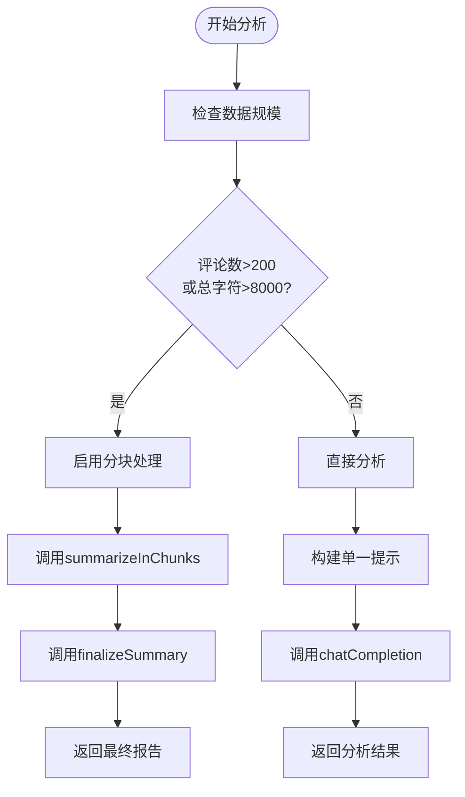
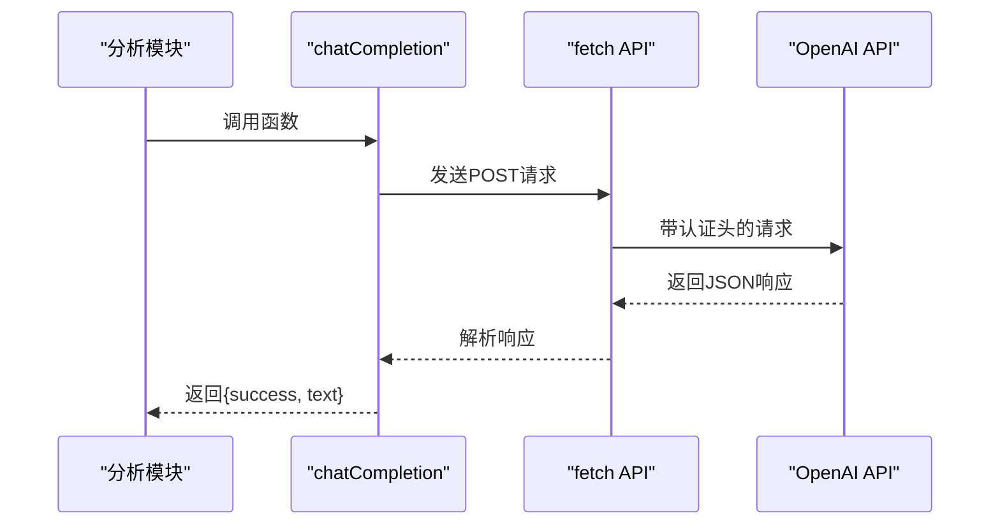

# AI分析

<cite>
**本文档引用的文件**
- [background.js](file://background.js)
- [popup.js](file://popup.js)
</cite>

## 目录
1. [AI分析模块概述](#ai分析模块概述)
2. [分块处理机制](#分块处理机制)
3. [大文本分块策略与缓冲区管理](#大文本分块策略与缓冲区管理)
4. [HTTP请求封装实现](#http请求封装实现)
5. [最终报告合并机制](#最终报告合并机制)
6. [提示词设计原理](#提示词设计原理)
7. [情感分析与主题识别实现](#情感分析与主题识别实现)
8. [结构化解析局限性](#结构化解析局限性)
9. [调试与性能优化](#调试与性能优化)

## AI分析模块概述

CommentInsight扩展的AI驱动分析模块通过`analyzeComments`函数实现对社交媒体评论的智能分析。该函数作为后台服务的核心功能，接收从各个平台提取的评论数据，并根据配置调用AI模型生成结构化分析报告。

当用户在弹出窗口中点击"AI分析"按钮时，`CommentInsightPopup.analyzeComments`方法被触发，向后台脚本发送`analyzeComments`消息。后台脚本的`handleMessage`方法接收到此消息后，调用`analyzeComments`函数执行实际的分析任务。

分析过程首先验证AI API密钥的有效性，然后根据评论数量和总文本长度决定是否启用分块处理。对于较小的数据集，系统直接将所有评论拼接成单个提示发送给AI模型；对于较大的数据集，则采用分批总结再汇总的策略，确保分析质量和API调用效率。

**Section sources**
- [background.js](file://background.js#L354-L402)
- [popup.js](file://popup.js#L239-L275)

## 分块处理机制

`analyzeComments`函数通过双重判断标准自动决定是否启用分块处理（summarizeInChunks）。系统同时考虑评论数量和文本总长度两个维度：

**Diagram sources**
- [background.js](file://background.js#L354-L402)

**Section sources**
- [background.js](file://background.js#L354-L402)

## 大文本分块策略与缓冲区管理

`summarizeInChunks`函数实现了精细的大文本分块策略，通过字符计数和缓冲区管理确保每个数据块的大小适中。算法维护一个动态缓冲区（buffer）和字符计数器（charCount），逐条处理评论并进行实时大小评估。

当添加新评论会导致总字符数超过8000的限制且缓冲区非空时，系统将当前缓冲区内容作为一个数据块保存，并重置缓冲区和计数器。这种贪心算法确保了数据块的合理分割，避免了单个数据块过大导致API调用失败的风险。

分块完成后，系统对每个数据块分别调用AI模型生成小结，使用专门优化的提示模板提炼要点、情感比例、主题和显著现象。这种方法不仅提高了大型评论集的处理能力，还通过分而治之的策略提升了分析的准确性和效率。

**Section sources**
- [background.js](file://background.js#L404-L433)

## HTTP请求封装实现

`chatCompletion`函数封装了OpenAI兼容接口的HTTP请求，实现了完整的API调用流程。该函数接受AI配置、消息数组和最大令牌数作为参数，构建符合OpenAI API规范的请求。

认证头设置方面，函数在请求头中包含`Authorization: Bearer ${apiKey}`，确保请求的身份验证。请求体构建遵循OpenAI的JSON格式要求，包含模型名称、消息数组、温度值和最大令牌数等关键参数。

尽管代码中未显式实现流式响应处理，但其异步Promise结构为未来支持流式响应提供了良好的基础。函数返回一个包含成功状态和响应文本的对象，便于调用方进行错误处理和结果提取。

**Diagram sources**
- [background.js](file://background.js#L445-L468)

**Section sources**
- [background.js](file://background.js#L445-L468)

## 最终报告合并机制

`finalizeSummary`函数负责将多个小结合并为最终报告，解决信息重复问题。该函数接收分块分析产生的所有小结数组，通过精心设计的提示模板引导AI模型进行整合。

提示词明确要求"避免重复，提供最终可执行建议"，并指定了统一的输出结构。系统将每个小结标记为【小结1】、【小结2】等，帮助AI模型识别不同来源的信息。这种方法利用了大语言模型的上下文理解能力，实现了高质量的信息融合。

合并过程本身也是一次AI调用，确保了最终报告的一致性和专业性。通过这种方式，CommentInsight能够在处理大规模评论数据时保持分析质量，同时避免了简单拼接导致的内容冗余和逻辑断裂。

**Section sources**
- [background.js](file://background.js#L435-L443)

## 提示词设计原理

系统提示词（systemPrompt）和用户提示词的设计体现了专业的分析框架。默认系统提示词"你是一个专业的社交媒体评论分析师"确立了AI的角色定位，引导其以专业分析师的视角进行思考。

用户提示词采用结构化模板，强制要求特定的输出格式：
- ## 关键洞察：总结主要发现
- ## 情感分析：量化正面、中性、负面情感比例
- ## 主要主题：列出并描述核心话题
- ## 显著趋势：识别模式和变化
- ## 建议：提供可执行的洞察

这种设计确保了输出的一致性和可解析性，即使在不同AI模型间切换也能获得相似格式的结果。提示词中的具体格式要求减少了AI的自由发挥空间，提高了分析结果的可靠性和实用性。

**Section sources**
- [background.js](file://background.js#L354-L402)

## 情感分析与主题识别实现

情感分析、主题识别和趋势总结的具体实现路径完全依赖于AI模型的自然语言处理能力。系统通过精心设计的提示词模板，引导AI模型在一次调用中完成多项分析任务。

情感分析以百分比形式呈现，要求AI估算正面、中性、负面情感的比例。主题识别采用编号列表格式，确保主要话题的清晰呈现。趋势总结则关注评论中的模式和变化，提供更深层次的洞察。

这些分析结果的生成不依赖于本地算法，而是充分利用了现代大语言模型在文本理解和语义分析方面的强大能力。通过这种方式，CommentInsight能够提供远超简单关键词匹配的深度分析。

**Section sources**
- [background.js](file://background.js#L354-L402)

## 结构化解析局限性

`extractSummaryFromAnalysis`函数揭示了当前实现的一个重要局限性：结构化解析能力较弱。目前该函数仅返回空的摘要对象，没有实现真正的文本解析。

这一设计表明，系统目前主要依赖AI模型直接生成格式化的Markdown输出，而不是对自由格式文本进行后期解析。虽然这简化了实现，但也带来了风险——如果AI模型偏离了预期格式，系统将无法正确提取结构化数据。

改进方向包括实现基于正则表达式的解析器，或使用更先进的文本处理技术来提取关键信息。此外，可以考虑引入JSON模式约束，强制AI模型输出结构化JSON而非自由格式文本，从而提高数据提取的可靠性。

**Section sources**
- [background.js](file://background.js#L470-L483)

## 调试与性能优化

系统提供了多种调试技巧和性能优化措施。在配置页面中，用户可以测试AI连接，验证API密钥的有效性。速率限制应对主要通过分块处理实现，将大型请求分解为多个较小请求，降低单次调用的资源消耗。

模型切换支持体现在配置系统的灵活性上，用户可以自由更改AI模型名称，系统会相应调整API调用参数。这种设计允许用户在不同性能和成本的模型间切换，如从gpt-3.5-turbo切换到更强大的gpt-4。

性能方面，系统通过合理的分块策略平衡了分析质量和响应速度。对于小型评论集，直接分析确保了低延迟；对于大型评论集，分块处理虽然增加了总处理时间，但保证了分析的可行性和稳定性。

**Section sources**
- [background.js](file://background.js#L500-L543)
- [options.js](file://options.js#L280-L325)