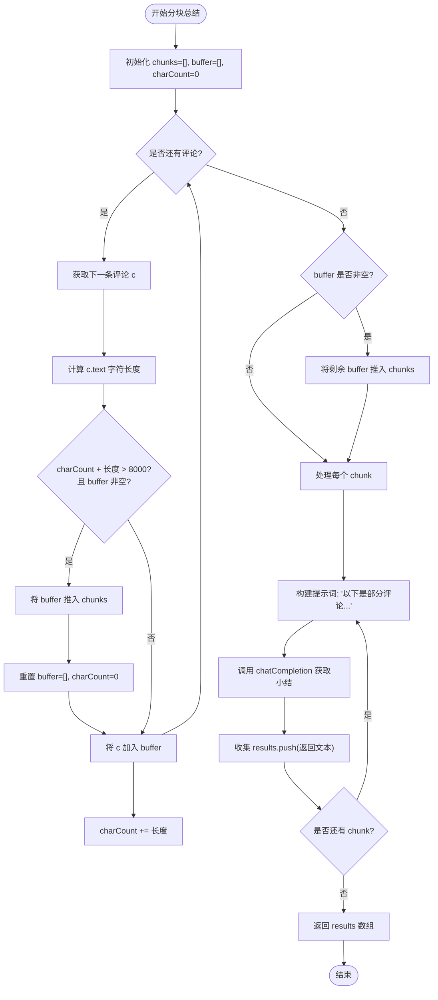

# 分块处理机制

<cite>
**本文档引用的文件**
- [background.js](file://background.js)
</cite>

## 目录
1. [分块处理策略概述](#分块处理策略概述)
2. [缓冲区管理与字符计数逻辑](#缓冲区管理与字符计数逻辑)
3. [分块后局部总结执行流程](#分块后局部总结执行流程)
4. [性能与成本影响分析](#性能与成本影响分析)
5. [调试建议与日志输出](#调试建议与日志输出)
6. [极端情况下的潜在问题与优化方向](#极端情况下的潜在问题与优化方向)

## 分块处理策略概述

`summarizeInChunks` 方法是 CommentInsight 扩展中用于处理大规模评论集的核心机制。当评论数量超过 200 条或总字符数超过 8000 时，系统会自动启用该方法以避免单次 AI 请求超出上下文窗口限制。

该方法通过动态划分评论数据实现高效处理：将原始评论数组按字符长度（每 chunk 不超过约 8000 字符）和评论条数进行分组，形成多个较小的数据块（chunks）。每个 chunk 独立提交给 AI 模型进行局部总结，从而确保每次请求都在模型的上下文容量范围内。

此策略有效解决了长文本输入导致的 API 超限问题，同时保持了对整体评论集合的全面覆盖。

**Section sources**
- [background.js](file://background.js#L404-L433)

## 缓冲区管理与字符计数逻辑

在 `summarizeInChunks` 方法中，采用了基于累加器的缓冲区管理机制来精确控制每个数据块的大小：

- **`buffer` 数组**：临时存储当前正在构建的评论块。
- **`charCount` 变量**：实时累计当前 buffer 中所有评论文本的总字符数。
- **`LIMIT = 8000`**：设定单个 chunk 的最大字符限制。

每当遍历一条新评论时，系统首先检查将其加入当前 buffer 是否会导致总字符数超过 LIMIT。如果“是”且 buffer 非空，则立即关闭当前 chunk，将其推入结果数组 `chunks`，并重置 buffer 和 charCount 开始新的分块。否则，直接将该评论加入 buffer 并更新 charCount。

特别地，即使某条评论本身接近甚至略微超过 8000 字符，系统仍会将其单独作为一个 chunk 处理，保证不丢失任何评论内容。

**Section sources**
- [background.js](file://background.js#L404-L433)

## 分块后局部总结执行流程

完成分块后，系统为每个 chunk 生成独立提示词并调用 `chatCompletion` 接口执行局部总结：

1. 对每个 chunk 内的评论使用 `- ${c.text}` 格式拼接成多行字符串；
2. 构造专用 prompt：“以下是部分评论，请提炼要点，输出小结（要点、情感比例、主题与显著现象）”；
3. 调用 `chatCompletion` 发起 AI 请求，其中 max_tokens 动态设置为 `Math.max(512, Math.min(2048, aiConfig.maxTokens || 2000))`，确保响应长度适中；
4. 收集各 chunk 的返回结果，形成 partials 数组供后续汇总使用。

这一流程实现了并行化潜力（理论上可并发请求），但由于当前实现为同步循环，实际为串行处理。

**Diagram sources**
- [background.js](file://background.js#L404-L433)

**Section sources**
- [background.js](file://background.js#L404-L433)

## 性能与成本影响分析

分块处理机制显著提升了系统的稳定性与可用性，但也带来了以下性能与成本方面的权衡：

- **优点**：
  - 成功规避了大文本输入引发的上下文溢出错误；
  - 提高了请求成功率，增强了用户体验；
  - 支持无限扩展的评论规模（理论上仅受限于内存）。

- **缺点**：
  - 多次 AI 请求增加了总体延迟，尤其是串行执行模式下；
  - 请求次数线性增长导致 API 成本上升；
  - 局部总结可能遗漏跨块语义关联，影响最终汇总质量。

因此，在高吞吐场景下需谨慎评估成本效益比，并考虑引入缓存、批处理压缩等优化手段。

**Section sources**
- [background.js](file://background.js#L404-L433)

## 调试建议与日志输出

为了便于监控和排查分块行为，建议添加如下调试信息：

- 在每次 push chunk 前输出日志：`console.log('分块边界触发', { charCount, commentCount: buffer.length });`
- 记录每个 chunk 的实际字符长度与评论数量；
- 统计总请求数、平均响应时间及失败率；
- 提供配置项允许开发者开启/关闭详细日志模式。

这些措施有助于识别异常分块行为（如过小 chunk）、评估负载分布均衡性，并为后续优化提供数据支持。

**Section sources**
- [background.js](file://background.js#L404-L433)

## 极端情况下的潜在问题与优化方向

尽管当前分块策略已较为稳健，但在极端情况下仍存在改进空间：

### 潜在问题
- 单条评论极长（>8000 字符）可能导致单个请求仍超限；
- 分块边界切割不当可能破坏语义完整性；
- 串行请求造成不必要的等待时间。

### 优化方向
1. **智能切分长评论**：对超长评论进一步按句子或段落拆分，结合标点符号保留语义单元；
2. **异步并发处理**：利用 Promise.all 实现 chunk 级别并行请求，大幅降低总耗时；
3. **动态 LIMIT 调整**：根据模型实际支持的最大 token 数动态估算安全阈值，而非固定 8000 字符；
4. **两级缓存机制**：对相同或相似评论集的结果进行缓存，减少重复请求；
5. **增量式总结**：引入滑动窗口机制，在相邻 chunk 间保留少量重叠评论以增强上下文连贯性。

通过上述优化，可在保障稳定性的前提下进一步提升效率与分析质量。

**Section sources**
- [background.js](file://background.js#L404-L433)