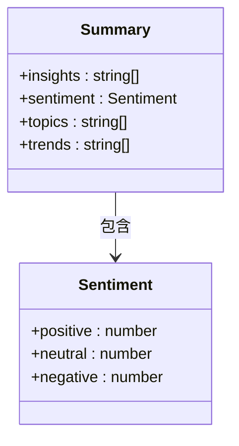
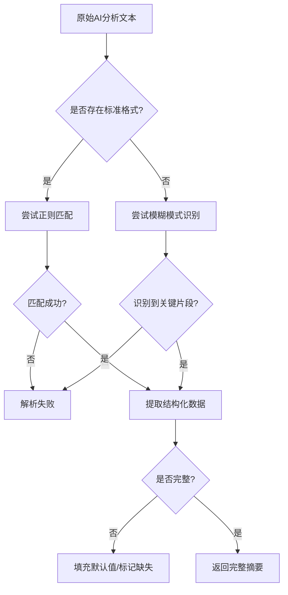

# 分析结果结构化解析

<cite>
**Referenced Files in This Document **  
- [background.js](file://background.js)
- [viewer.js](file://viewer.js)
</cite>

## 目录
1. [函数设计现状与局限性](#函数设计现状与局限性)  
2. [空模板返回原因分析](#空模板返回原因分析)  
3. [预期输出格式解析](#预期输出格式解析)  
4. [非结构化文本提取挑战](#非结构化文本提取挑战)  
5. [可行解析方案对比](#可行解析方案对比)  
6. [未来迭代路线图](#未来迭代路线图)

## 函数设计现状与局限性

`extractSummaryFromAnalysis` 函数目前作为评论洞察扩展的核心数据处理模块，其主要职责是从AI生成的原始分析文本中提取结构化摘要信息。该函数位于 `background.js` 文件中，是后台服务逻辑的一部分，负责将非结构化的自然语言分析结果转换为前端可消费的标准化数据格式。

当前实现采用最简化的占位符策略：无论输入何种分析文本，均返回一个预定义的空模板对象。这种设计虽保证了接口调用的稳定性（避免因解析失败导致异常），但完全依赖外部机制完成实际的数据抽取工作，自身并未集成任何实质性的解析逻辑。

从架构角度看，此函数处于数据流的关键路径上——上游接收来自LLM的自由格式文本，下游供给 `viewer.js` 中的UI组件进行可视化展示。然而，由于缺乏内聚的解析能力，系统整体对第三方处理方式产生了强耦合，降低了模块独立性和可维护性。

**Section sources**  
- [background.js](file://background.js#L470-L483)

## 空模板返回原因分析

`extractSummaryFromAnalysis` 函数返回空模板的根本原因在于其实现尚未集成有效的文本解析机制。根据代码注释“简单的文本解析来提取关键信息，在实际应用中可以使用更复杂的解析逻辑”，开发者明确意识到当前版本仅为临时方案，真正的语义提取功能需后续补充。

具体而言，函数体内部未包含任何正则表达式匹配、关键词识别或模式扫描逻辑，也未调用外部NLP工具或小型语言模型来进行结构化转换。相反，它直接构造并返回了一个静态的默认对象，其中各字段值均为初始状态（如情感比例全为0，主题和趋势列表为空数组）。

这一设计选择反映了项目现阶段的技术权衡：优先确保系统基础流程畅通，将复杂的数据解析任务推迟至后期优化阶段。虽然规避了早期开发中的不确定性风险，但也导致当前版本无法真正利用AI分析结果的价值，限制了产品的核心功能表现。

**Section sources**  
- [background.js](file://background.js#L470-L483)

## 预期输出格式解析

尽管当前函数仅返回空模板，但从其结构可推断出系统期望的结构化输出应包含以下四个核心维度：

### 关键洞察（Insights）
用于呈现从评论集合中提炼出的重要发现，通常以要点形式列出。例如：“用户普遍反映产品启动速度慢”、“多个用户建议增加夜间模式”。

### 情感比例（Sentiment Distribution）
量化不同情绪倾向的评论占比，支持多分类统计：
- 正面情感（positive）
- 中性情感（neutral）
- 负面情感（negative）

此类数据常用于绘制饼图或柱状图，帮助用户快速把握舆论基调。

### 主题列表（Topics）
归纳高频讨论话题，形成标签化集合。如“性能问题”、“界面设计”、“价格反馈”等，便于后续按主题筛选和深入分析。

### 趋势分析（Trends）
识别随时间演变的观点变化，揭示新兴关注点或满意度走势。例如“关于电池续航的负面评价在过去两周上升了40%”。

这些字段共同构成了一个多维分析视图，旨在将海量非结构化评论转化为易于理解的业务洞察。

**Diagram sources **  
- [background.js](file://background.js#L470-L483)

## 非结构化文本提取挑战

从AI生成的自由格式回复中可靠地提取上述结构化数据面临多重技术挑战：

### 格式偏差（Format Variability）
LLM输出缺乏统一规范，同一类信息可能以多种方式表述。例如情感统计既可能写成“正面评价占60%”，也可能表达为“在100条评论中，60条持积极态度”。这种多样性使得固定规则难以覆盖所有情况。

### 语言变异（Linguistic Variation）
自然语言本身具有高度灵活性，同义替换、句式变换、修辞手法等都会影响关键词匹配效果。如“用户体验不佳”与“使用体验不理想”语义相近但字面不同，传统正则难以准确捕捉。

### 缺失字段（Missing Fields）
AI模型可能因输入不足或推理失误而遗漏某些分析维度。例如未提及具体情感分布数值，或跳过趋势分析部分。解析器必须具备容错能力，不能因个别字段缺失而导致整体解析失败。

### 上下文依赖（Context Dependency）
某些信息的理解依赖于上下文。例如“这个功能很糟糕”需结合前文才能确定“这个功能”指代的具体模块。脱离语境的孤立解析容易产生歧义。

### 多语言混合
实际评论可能涉及中英文混杂或其他语言变体，进一步增加词法分析难度。

这些问题共同导致基于规则的解析方法鲁棒性较差，难以应对真实场景下的复杂文本。

**Diagram sources **  
- [background.js](file://background.js#L470-L483)

## 可行解析方案对比

针对上述挑战，以下是三种可行的结构化解析方案及其优劣分析：

### 方案一：基于正则表达式的模式匹配

利用正则表达式定义一系列规则来捕获特定信息模式。例如：
- 情感比例：`/正面[:：]?\s*(\d+)%/`
- 主题标签：`/\*+\s*主题[:：]\s*([^\n]+)/`

**优点**：
- 实现简单，性能开销低
- 易于调试和维护规则集
- 不依赖外部服务，运行环境要求低

**缺点**：
- 规则覆盖率有限，难以应对语言变异
- 维护成本随规则数量增长而显著上升
- 对格式偏差敏感，健壮性差

**适用场景**：当AI输出格式相对稳定且可控时可作为轻量级解决方案。

### 方案二：使用小型LLM进行结构化转换

引入专用的小型语言模型（如TinyBERT、DistilGPT等），将其作为“结构化翻译器”，将自由文本转换为JSON格式输出。

**优点**：
- 具备较强的语言理解能力，适应性强
- 可处理复杂语义和上下文依赖
- 易于扩展新字段类型

**缺点**：
- 推理延迟较高，影响响应速度
- 需额外部署模型服务，增加运维复杂度
- 存在幻觉风险，需后处理验证

**适用场景**：对解析准确性要求高且能接受一定延迟的离线批处理场景。

### 方案三：采用JSON mode输出

修改上游AI调用逻辑，要求模型直接以JSON格式输出分析结果。现代LLM（如GPT-4o、Claude 3）已支持强制JSON输出模式，确保语法正确性。

**优点**：
- 输出天然结构化，无需额外解析
- 数据完整性高，字段齐全
- 性能最优，零解析开销

**缺点**：
- 依赖LLM厂商的JSON mode支持
- 错误提示不够友好，调试困难
- 模型可能生成不符合schema的字段

**适用场景**：理想方案，适用于支持结构化输出的新一代AI API。

| 方案 | 准确性 | 维护成本 | 性能开销 | 实施难度 |
|------|--------|----------|-----------|------------|
| 正则匹配 | 低 | 高 | 极低 | 低 |
| 小型LLM转换 | 高 | 中 | 高 | 中 |
| JSON mode | 极高 | 极低 | 极低 | 中 |

**Section sources**  
- [background.js](file://background.js#L470-L483)

## 未来迭代路线图

为实现稳定高效的数据抽取能力，建议按照以下阶段推进迭代：

### 第一阶段：增强正则解析（短期）
- 构建覆盖常见表述模式的正则规则库
- 引入模糊匹配机制提升容错能力
- 添加日志记录以便监控解析成功率

目标：在不改变现有架构的前提下，提升基础解析能力至可用水平。

### 第二阶段：引入JSON mode（中期）
- 修改AI请求接口，启用JSON schema约束
- 定义严格的输出结构规范
- 实现自动校验与降级机制

目标：从根本上解决格式混乱问题，大幅提高数据可靠性。

### 第三阶段：构建混合解析引擎（长期）
- 设计分层解析架构：优先尝试JSON解析，失败后回退至规则+小型LLM组合
- 建立解析质量评估体系
- 支持动态更新解析策略

目标：打造高鲁棒性、自适应的智能解析管道，适应多样化输入源。

通过以上路线图的逐步实施，可有效提升 `extractSummaryFromAnalysis` 函数的实际价值，使其从一个空壳接口演变为真正具备语义理解能力的核心组件，从而全面释放AI分析结果的商业潜力。

**Section sources**  
- [background.js](file://background.js#L470-L483)