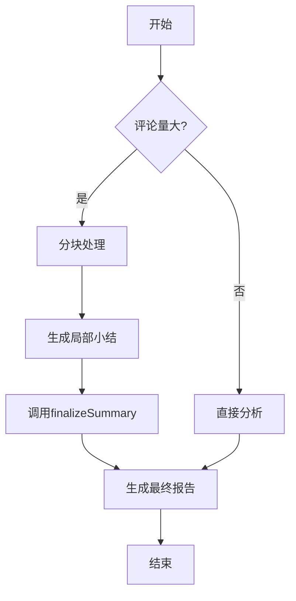

# 最终报告汇总逻辑

<cite>
**本文档引用的文件**
- [background.js](file://background.js)
- [options.js](file://options.js)
</cite>

## 目录
1. [简介](#简介)
2. [核心组件分析](#核心组件分析)
3. [汇总流程架构](#汇总流程架构)
4. [输入格式设计与结构识别](#输入格式设计与结构识别)
5. [系统提示词的作用机制](#系统提示词的作用机制)
6. [输出格式约束与一致性保障](#输出格式约束与一致性保障)
7. [上下文压缩风险与信息损失](#上下文压缩风险与信息损失)
8. [改进方案建议](#改进方案建议)

## 简介
本项目为社交媒体评论洞察扩展，其核心功能是通过AI模型对大量用户评论进行智能分析。当评论数量较大时，系统采用分块处理策略：先将评论切分为多个批次并生成局部小结，再调用`finalizeSummary`函数将这些小结合并为统一的最终分析报告。该过程涉及复杂的提示工程、上下文管理与结构化输出控制，是决定整体分析质量的关键环节。

## 核心组件分析

`finalizeSummary`函数作为多阶段分析流程的收尾步骤，承担着整合分散信息、消除冗余、提炼关键洞察的重要职责。该函数接收由`summarizeInChunks`方法生成的多个局部小结（partials），并通过构造特定格式的用户提示（prompt）和系统提示（systemPrompt），引导AI模型完成跨段落综合任务。

该函数不仅负责最终报告的生成，还通过严格的错误处理机制确保流程稳定性。若AI服务返回失败状态或无有效响应，函数会抛出明确异常，防止不完整或错误的数据进入后续处理流程。

**Section sources**
- [background.js](file://background.js#L435-L443)

## 汇总流程架构

整个分析流程遵循“检测→提取→分块总结→最终汇总”的工作流。对于大规模评论集（超过200条或总字符数超8000），系统自动启用分批处理模式：

1. **评论提取**：根据平台类型使用API或DOM解析获取原始评论数据
2. **分块处理**：按约8000字符限制将评论划分为若干批次
3. **局部总结**：对每个批次独立调用AI模型生成小结
4. **最终汇总**：调用`finalizeSummary`合并所有小结

此架构有效规避了单次请求的上下文长度限制，同时保持了分析的可扩展性。

**Diagram sources**
- [background.js](file://background.js#L364-L385)
- [background.js](file://background.js#L404-L433)

## 输入格式设计与结构识别

`finalizeSummary`函数精心设计了输入提示的结构，以增强AI模型对多源小结的识别与理解能力。具体体现在以下两个层面：

### 结构化标记
通过为每个小结添加【小结1】、【小结2】等序号化标签，显式地向模型传达这是多个独立片段的集合。这种标记方式具有以下优势：
- 提供清晰的边界分割，帮助模型识别不同来源
- 维持处理顺序，保留潜在的时间或逻辑序列信息
- 增强可读性，便于人工调试与验证

### 上下文构建
完整的用户提示包含三个关键部分：
1. 任务指令：“将以下分批小结合并为一份完整的分析报告”
2. 多个小结内容：经结构化标记的输入数据
3. 输出格式要求：明确规定最终报告的组织形式

这种三段式结构符合认知科学中的“指令-数据-期望”模式，显著提升了模型的理解准确率。

**Section sources**
- [background.js](file://background.js#L435-L443)

## 系统提示词的作用机制

系统提示词（systemPrompt）在跨段落综合中扮演着至关重要的角色。它定义了AI模型的角色定位与行为准则，即“你是一个专业的社交媒体评论分析师”。这一设定产生了以下几个关键影响：

### 角色锚定效应
通过明确指定专业身份，使模型从通用对话模式切换到专业分析模式，激活相关知识图谱与推理能力。

### 分析框架预设
系统提示隐含了结构化输出的预期，配合用户提示中的具体格式要求，共同构建了一个完整的分析框架，指导模型如何组织信息。

### 冗余消除导向
作为专业分析师，模型被期望具备去重、归纳与提炼的能力，这正是`finalizeSummary`需要实现的核心功能——避免重复，提供可执行建议。

值得注意的是，系统提示在配置文件中被统一管理，并可通过选项页面进行自定义，体现了良好的可配置性设计。

**Section sources**
- [background.js](file://background.js#L35)
- [options.js](file://options.js#L107)

## 输出格式约束与一致性保障

为了确保最终报告的机器可读性与用户体验一致性，`finalizeSummary`严格规定了输出结构。该结构包含五个标准化部分：

- **关键洞察**：浓缩最重要的发现
- **情感分析**：量化正面、中性、负面情感比例
- **主要主题**：列出前三大主题及其描述
- **显著趋势**：识别评论中的模式与变化
- **建议**：提供基于分析结果的可执行建议

这种强制性的输出模板不仅便于前端解析展示，也保证了不同分析任务间的结果可比性。即使底层AI模型存在波动，输出格式的一致性仍能维持产品体验的稳定。

**Section sources**
- [background.js](file://background.js#L435-L443)

## 上下文压缩风险与信息损失

尽管分块-汇总架构解决了长文本处理问题，但也引入了潜在的信息损失风险：

### 上下文割裂
分块处理可能导致语义连续的评论被强行分割，影响局部小结的质量，进而波及最终汇总效果。

### 二次误差累积
每一轮AI调用都存在一定的不确定性，分块总结与最终汇总两次调用可能造成误差叠加，降低整体准确性。

### 权重失衡
当前方法默认各小结权重相等，无法体现某些高价值评论块（如包含极端情绪或关键意见领袖观点）应具有的更高影响力。

这些问题在处理高度异质化的评论数据时尤为突出，可能导致重要信号被稀释或误判。

**Section sources**
- [background.js](file://background.js#L435-L443)

## 改进方案建议

针对现有架构的局限性，提出以下优化方向：

### 引入注意力权重机制
在汇总阶段为每个小结分配动态权重，依据其信息密度、情感强度或话题新颖度进行加权融合，提升关键信息的保留率。

### 实施两阶段聚合策略
第一阶段进行主题聚类，将相似小结先行合并；第二阶段再对聚类结果进行全局整合。这种方式更贴近人类分析师的思维过程，有助于提高逻辑连贯性。

### 增强反馈闭环
将最终报告的部分内容反哺至局部小结生成阶段，形成迭代优化循环。例如，利用已识别的主要主题指导后续小结的提炼重点。

### 支持增量更新
设计支持追加分析的接口，允许在新增评论后仅对新数据进行处理并更新原有报告，而非全量重算，提升效率与实时性。

这些改进可在不改变整体架构的前提下，显著提升汇总精度与分析深度。