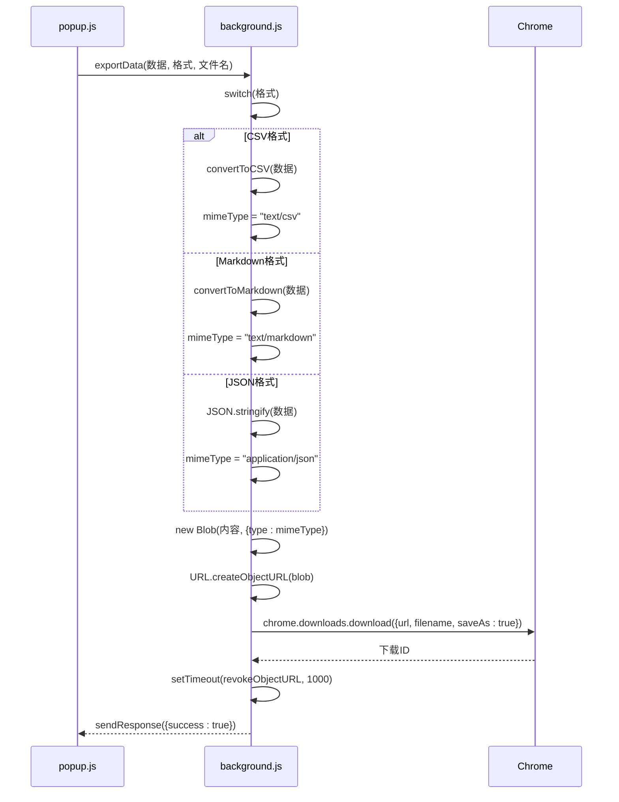

# CSV格式导出

<cite>
**Referenced Files in This Document**   
- [background.js](file://background.js)
- [popup.js](file://popup.js)
</cite>

## 目录
1. [CSV导出机制概述](#csv导出机制概述)
2. [数据转换流程](#数据转换流程)
3. [安全单元格处理](#安全单元格处理)
4. [主导出流程](#主导出流程)
5. [异常处理与最佳实践](#异常处理与最佳实践)

## CSV导出机制概述

CommentInsight扩展通过后台脚本中的`exportData`方法实现CSV格式的数据导出功能。该机制遵循RFC 4180标准，将评论数据转换为结构化文本文件，并利用Chrome下载API完成文件保存。整个过程包含数据验证、格式转换、Blob构造和临时资源清理等关键步骤。

**Section sources**
- [background.js](file://background.js#L577-L689)
- [popup.js](file://popup.js#L425-L545)

## 数据转换流程

### 表头定义与数据行生成

`convertToCSV`函数负责将评论数据对象转换为符合RFC 4180标准的CSV文本。首先对输入数据进行有效性验证，确保`comments`字段存在且为数组类型，否则抛出"无效的评论数据"错误。

表头行由固定的中文字段组成：['作者', '内容', '时间戳', '点赞数', '回复数']，通过逗号连接形成首行。数据行则通过映射评论数组生成，每条评论被转换为包含五个字段的数组：
- 作者：调用`safeCsvCell`处理作者名称
- 内容：调用`safeCsvCell`处理评论内容
- 时间戳：调用`safeCsvCell`处理时间信息
- 点赞数：直接使用数字值或默认0
- 回复数：直接使用数字值或默认0

所有字段通过`join(',')`方法合并为一行，最终将表头和所有数据行用换行符连接返回完整CSV内容。

```mermaid
flowchart TD
Start([开始]) --> ValidateInput["验证输入数据"]
ValidateInput --> InputValid{"数据有效?"}
InputValid --> |否| ThrowError["抛出'无效的评论数据'错误"]
InputValid --> |是| DefineHeaders["定义表头: 作者,内容,时间戳,点赞数,回复数"]
DefineHeaders --> ProcessComments["遍历评论数组"]
ProcessComments --> ExtractFields["提取各字段值"]
ExtractFields --> SafeAuthor["safeCsvCell(作者)"]
ExtractFields --> SafeContent["safeCsvCell(内容)"]
ExtractFields --> SafeTimestamp["safeCsvCell(时间戳)"]
ExtractFields --> Likes["点赞数"]
ExtractFields --> Replies["回复数"]
SafeAuthor --> JoinRow["字段值join(',')]
SafeContent --> JoinRow
SafeTimestamp --> JoinRow
Likes --> JoinRow
Replies --> JoinRow
JoinRow --> AddToResult["添加到结果数组"]
AddToResult --> MoreComments{"还有更多评论?"}
MoreComments --> |是| ProcessComments
MoreComments --> |否| JoinLines["所有行join('\\n')"]
JoinLines --> ReturnCSV["返回CSV字符串"]
ThrowError --> End([结束])
ReturnCSV --> End
```

**Diagram sources**
- [background.js](file://background.js#L618-L636)

**Section sources**
- [background.js](file://background.js#L618-L636)

## 安全单元格处理

### 防止CSV注入攻击

`safeCsvCell`函数在防止CSV注入攻击中起着至关重要的作用。针对以`=`, `+`, `-`, `@`开头的单元格值，这些字符可能被电子表格软件解释为公式前缀，从而导致安全漏洞。该函数通过正则表达式`/^[=+\-@]/`检测此类危险字符，并在匹配时自动添加单引号前缀，使内容被视为纯文本而非可执行公式。

### 字段值转义处理

对于字段值中的双引号，按照RFC 4180标准，采用两个双引号`""`进行转义。这通过`replace(/"/g, '""')`实现全局替换，确保包含引号的内容能正确解析。

### 换行符规范化

考虑到CSV标准建议避免字段内换行，该函数将所有回车符和换行符（`\r?\n`）统一替换为空格字符，保证每条记录占据单一物理行，提高文件的兼容性和可读性。

```mermaid
flowchart TD
Start([输入原始值]) --> ToString["转换为字符串"]
ToString --> ReplaceQuotes["将\"替换为\"\""]
ReplaceQuotes --> CheckInjection["检查是否以= + - @开头"]
CheckInjection --> NeedPrefix{"需要前缀?"}
NeedPrefix --> |是| AddQuotePrefix["添加单引号前缀"]
NeedPrefix --> |否| NoPrefix
AddQuotePrefix --> NormalizeNewlines
NoPrefix --> NormalizeNewlines
NormalizeNewlines --> ReplaceNewlines["将\\r?\\n替换为空格"]
ReplaceNewlines --> WrapQuotes["用双引号包裹"]
WrapQuotes --> Output["输出安全单元格"]
```

**Diagram sources**
- [background.js](file://background.js#L638-L647)

**Section sources**
- [background.js](file://background.js#L638-L647)

## 主导出流程

### Blob构造与MIME类型设置

`exportData`主流程作为导出功能的核心协调者，接收数据、格式和文件名参数。根据指定格式调用相应的转换函数（如`convertToCSV`），并设置正确的MIME类型（text/csv）。随后创建Blob对象封装内容，通过`URL.createObjectURL`生成临时URL。

### Chrome下载API集成

利用Chrome扩展的`chrome.downloads.download` API发起下载请求，传入临时URL和用户友好的文件名。设置`saveAs: true`允许用户选择保存位置。下载完成后，通过`setTimeout`延迟1秒调用`URL.revokeObjectURL`清理内存中的临时资源，防止内存泄漏。



**Diagram sources**
- [background.js](file://background.js#L577-L616)
- [popup.js](file://popup.js#L425-L480)

**Section sources**
- [background.js](file://background.js#L577-L616)
- [popup.js](file://popup.js#L425-L480)

## 异常处理与最佳实践

### 错误处理路径

系统实现了多层次的异常处理机制。在`convertToCSV`函数中，对无效评论数据直接抛出明确的错误信息。`exportData`方法使用try-catch块捕获所有潜在异常，记录详细错误日志并通过消息响应机制向调用方传递错误详情。前端界面根据响应结果显示相应的通知提示。

### 临时URL清理

采用异步延迟清理策略，在发起下载请求后立即设置定时器，1秒后自动调用`URL.revokeObjectURL`释放临时资源。这种设计平衡了下载可靠性与内存效率，既给予浏览器足够时间启动下载，又避免长期占用内存。

### 用户体验优化

`popup.js`中的`exportData`方法首先检查是否存在可导出的数据，若无数据则提前终止并显示警告通知。支持批量导出多种格式，使用`Promise.all`并发处理多个导出任务，提升整体效率。成功导出后显示成功通知，失败时显示具体错误信息，提供良好的用户反馈。

**Section sources**
- [background.js](file://background.js#L577-L647)
- [popup.js](file://popup.js#L425-L480)