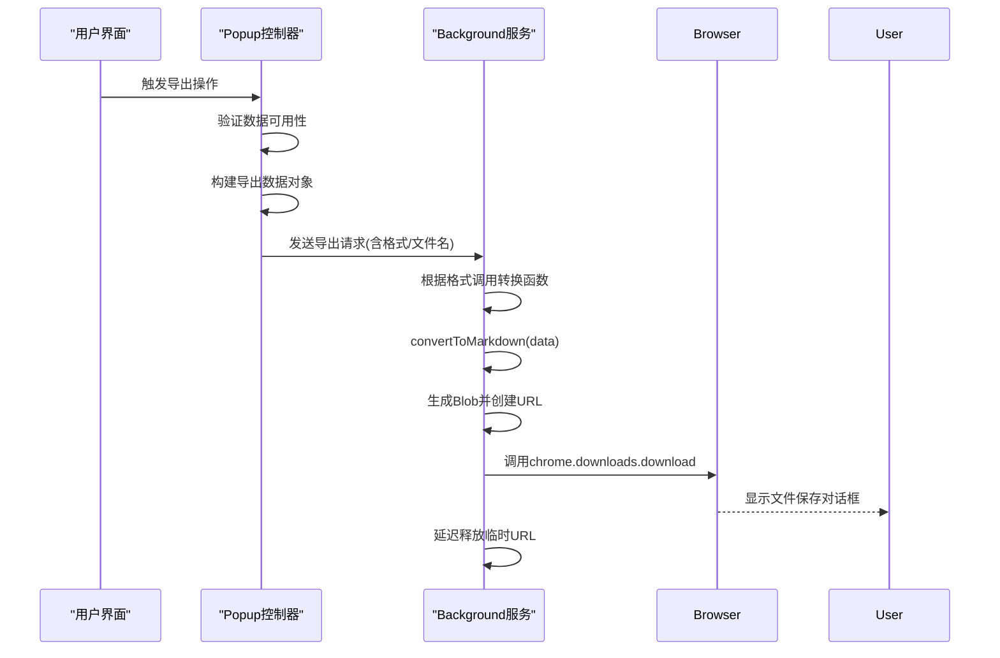
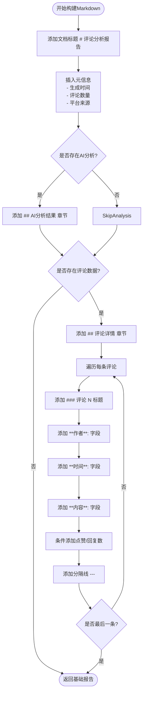

# Markdown格式导出

<cite>
**Referenced Files in This Document **   
- [background.js](file://background.js)
- [popup.js](file://popup.js)
</cite>

## 目录
1. [功能概述](#功能概述)
2. [核心流程解析](#核心流程解析)
3. [Markdown文档构建机制](#markdown文档构建机制)
4. [安全编码与特殊字符处理](#安全编码与特殊字符处理)
5. [评论列表模板化渲染](#评论列表模板化渲染)
6. [文件导出链路与MIME配置](#文件导出链路与mime配置)
7. [输出样例与最佳实践](#输出样例与最佳实践)

## 功能概述

CommentInsight的Markdown格式导出功能允许用户将评论数据和AI分析结果以结构化的Markdown文档形式保存。该功能支持多格式并行导出（CSV、Markdown、JSON），通过浏览器下载API实现文件落地，确保用户能够便捷地获取和分享分析成果。

**Section sources**
- [popup.js](file://popup.js#L425-L480)

## 核心流程解析

Markdown导出功能由前端界面触发，经消息传递至后台脚本执行完整流程。`exportData`主函数作为控制中枢，协调数据准备、格式转换与文件下载三个阶段。当用户在弹窗界面选择导出选项后，系统会收集当前页面的评论数据、AI分析结果及元信息，封装为统一数据对象，并根据配置启动多格式异步导出任务。

**Diagram sources **
- [popup.js](file://popup.js#L425-L480)
- [background.js](file://background.js#L577-L616)

**Section sources**
- [popup.js](file://popup.js#L425-L480)
- [background.js](file://background.js#L577-L616)

## Markdown文档构建机制

`convertToMarkdown`函数负责构建结构化报告文档，采用层级式标题设计确保内容组织清晰。文档以一级标题"# 评论分析报告"起始，形成视觉锚点；二级标题"## AI分析结果"专用于呈现智能分析摘要；每个评论条目使用三级标题"### 评论 N"进行独立分节，便于快速定位。

元信息插入机制在文档头部集中展示关键上下文：生成时间采用中文本地化格式（`new Date().toLocaleString('zh-CN')`），评论数量动态计算`data.comments?.length`，平台来源直接取自`data.platform`字段。若存在AI分析结果，则将其内容嵌入"## AI分析结果"章节，保持原始文本完整性。

**Diagram sources **
- [background.js](file://background.js#L649-L675)

**Section sources**
- [background.js](file://background.js#L649-L675)

## 安全编码与特殊字符处理

`escapeMarkdownText`函数实施双重防护策略，防止恶意或意外的Markdown语法破坏。对于HTML敏感字符（&, <, >），采用标准HTML实体编码（&amp;、&lt;、&gt;）避免XSS风险；对Markdown特殊符号（`, *, _），使用反斜杠转义（\`, \*, \\_）维持文本字面意义。

此安全编码机制至关重要：未转义的星号可能被误解析为强调标签，导致后续文本被错误加粗；尖括号可能创建非法HTML标签，破坏渲染结构；反引号可能开启代码块，使大量正文变为等宽字体。通过预处理这些危险字符，系统确保即使评论包含复杂代码片段或格式化文本，也能安全呈现为纯文本内容。

**Section sources**
- [background.js](file://background.js#L677-L685)

## 评论列表模板化渲染

评论列表采用模板化方式逐项渲染，每条评论包含标准化字段集：作者、时间、内容、点赞数与回复数。字段以加粗标签（**字段名**:）开头，增强可读性；仅当点赞或回复数大于零时才显示对应字段，避免冗余信息。

分隔线（---）作为评论间的视觉分隔符，遵循以下规范：位于每条评论末尾，前后各留一个空行，形成清晰的区块边界。这种设计既符合Markdown语法要求，又提供良好的扫描体验，使用户能快速区分相邻评论。

**Section sources**
- [background.js](file://background.js#L649-L675)

## 文件导出链路与MIME配置

导出链路由`chrome.downloads.download` API驱动，配合Blob对象实现无缝下载。MIME类型精确配置为"text/markdown"，确保浏览器和操作系统正确识别文件性质。文件生成采用`saveAs: true`模式，主动唤起保存对话框而非自动下载，给予用户完全控制权。

临时资源管理采用延迟释放策略：通过`setTimeout`在1秒后调用`URL.revokeObjectURL`，平衡用户体验与内存效率。过早释放可能导致下载中断，过晚则造成内存泄漏，1秒窗口期足以完成大多数网络传输。

**Section sources**
- [background.js](file://background.js#L577-L616)

## 输出样例与最佳实践

典型输出包含结构化标题、元信息区、AI分析摘要及带分隔符的评论列表。最佳实践建议：
1. 始终对用户生成内容执行`escapeMarkdownText`处理
2. 使用语义化标题层级（#→##→###）构建文档大纲
3. 条件性渲染非必需字段，保持简洁
4. 分隔线前后保留空行，符合Markdown规范
5. 采用中文本地化时间格式提升可读性
6. 异步执行多格式导出，提高整体效率