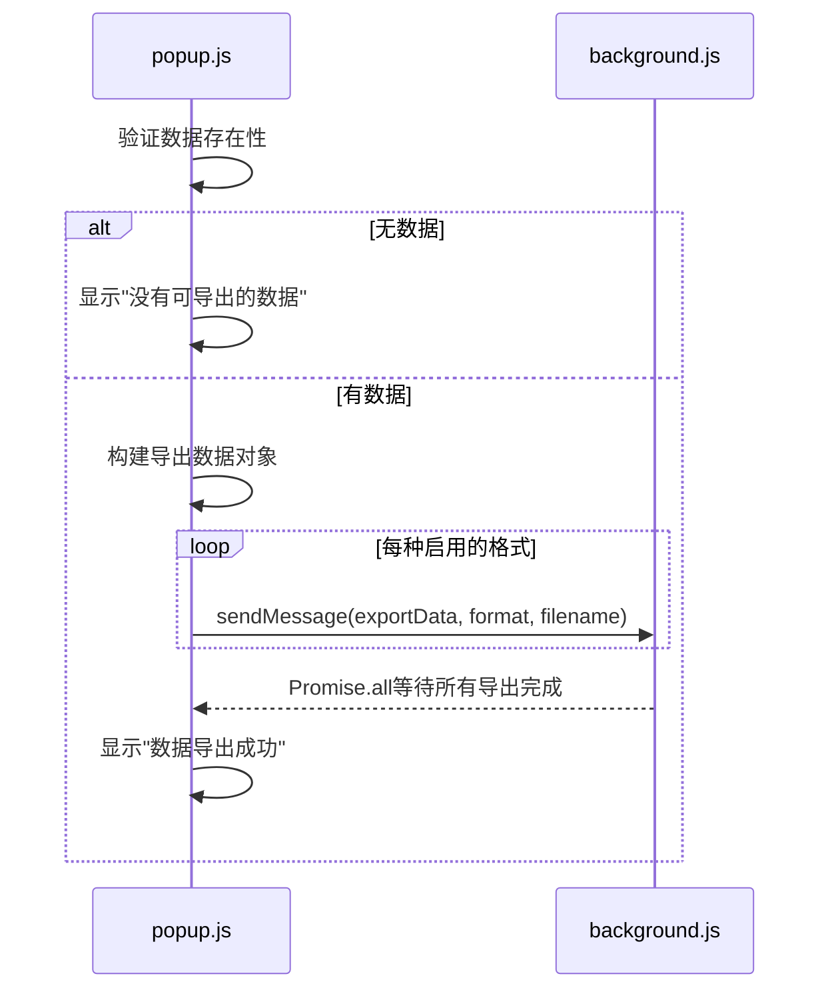
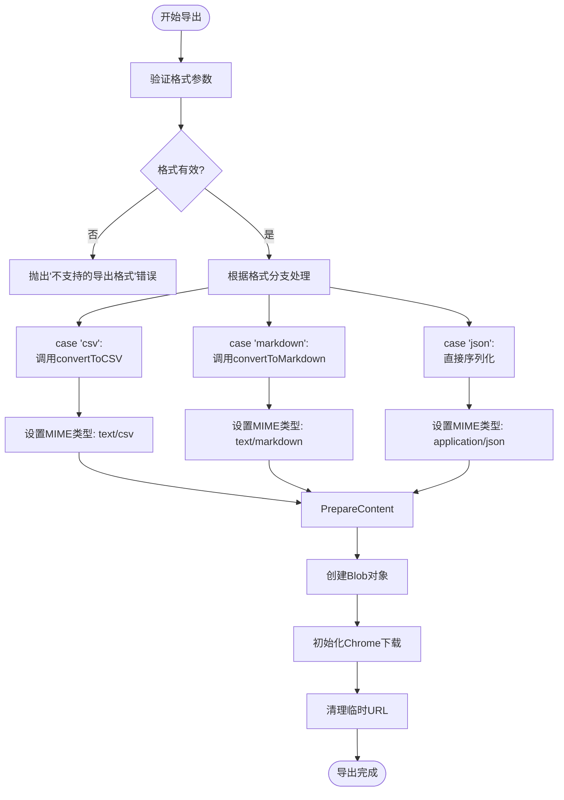
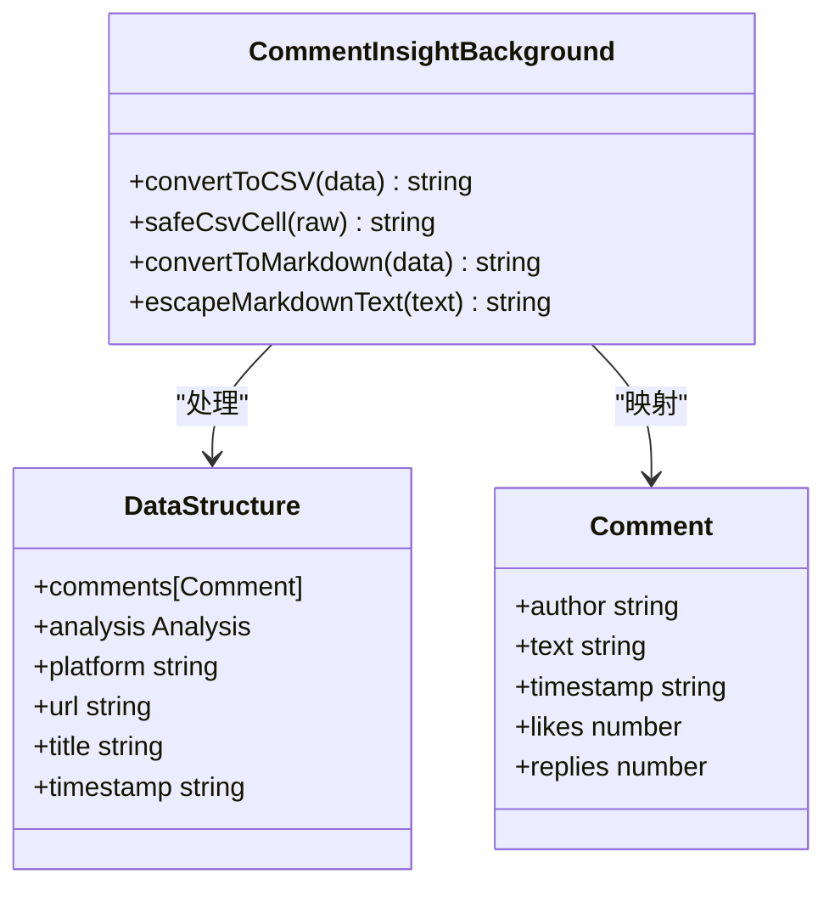

# 数据导出

<cite>
**Referenced Files in This Document**   
- [popup.js](file://popup.js)
- [background.js](file://background.js)
</cite>

## Table of Contents
1. [数据导出功能概述](#数据导出功能概述)
2. [导出流程控制](#导出流程控制)
3. [格式转换实现](#格式转换实现)
4. [文件名生成机制](#文件名生成机制)
5. [下载与资源管理](#下载与资源管理)

## 数据导出功能概述

CommentInsight扩展的数据导出功能允许用户将提取的评论数据和AI分析结果以多种格式保存到本地。该功能支持CSV、Markdown和JSON三种主要格式，满足不同用户的使用需求。整个导出过程由前端弹出窗口（popup.js）发起，通过消息传递机制交由后台脚本（background.js）执行具体的格式转换和文件下载操作。

**Section sources**
- [popup.js](file://popup.js#L425-L480)
- [background.js](file://background.js#L577-L616)

## 导出流程控制

### 前端触发逻辑

数据导出流程始于`CommentInsightPopup`类中的`exportData`方法。该方法首先验证是否存在可导出的评论数据，若无数据则显示警告通知。当有数据时，它会构建包含评论、分析结果、平台信息等元数据的统一数据对象，并根据用户在配置中选择的导出格式，向后台脚本发送多个异步导出请求。

**Diagram sources **
- [popup.js](file://popup.js#L425-L480)

**Section sources**
- [popup.js](file://popup.js#L425-L480)

### 后台处理调度

后台脚本中的`exportData`方法作为导出功能的核心处理器，接收来自前端的导出请求。该方法根据指定的格式参数（csv/markdown/json），调用相应的转换函数进行数据处理，并设置正确的MIME类型。对于不支持的格式，系统会抛出错误异常。

**Diagram sources **
- [background.js](file://background.js#L577-L616)

**Section sources**
- [background.js](file://background.js#L577-L616)

## 格式转换实现

### CSV格式转换

#### 字段映射与结构

`convertToCSV`函数负责将原始数据转换为逗号分隔值格式。它定义了固定的表头字段：作者、内容、时间戳、点赞数和回复数，并将每条评论映射为一行数据。该函数首先验证输入数据的有效性，确保评论数组存在且为数组类型。

#### 安全防护措施

`safeCsvCell`函数实现了关键的安全防护机制：
- **防CSV注入**：检查单元格内容是否以`=`, `+`, `-`, `@`等特殊字符开头，这些字符可能被电子表格软件解释为公式。若检测到此类情况，会在内容前添加单引号进行转义。
- **引号处理**：将内容中的双引号替换为两个双引号（标准CSV转义规则），并用双引号包裹整个单元格内容。
- **换行符规范化**：将所有的回车换行符（`\r\n`或`\n`）替换为空格，防止CSV文件结构被破坏。

**Diagram sources **
- [background.js](file://background.js#L618-L636)
- [background.js](file://background.js#L638-L647)

**Section sources**
- [background.js](file://background.js#L618-L647)

### Markdown格式转换

#### 文档结构生成

`convertToMarkdown`函数生成结构化的Markdown文档，采用清晰的标题层级组织内容：
- 使用一级标题`#`表示"评论分析报告"
- 使用二级标题`##`区分"AI分析结果"和"评论详情"等主要部分
- 使用三级标题`###`为每条评论创建独立的小节

文档包含丰富的元信息，如生成时间、评论数量和平台名称，便于后续追溯。AI分析结果被完整嵌入到专门的章节中，保持其原有的格式和结构。

#### 特殊字符转义

`escapeMarkdownText`函数对文本内容进行必要的HTML实体编码和Markdown特殊字符转义，包括：
- 将`&`, `<`, `>`转换为对应的HTML实体，防止XSS攻击和渲染问题
- 对Markdown语法字符如反引号(``)、星号(*)和下划线(_)进行反斜杠转义，确保它们作为普通文本显示而非格式化标记

这种转义处理保证了即使评论内容包含复杂的Markdown语法，也能安全地呈现为纯文本，避免文档结构被意外破坏。

**Section sources**
- [background.js](file://background.js#L649-L685)

### JSON格式转换

JSON格式的导出最为直接，采用`JSON.stringify(data, null, 2)`对原始数据对象进行序列化。这种方法保留了数据的完整层次结构和所有属性，生成带有2个空格缩进的格式化JSON字符串，既保证了可读性又易于程序解析。与其他格式不同，JSON导出不需要额外的转换逻辑或安全处理，因为它本身就是一种标准的数据交换格式。

**Section sources**
- [background.js](file://background.js#L577-L616)

## 文件名生成机制

文件名动态生成依赖于`filenamePattern`配置项，该配置存储在`config.export.filenamePattern`中，默认值为`{platform}_{title}_{date}`。`generateFilename`方法解析此模式字符串，将占位符替换为实际值：
- `{platform}`：替换为当前社交媒体平台名称（如youtube）
- `{title}`：替换为网页标题，经过`sanitizeFilename`清洗以移除文件系统非法字符
- `{date}`：替换为ISO格式的日期（YYYY-MM-DD）
- `{time}`：替换为时间戳（HH-MM-SS）

`sanitizeFilename`函数通过正则表达式`/[<>:"/\\|?*]/g`将Windows和Unix系统中的文件名禁用字符替换为下划线，并限制文件名长度不超过50个字符，确保生成的文件名在各种操作系统上都有效。

**Diagram sources **
- [popup.js](file://popup.js#L482-L495)

**Section sources**
- [popup.js](file://popup.js#L482-L495)

## 下载与资源管理

### Blob与Object URL技术

系统利用Web API中的Blob和createObjectURL技术创建可下载资源。具体步骤如下：
1. 将格式化后的内容字符串与对应的MIME类型结合，创建Blob对象
2. 使用`URL.createObjectURL(blob)`生成一个指向该Blob的临时URL
3. 调用Chrome扩展的`chrome.downloads.download`API，传入此临时URL和建议的文件名
4. 用户可以选择保存位置，浏览器将自动处理文件下载

### 临时URL清理

由于`createObjectURL`生成的URL会占用内存资源，必须在下载完成后及时释放。系统通过`setTimeout`在1秒后调用`URL.revokeObjectURL(url)`来清理临时URL。这个延迟设计是为了确保Chrome下载系统有足够时间启动下载任务，避免因过早回收URL而导致下载失败。这是一种平衡资源管理和用户体验的最佳实践。

**Section sources**
- [background.js](file://background.js#L577-L616)