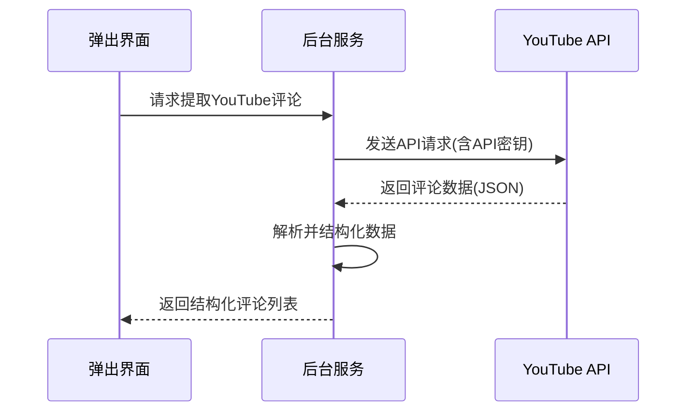
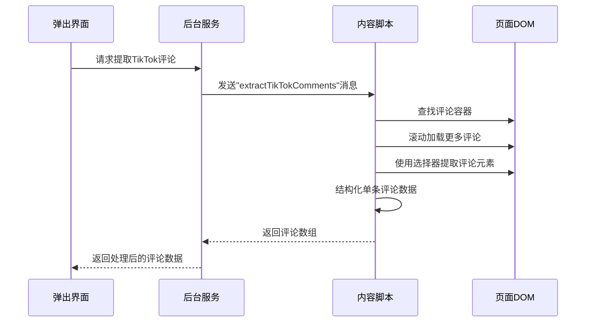
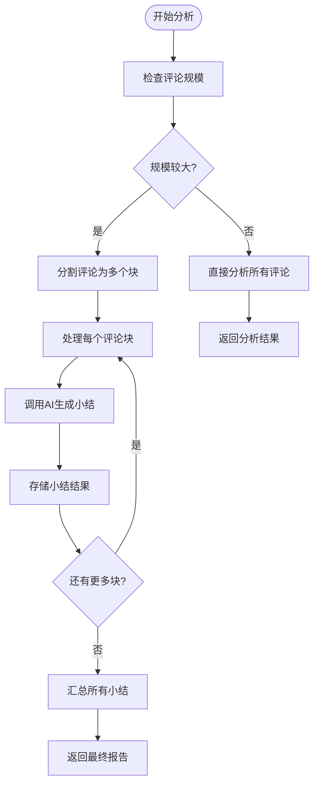
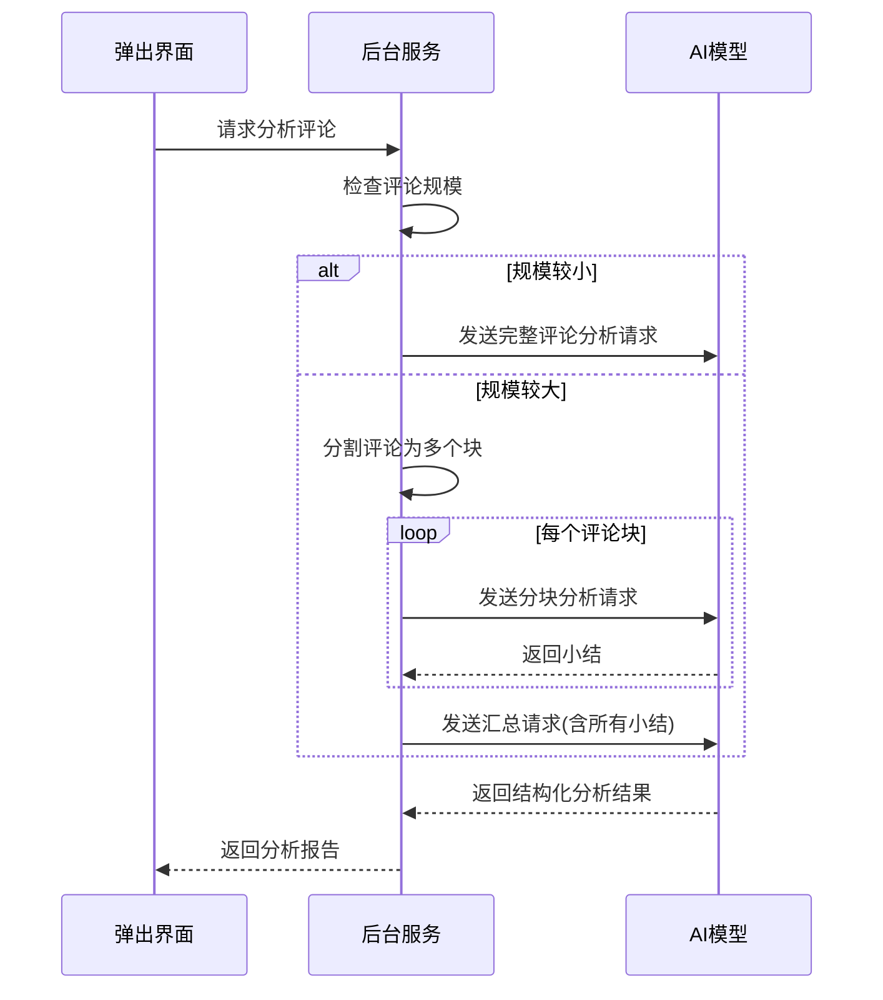
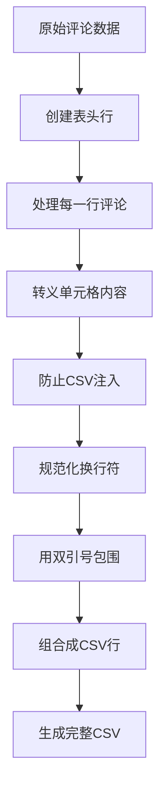
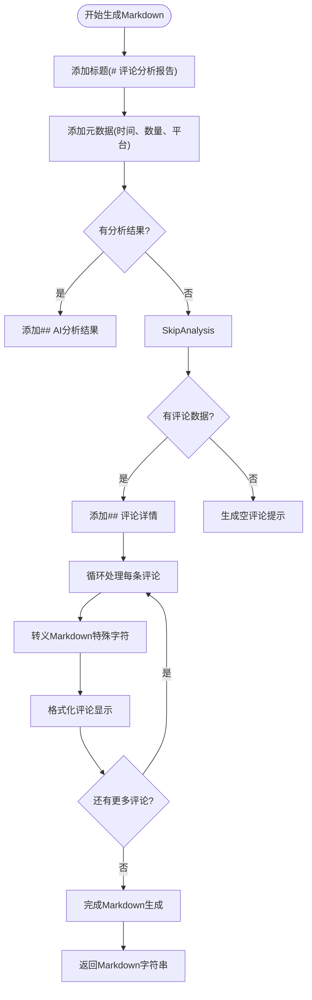
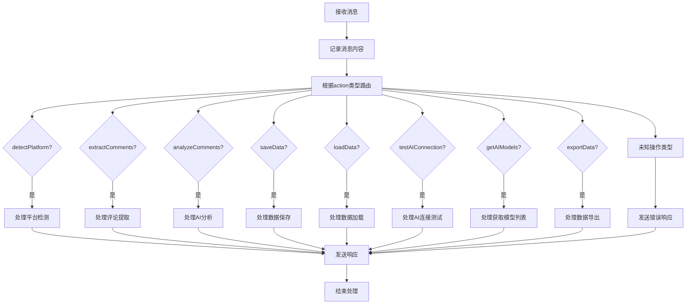

# 核心功能详解

<cite>
**本文档引用的文件**
- [background.js](file://background.js)
- [content.js](file://content.js)
- [popup.js](file://popup.js)
- [viewer.js](file://viewer.js)
</cite>

## 目录
1. [多平台评论提取机制](#多平台评论提取机制)
2. [AI分析模块实现原理](#ai分析模块实现原理)
3. [数据导出功能实现细节](#数据导出功能实现细节)
4. [后台服务消息处理流程](#后台服务消息处理流程)

## 多平台评论提取机制

CommentInsight通过两种不同的技术路径实现跨平台评论提取：对于YouTube采用官方API方式，而对于TikTok、Instagram、Facebook和Twitter则采用DOM注入解析方式。

### YouTube平台API数据获取

YouTube平台通过其官方v3 API进行数据获取。`extractYouTubeComments`方法首先从视频URL中提取视频ID，然后使用配置中的API密钥向`https://www.googleapis.com/youtube/v3/commentThreads`端点发起请求。该方法支持分页加载，通过`pageToken`参数获取后续页面的评论数据，并将结果限制在用户配置的最大评论数范围内。评论数据经过结构化映射后返回，包含评论ID、作者名称、原始文本内容（避免HTML转义）、发布时间戳、点赞数和回复数等字段。

**Diagram sources**
- [background.js](file://background.js#L192-L245)

### 其他平台DOM解析机制

对于TikTok、Instagram、Facebook和Twitter平台，由于API访问限制较多，系统采用content script注入DOM的方式进行解析。`extractTikTokComments`、`extractInstagramComments`、`extractFacebookComments`和`extractTwitterComments`方法均通过`chrome.tabs.sendMessage`向当前标签页发送特定消息，触发content script中的相应提取器执行DOM解析。

每个平台都有专门的提取器类（如`TikTokExtractor`、`InstagramExtractor`等），继承自`BaseExtractor`基类，提供元素等待、滚动加载、文本清理等通用功能。这些提取器使用灵活的选择器策略应对各平台频繁变化的DOM结构，通过`waitForElement`确保目标元素已加载，并调用`scrollToLoadMore`方法滚动页面以加载更多评论内容。

**Diagram sources**
- [background.js](file://background.js#L247-L352)
- [content.js](file://content.js#L43-L98)

**Section sources**
- [background.js](file://background.js#L168-L352)
- [content.js](file://content.js#L1-L99)

## AI分析模块实现原理

AI分析模块利用OpenAI兼容接口执行情感分析、主题识别和摘要生成，通过智能的分块处理策略应对大文本量的分析需求。

### 大文本分块处理策略

当评论数量超过200条或总字符长度超过8000时，系统自动启用`summarizeInChunks`分批总结策略。该方法将评论数组分割成多个大小合适的块（每块约8000字符），对每个块分别调用AI模型生成小结。这种分而治之的策略有效避免了单次请求超出模型上下文窗口限制的问题。

**Diagram sources**
- [background.js](file://background.js#L404-L433)

### 最终汇总逻辑

分块处理完成后，`finalizeSummary`方法负责将所有小结合并为一份完整的分析报告。该方法构造一个包含所有小结的提示词（prompt），要求AI模型整合信息、消除重复，并生成最终可执行的建议。这种方法既保证了大规模数据的可处理性，又确保了最终输出的连贯性和完整性。

AI分析的核心是`chatCompletion`方法，它封装了与OpenAI兼容API的通信逻辑，包括设置正确的HTTP头（Authorization和Content-Type）、构建符合规范的请求体，以及处理响应和错误情况。分析结果按照预定义的结构化格式输出，包含关键洞察、情感分析、主要主题、显著趋势和建议等部分。

**Diagram sources**
- [background.js](file://background.js#L354-L468)

**Section sources**
- [background.js](file://background.js#L354-L468)

## 数据导出功能实现细节

数据导出功能支持CSV、Markdown和JSON三种格式，每种格式都有专门的实现逻辑和安全处理措施。

### CSV格式实现

`convertToCSV`方法将评论数据转换为逗号分隔值格式。该方法首先定义表头行，然后逐行映射评论数据。为了防止CSV注入攻击，`safeCsvCell`方法对每个单元格内容进行严格处理：将双引号转义为两个双引号，对以`=+@-`开头的内容添加单引号前缀，并将换行符替换为空格。所有单元格内容都用双引号包围，确保数据的正确解析。

**Diagram sources**
- [background.js](file://background.js#L618-L636)

### Markdown格式实现

`convertToMarkdown`方法生成结构化的Markdown文档，包含元信息、AI分析结果和详细的评论列表。为了防止XSS攻击，`escapeMarkdownText`方法对特殊字符进行HTML实体编码，包括`&<>`符号以及Markdown语法字符如反引号、星号和下划线。评论按编号列出，使用水平分隔线分隔，确保文档的可读性。

**Diagram sources**
- [background.js](file://background.js#L649-L675)

### JSON格式实现

JSON格式直接使用`JSON.stringify(data, null, 2)`进行序列化，保持数据的完整性和层次结构，便于程序化处理和数据交换。

所有格式的导出最终都通过Chrome的`downloads.download` API实现文件下载，创建Blob对象和临时URL，下载完成后及时清理资源。

**Section sources**
- [background.js](file://background.js#L577-L685)

## 后台服务消息处理流程

`handleMessage`方法是后台服务的核心消息处理器，采用异步方式处理来自弹出界面和内容脚本的各种请求。该方法使用`switch-case`结构路由不同类型的请求，包括平台检测、评论提取、AI分析、数据存储、数据加载、AI连接测试、模型列表获取和数据导出等操作。

消息处理采用Promise模式保持通道开放，支持异步响应。每个操作都被包裹在try-catch块中，确保错误能够被捕获并以统一格式返回给调用方。这种设计实现了清晰的关注点分离，使后台服务能够高效地协调各个组件之间的通信。

**Diagram sources**
- [background.js](file://background.js#L73-L129)

**Section sources**
- [background.js](file://background.js#L73-L129)