# Facebook评论提取

<cite>
**Referenced Files in This Document **   
- [content.js](file://content.js)
- [background.js](file://background.js)
- [manifest.json](file://manifest.json)
</cite>

## 目录
1. [引言](#引言)
2. [项目结构](#项目结构)
3. [核心组件](#核心组件)
4. [架构概述](#架构概述)
5. [详细组件分析](#详细组件分析)
6. [依赖分析](#依赖分析)
7. [性能考虑](#性能考虑)
8. [故障排除指南](#故障排除指南)
9. [结论](#结论)

## 引言

本文件全面介绍CommentInsight扩展在Facebook平台上实施评论提取的技术细节。重点剖析`FacebookExtractor`如何应对Facebook复杂且高度动态化的DOM结构，使用`data-testid`和`aria-label`等语义化属性精准定位评论容器。说明在缺乏稳定CSS类名的情况下，如何通过多重选择器回退机制提高提取成功率。描述内容脚本如何在等待3秒后开始提取以确保React组件完全渲染，并结合页面滚动加载更多评论。分析`background.js`中消息传递的安全性考虑，以及如何防止因Facebook反爬机制导致的提取中断。讨论当前实现仅获取评论文本而无法获得点赞数等元数据的限制，并提出基于GraphQL接口的潜在优化方案。

## 项目结构

CommentInsight是一个浏览器扩展，旨在从多个社交媒体平台（包括YouTube、TikTok、Instagram、Facebook和Twitter）提取评论并进行AI分析。其主要文件结构如下：

```
.
├── README.md
├── background.js
├── content.js
├── manifest.json
├── options.html
├── options.js
├── popup.html
├── popup.js
├── viewer.html
└── viewer.js
```

该扩展的核心功能由`content.js`和`background.js`两个文件驱动。`content.js`作为内容脚本，在各个社交媒体页面上运行，负责DOM解析和评论提取；`background.js`作为后台服务工作脚本，处理API调用、数据存储和消息传递。

```mermaid
graph TB
subgraph "前端"
UI[用户界面]
Popup[弹出窗口]
Options[选项页面]
end
subgraph "浏览器扩展"
ContentScript[content.js<br>DOM解析与提取]
BackgroundScript[background.js<br>消息处理与存储]
end
subgraph "外部服务"
AI[AI分析服务]
Storage[本地存储]
end
UI --> ContentScript
Popup --> BackgroundScript
Options --> BackgroundScript
ContentScript < --> BackgroundScript
BackgroundScript --> AI
BackgroundScript --> Storage
```

**Diagram sources**
- [manifest.json](file://manifest.json#L1-L49)

**Section sources**
- [manifest.json](file://manifest.json#L1-L49)

## 核心组件

CommentInsight的核心组件围绕一个模块化的提取器架构构建。`CommentExtractor`是主控制器，它根据当前页面的域名自动检测平台，并初始化相应的具体提取器实例（如`YouTubeExtractor`、`FacebookExtractor`等）。所有提取器都继承自`BaseExtractor`基类，该基类提供了通用的辅助方法，如`waitForElement`用于等待元素出现，`scrollToLoadMore`用于模拟滚动以加载更多内容，以及`delay`用于引入延迟。

`FacebookExtractor`是专门针对Facebook平台设计的提取器，它不依赖于易变的CSS类名，而是优先使用Facebook内部使用的`data-testid`属性来定位评论节点。当首选选择器失败时，它会回退到`aria-label`或包含"comment"关键词的类名。这种多重选择器策略显著提高了在Facebook频繁更新DOM结构情况下的提取鲁棒性。

**Section sources**
- [content.js](file://content.js#L1-L560)

## 架构概述

CommentInsight采用经典的浏览器扩展三层架构：用户界面层、业务逻辑层和数据访问层。用户通过`popup.html`触发操作，该操作通过Chrome的消息系统发送到`background.js`。`background.js`验证请求后，再通过`chrome.tabs.sendMessage`将指令转发给运行在目标页面上的`content.js`。`content.js`执行具体的DOM操作和数据提取，然后将结果返回给`background.js`，最终由`background.js`将数据存储到`chrome.storage.local`或传递给AI分析服务。

这种架构实现了关注点分离，确保了安全性（内容脚本在隔离的环境中运行），并且允许后台脚本管理跨标签页的状态。


**Diagram sources**
- [content.js](file://content.js#L43-L98)
- [background.js](file://background.js#L145-L175)

## 详细组件分析

### FacebookExtractor分析

`FacebookExtractor`的设计充分考虑了Facebook平台的技术挑战。由于Facebook广泛使用React框架，其UI是动态生成的，因此直接查询DOM可能会在组件渲染完成前失败。为解决此问题，`FacebookExtractor.extract`方法首先调用`await this.delay(3000)`，强制等待3秒钟，以确保React组件有足够的时间完成初始渲染和数据加载。

#### DOM定位策略


**Diagram sources**
- [content.js](file://content.js#L429-L470)

**Section sources**
- [content.js](file://content.js#L428-L494)

#### 多重选择器回退机制
`FacebookExtractor`使用了一个精心设计的选择器数组，按优先级顺序排列：
1.  **`[data-testid="UFI2Comment/root"]`**: 这是最可靠的选择器，因为`data-testid`是Facebook开发者用于测试的专用属性，通常比CSS类名更稳定。
2.  **`[aria-label*="comment"]`**: 利用ARIA无障碍属性，这些属性对于屏幕阅读器至关重要，因此不太可能被随意更改。
3.  **`[class*="comment"]`**: 作为最后的手段，搜索任何包含"comment"字符串的CSS类名。

这种方法通过`for...of`循环实现，一旦某个选择器返回了非空的结果集，就会立即跳出循环，避免不必要的DOM查询。

#### 滚动加载
为了获取完整的评论列表，`FacebookExtractor`在执行DOM查询后调用`await this.scrollToLoadMore(window)`。这个方法会反复将页面滚动到底部，并等待1秒让新内容加载，最多重复10次。这使得扩展能够捕获无限滚动加载的评论。

### 内容脚本与后台脚本通信分析

`CommentExtractor.handleMessage`方法是内容脚本的入口点，它监听来自`background.js`的消息。当收到`extractFacebookComments`指令时，它会检查当前平台是否为Facebook，然后调用`FacebookExtractor`的`extract`方法。


**Diagram sources**
- [content.js](file://content.js#L43-L98)
- [background.js](file://background.js#L275-L285)

**Section sources**
- [content.js](file://content.js#L43-L98)

## 依赖分析

CommentInsight的依赖关系清晰且松散耦合。`content.js`和`background.js`通过Chrome的`runtime.onMessage` API进行通信，这是一种异步、事件驱动的模式，避免了直接的代码依赖。`manifest.json`文件声明了扩展所需的权限和主机权限，明确了其与外部域的交互边界。

`FacebookExtractor`依赖于`BaseExtractor`提供的通用方法，但没有引入任何外部npm包，所有功能均通过原生JavaScript和Chrome API实现。这种最小化的依赖树减少了安全风险和维护成本。

```mermaid
classDiagram
class CommentExtractor {
+platform string
+extractors Map~string, BaseExtractor~
+detectCurrentPlatform() string
+initializeContentScript() void
+handleMessage(message, sender, sendResponse) Promise~void~
}
class BaseExtractor {
#maxRetries int
#retryDelay int
+waitForElement(selector, timeout) Promise~Element~
+scrollToLoadMore(scrollContainer, maxScrolls) Promise~void~
+delay(ms) Promise~void~
+sanitizeText(text) string
+extractTimestamp(element) string
}
class FacebookExtractor {
+extract(config) Promise~Comment[]~
+extractSingleFacebookComment(element) Comment or null
}
class CommentInsightBackground {
+initializeBackground() void
+onInstalled(details) void
+handleMessage(message, sender, sendResponse) Promise~void~
+extractComments(platform, url, config, tabId) Promise~Comment[]~
+analyzeComments(comments, config) Promise~AnalysisResult~
+saveData(data) Promise~void~
+loadData(key) Promise~any~
+exportData(data, format, filename) Promise~void~
}
CommentExtractor --> BaseExtractor : "uses"
FacebookExtractor --|> BaseExtractor : "extends"
CommentExtractor --> FacebookExtractor : "instantiates"
CommentInsightBackground --> CommentExtractor : "communicates with via messages"
```



**Diagram sources**
- [content.js](file://content.js#L1-L560)
- [background.js](file://background.js#L1-L690)

**Section sources**
- [content.js](file://content.js#L1-L560)
- [background.js](file://background.js#L1-L690)

## 性能考虑

`FacebookExtractor`的性能主要受网络延迟和DOM复杂度的影响。3秒的固定延迟虽然简单有效，但在网络状况良好时可能造成不必要的等待。一个潜在的优化是使用`MutationObserver`来监控特定的父容器，一旦观察到新的评论节点被添加就立即开始提取，而不是盲目等待。

此外，`document.querySelectorAll`在大型DOM树上可能很慢。未来可以考虑先定位到最外层的评论容器，然后再在其内部作用域内进行查询，以缩小搜索范围。

## 故障排除指南

如果Facebook评论提取失败，可以按照以下步骤排查：

1.  **检查平台检测**: 确认`CommentExtractor.detectCurrentPlatform()`正确识别了`facebook.com`或`fb.com`。
2.  **验证消息传递**: 确保`background.js`成功向`content.js`发送了`extractFacebookComments`消息，并且`content.js`收到了该消息。
3.  **审查选择器**: 打开Facebook页面的开发者工具，检查评论节点是否仍然具有`data-testid="UFI2Comment/root"`属性。如果Facebook已更改其DOM结构，则需要更新选择器。
4.  **调整延迟时间**: 如果评论加载较慢，可以尝试增加`this.delay(3000)`中的毫秒数。
5.  **检查反爬机制**: Facebook可能会检测到自动化行为并阻止脚本执行。确保扩展的行为尽可能像真实用户。

**Section sources**
- [content.js](file://content.js#L429-L470)
- [background.js](file://background.js#L275-L285)

## 结论

CommentInsight通过`FacebookExtractor`实现了一种健壮的Facebook评论提取方案。它利用语义化属性`data-testid`和`aria-label`来应对动态DOM，通过多重选择器回退和页面滚动机制提高了提取的成功率。尽管当前实现受限于只能获取评论文本，但其模块化和可扩展的架构为未来的改进（如集成Facebook GraphQL API以获取点赞数、回复数等丰富元数据）奠定了坚实的基础。