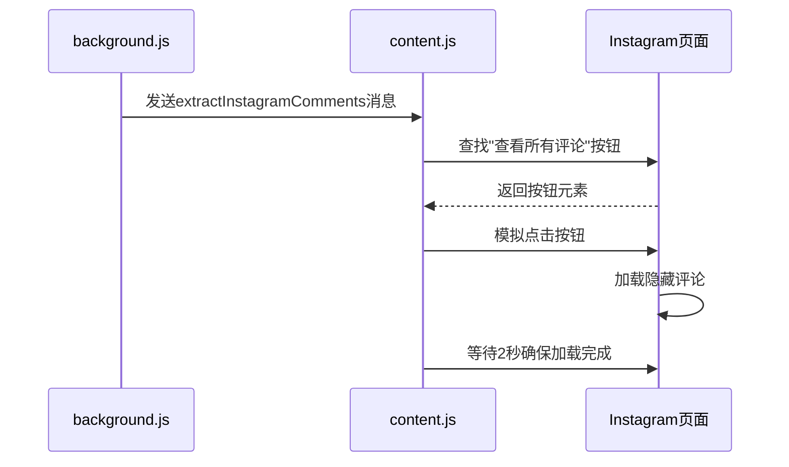
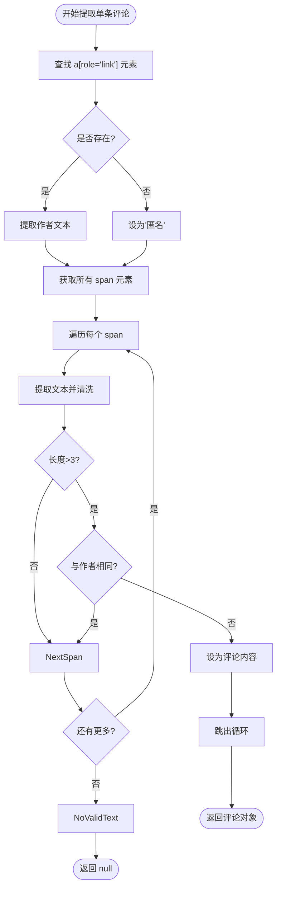
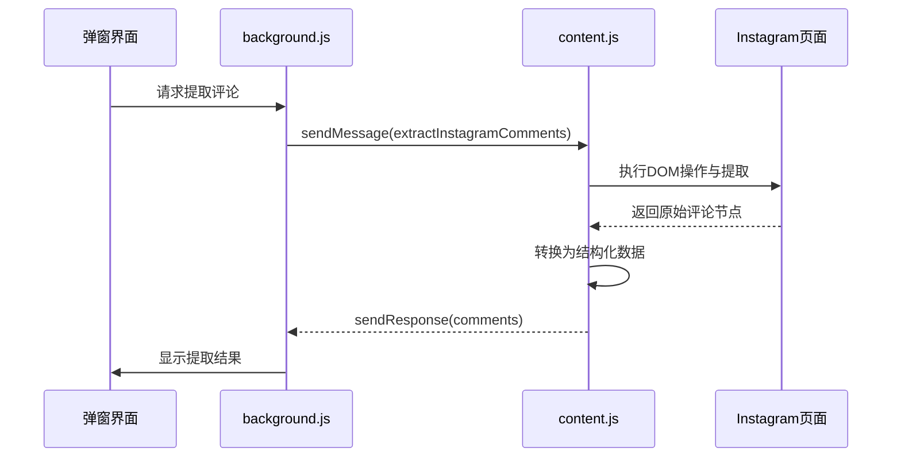

# Instagram评论提取

<cite>
**本文档引用的文件**
- [content.js](file://content.js)
- [background.js](file://background.js)
- [manifest.json](file://manifest.json)
</cite>

## 目录
1. [Instagram评论提取流程概述](#instagram评论提取流程概述)
2. [用户交互模拟与内容解锁机制](#用户交互模拟与内容解锁机制)
3. [滚动加载更多评论的实现原理](#滚动加载更多评论的实现原理)
4. [多层级选择器匹配策略](#多层级选择器匹配策略)
5. [单条评论数据精准提取方法](#单条评论数据精准提取方法)
6. [后台服务与内容脚本通信机制](#后台服务与内容脚本通信机制)
7. [跨域权限限制处理方案](#跨域权限限制处理方案)
8. [未使用官方API的原因分析](#未使用官方api的原因分析)
9. [未来改进路径建议](#未来改进路径建议)

## Instagram评论提取流程概述

CommentInsight扩展通过浏览器插件架构从Instagram页面提取评论，整个过程涉及内容脚本（content script）与后台脚本（background script）的协同工作。系统首先检测当前页面是否为Instagram平台，随后触发评论提取任务，利用DOM操作技术获取隐藏和分页加载的评论内容。

该流程的核心在于模拟真实用户行为，绕过动态加载机制，并通过灵活的选择器策略适应Instagram频繁变化的UI结构。最终将非结构化的HTML评论节点转化为标准化的数据格式，供后续分析使用。

**Section sources**
- [content.js](file://content.js#L1-L559)
- [background.js](file://background.js#L1-L689)

## 用户交互模拟与内容解锁机制

InstagramExtractor通过`document.querySelector('button[class*="comment"]')`定位“查看所有评论”按钮，并检查其文本是否包含“查看”。一旦找到目标按钮，调用`click()`方法模拟用户点击行为，从而触发隐藏评论的加载。

此设计的关键优势在于：
- **无需依赖特定类名**：使用`[class*="comment"]`属性选择器匹配包含"comment"关键词的任意类名，增强对CSS类名变更的容错性。
- **条件判断安全执行**：仅在按钮存在且文本符合预期时才执行点击，避免无效或错误操作。
- **延迟等待响应**：点击后调用`await this.delay(2000)`暂停2秒，确保服务器响应和DOM更新完成。

这种基于语义而非精确标识符的交互方式，使系统能够在Instagram前端更新时仍保持基本功能稳定。



**Diagram sources**
- [content.js](file://content.js#L343-L391)
- [background.js](file://background.js#L285-L306)

## 滚动加载更多评论的实现原理

`scrollToLoadMore`方法是BaseExtractor提供的通用滚动加载工具，用于触发无限滚动机制以加载更多评论。其实现逻辑如下：

1. 设置最大滚动次数（默认10次）和高度记录变量。
2. 在循环中比较当前页面/容器总高度与上次记录的高度。
3. 若高度发生变化，说明有新内容加载，则继续滚动到底部。
4. 使用`window.scrollTo(0, document.documentElement.scrollHeight)`实现页面级滚动。
5. 每次滚动后调用`delay(1000)`等待1秒让内容加载。
6. 当连续两次高度无变化时终止循环，认为已加载全部内容。

该方法具备良好的适应性，既支持全局窗口滚动也支持局部容器滚动，能够有效应对Instagram分批加载评论的设计模式。

**Section sources**
- [content.js](file://content.js#L136-L161)

## 多层级选择器匹配策略

为了应对Instagram频繁变动的DOM结构，`commentSelectors`数组定义了三级递进式选择器策略：

```javascript
const commentSelectors = [
    'article ul > div > li',           // 最具体：基于结构路径
    '[class*="comment"]',               // 中等：基于类名关键词
    'article div[role="button"]'        // 备用：基于角色属性
];
```

系统按优先级顺序尝试每个选择器，一旦`querySelectorAll`返回非空结果即停止搜索。这种策略的优势包括：

- **结构稳定性优先**：首选基于DOM层级关系的选择器，减少样式类名变更的影响。
- **语义化降级匹配**：当精确结构失效时，退而使用语义相关的类名进行模糊匹配。
- **角色属性兜底**：最后尝试基于ARIA角色的通用选择器，提高极端情况下的存活率。

该设计体现了“渐进式增强”的思想，在保证准确性的同时极大提升了系统的鲁棒性。

**Section sources**
- [content.js](file://content.js#L378-L385)

## 单条评论数据精准提取方法

`extractSingleInstagramComment`方法采用精细化解析策略从复杂嵌套结构中提取作者名和评论文本，主要步骤如下：

1. **作者识别**：通过`a[role="link"]`定位作者链接元素，利用其可访问性属性提高匹配准确率。
2. **文本候选收集**：获取所有`span`元素作为潜在评论文本来源。
3. **智能过滤排除**：
   - 排除空白或过短（≤3字符）的文本片段
   - 排除与作者名完全相同的文本（防止误取用户名）
4. **优先级选取**：遍历`span`元素并返回第一个符合条件的文本作为评论内容。
5. **有效性验证**：若最终文本为空或等于作者名则返回`null`，避免垃圾数据入库。

此方法有效规避了广告、系统提示、点赞按钮等干扰元素，确保只提取真实的用户评论内容。



**Diagram sources**
- [content.js](file://content.js#L393-L424)

## 后台服务与内容脚本通信机制

CommentInsight采用Chrome扩展的消息通信模型协调后台服务与内容脚本的工作。具体流程如下：

1. **消息监听初始化**：
   - `background.js`中的`CommentInsightBackground`类注册全局消息监听器
   - `content.js`中的`CommentExtractor`同样注册消息监听器

2. **任务发起**：
   - 用户操作触发后台脚本调用`chrome.tabs.sendMessage`
   - 消息类型为`extractInstagramComments`，携带配置参数

3. **任务执行**：
   - 内容脚本接收到消息后调用`handleMessage`
   - 根据平台类型分发至`InstagramExtractor.extract`

4. **结果回传**：
   - 提取完成后通过`sendResponse`异步返回评论数据
   - 后台脚本接收结果并进一步处理（如AI分析、导出等）

该通信机制遵循请求-响应模式，保证了跨上下文执行的安全性和可靠性。



**Diagram sources**
- [background.js](file://background.js#L285-L306)
- [content.js](file://content.js#L43-L98)

## 跨域权限限制处理方案

由于Chrome扩展的安全策略，`background.js`无法直接访问网页DOM，必须通过`content.js`间接操作。解决方案如下：

1. **权限声明**：在`manifest.json`中声明`host_permissions`，允许访问Instagram域名。
2. **内容脚本注入**：配置`content_scripts`自动在匹配页面加载`content.js`。
3. **消息代理模式**：后台脚本通过`chrome.tabs.sendMessage`发送指令，由同源的内容脚本代为执行DOM查询和操作。
4. **结果回调传输**：内容脚本将提取结果通过响应函数传回后台。

这种方式既遵守了同源策略，又实现了对目标页面的安全访问，是浏览器扩展开发的标准实践。

**Section sources**
- [manifest.json](file://manifest.json#L1-L48)

## 未使用官方API的原因分析

当前实现未采用Instagram Graph API的主要原因包括：

1. **访问权限受限**：Instagram API对评论读取权限控制严格，普通开发者难以获得`pages_read_engagement`等必要权限。
2. **审核门槛高**：Meta平台对应用审核极为严格，个人或小型项目很难通过商业用途审批。
3. **速率限制严苛**：即使获得授权，API调用频率也受到极大限制，影响批量采集效率。
4. **数据完整性不足**：API可能不返回全部评论或缺少某些字段，而DOM包含完整呈现信息。
5. **部署复杂度高**：需要维护服务器端token刷新、OAuth流程等基础设施，增加系统复杂性。

相比之下，DOM解析方式虽然更易受UI变更影响，但无需认证、无调用限制、数据完整且部署简单，更适合此类轻量级工具。

**Section sources**
- [background.js](file://background.js#L285-L306)
- [content.js](file://content.js#L343-L391)

## 未来改进路径建议

针对当前实现的局限性，提出以下优化方向：

1. **混合模式采集**：
   - 优先尝试API方式（如有有效token）
   - 失败时自动降级为DOM解析
   - 提供用户配置选项切换模式

2. **选择器智能化升级**：
   - 引入机器学习模型识别评论区块
   - 基于历史成功模式动态调整选择器权重
   - 构建选择器效果反馈闭环

3. **抗变能力增强**：
   - 定期抓取Instagram测试页面建立DOM指纹库
   - 实现自动化选择器适配更新机制
   - 提供云端配置热更新支持

4. **性能优化**：
   - 支持增量提取而非全量重抓
   - 实现评论去重与合并逻辑
   - 添加加载进度反馈提升用户体验

5. **合规性改进**：
   - 增加robots.txt检查
   - 实现合理请求间隔避免滥用
   - 提供用户同意确认机制

这些改进将显著提升系统的稳定性、效率和合法性，使其更加适用于长期运行的生产环境。

**Section sources**
- [content.js](file://content.js#L343-L424)
- [background.js](file://background.js#L285-L306)