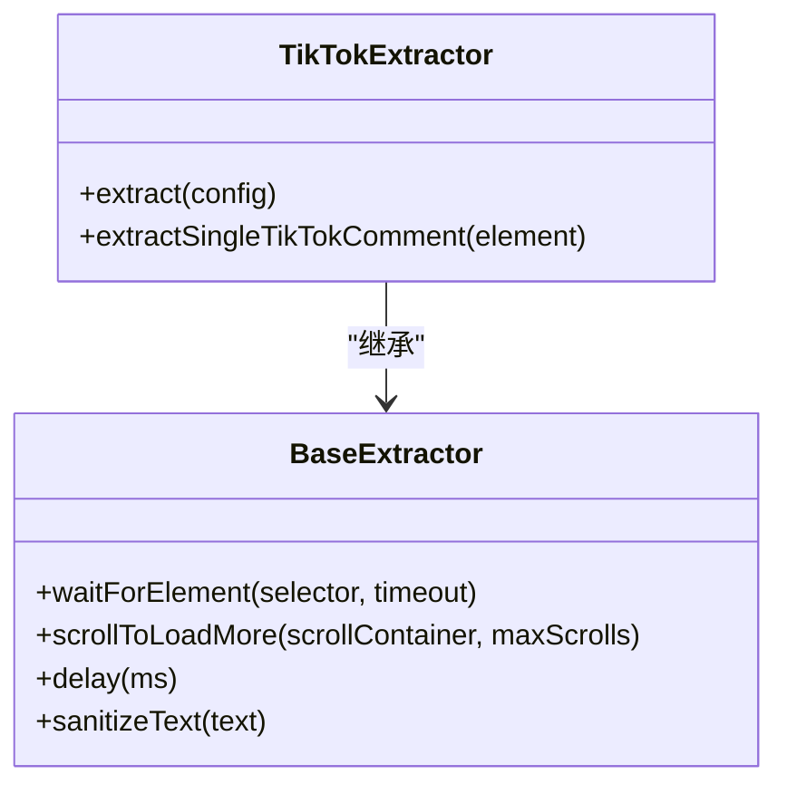
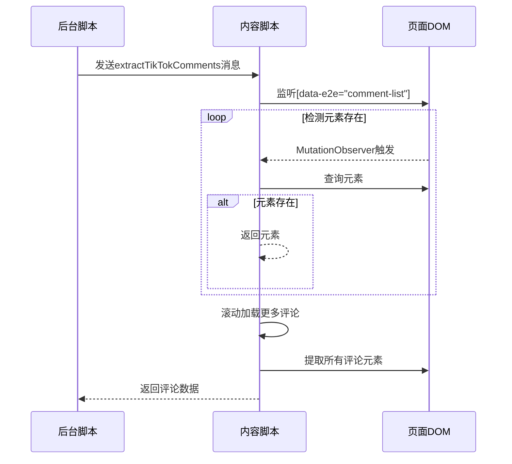
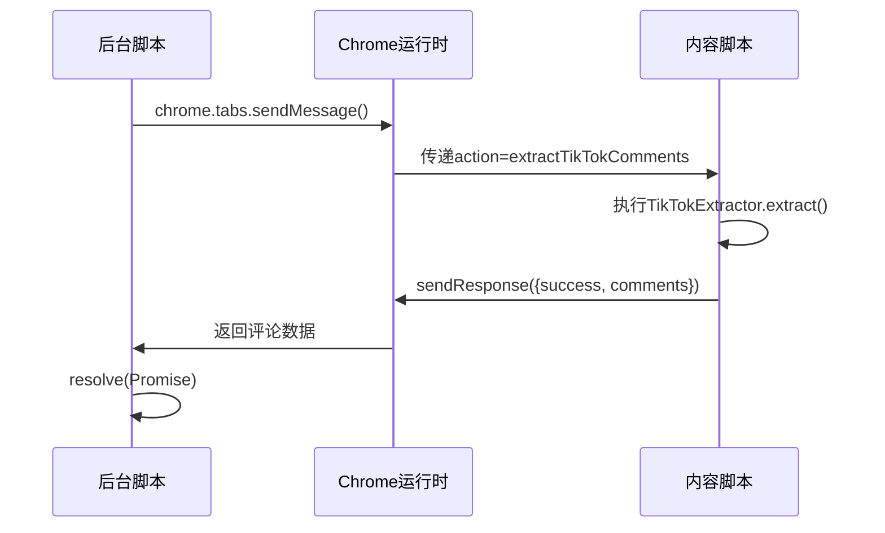

# TikTok评论提取

<cite>
**本文档引用的文件**
- [content.js](file://content.js)
- [background.js](file://background.js)
</cite>

## 目录
1. [TikTok评论提取机制概述](#tiktok评论提取机制概述)
2. [DOM解析与元素定位](#dom解析与元素定位)
3. [动态内容监听与滚动加载](#动态内容监听与滚动加载)
4. [多级选择器回退机制](#多级选择器回退机制)
5. [后台脚本通信机制](#后台脚本通信机制)
6. [防反爬策略实现](#防反爬策略实现)
7. [当前局限性与优化方向](#当前局限性与优化方向)

## TikTok评论提取机制概述

CommentInsight扩展通过DOM解析方式从TikTok平台提取评论数据，采用内容脚本（content script）与后台脚本（background script）协同工作的架构。系统首先通过`data-e2e`属性选择器精确定位评论区域和单条评论元素，利用MutationObserver监听页面动态内容变化，并结合智能滚动策略确保获取尽可能完整的评论数据集。

该实现机制针对TikTok频繁变更的DOM结构设计了多级选择器回退方案，当首选选择器失效时自动尝试备用选择器，提高了系统的鲁棒性。整个流程由后台脚本发起请求，通过Chrome扩展的消息系统与内容脚本通信，传递配置参数并接收提取结果，形成完整的数据采集闭环。

**Section sources**
- [content.js](file://content.js#L238-L349)
- [background.js](file://background.js#L261-L283)

## DOM解析与元素定位

TikTokExtractor类采用基于`data-e2e`属性的选择器进行精确元素定位，这是TikTok平台特有的端到端测试标识系统。在`extract`方法中，首先使用`[data-e2e="comment-list"]`选择器定位评论列表容器，确保目标区域已加载完成。



**Diagram sources**
- [content.js](file://content.js#L238-L349)

对于单条评论元素，系统优先使用`[data-e2e="comment-item"]`选择器进行定位。这种基于语义化属性的选择策略相比传统的CSS类名选择更加稳定，因为`data-e2e`属性主要用于自动化测试，较少因UI样式调整而改变。

**Section sources**
- [content.js](file://content.js#L250-L253)

## 动态内容监听与滚动加载

为应对TikTok的动态内容加载特性，系统实现了双重保障机制。首先，`BaseExtractor`类中的`waitForElement`方法结合MutationObserver API实时监控DOM变化，当指定选择器的元素出现时立即返回，避免了固定等待时间带来的效率损失。



**Diagram sources**
- [content.js](file://content.js#L102-L136)
- [content.js](file://content.js#L132-L175)

其次，`scrollToLoadMore`方法实现了智能滚动策略，通过比较滚动前后的容器高度判断是否还有新内容加载，最多执行10次滚动操作。每次滚动后设置1秒延迟，给予网络请求充分的响应时间，确保评论数据的完整性。

**Section sources**
- [content.js](file://content.js#L132-L175)

## 多级选择器回退机制

考虑到TikTok可能频繁调整其前端DOM结构，`extractSingleTikTokComment`方法设计了多层次的选择器回退机制。对于评论作者、内容和时间戳三个关键字段，系统都定义了多个备选选择器：

```mermaid
flowchart TD
Start([开始提取单条评论]) --> Author["作者提取"]
Author --> AuthorSelector1["[data-e2e='comment-username']"]
AuthorSelector1 --> |失败| AuthorSelector2[".username"]
AuthorSelector2 --> |失败| AuthorSelector3["[class*='username']")
AuthorSelector3 --> |成功| AuthorExtracted["提取作者成功"]
AuthorExtracted --> Content["内容提取"]
Content --> ContentSelector1["[data-e2e='comment-text']"]
ContentSelector1 --> |失败| ContentSelector2[".comment-text"]
ContentSelector2 --> |失败| ContentSelector3["[class*='comment-text']")
ContentSelector3 --> |成功| ContentExtracted["提取内容成功"]
ContentExtracted --> Time["时间戳提取"]
Time --> TimeSelector1["[data-e2e='comment-time']"]
TimeSelector1 --> |失败| TimeSelector2[".time"]
TimeSelector2 --> |失败| TimeSelector3["[class*='time']")
TimeSelector3 --> |成功| TimeExtracted["提取时间戳成功"]
TimeExtracted --> Validate["验证文本非空"]
Validate --> |无内容| ReturnNull["返回null"]
Validate --> |有内容| BuildComment["构建评论对象"]
BuildComment --> End([返回评论数据])
```

**Diagram sources**
- [content.js](file://content.js#L291-L338)

这种设计原理是"优雅降级"：优先使用最精确的`data-e2e`选择器，若失败则依次尝试通用CSS类名和包含特定关键词的类名。每个字段的提取过程独立进行，即使某个字段无法获取也不会影响其他字段的数据采集。

**Section sources**
- [content.js](file://content.js#L291-L338)

## 后台脚本通信机制

后台脚本通过`chrome.tabs.sendMessage` API与内容脚本建立通信通道，实现跨上下文的数据交换。`extractTikTokComments`函数封装了这一通信逻辑，创建一个Promise以支持异步操作。



**Diagram sources**
- [background.js](file://background.js#L261-L283)

通信过程中传递的配置参数包含延迟设置、最大重试次数等控制选项，使得提取行为可配置化。消息响应机制采用标准的Chrome扩展消息格式，包含success标志位和错误信息，便于上层调用者处理各种执行结果。

**Section sources**
- [background.js](file://background.js#L261-L283)

## 防反爬策略实现

系统实现了多种防反爬措施以模拟人类用户行为，降低被检测和封锁的风险。在`options.html`配置界面中，用户可以设置提取延迟，该值会作为配置参数传递给提取器。

```javascript
// 延迟设置应用示例
await this.delay(config.tiktok.delay || 1000);
```

重试机制内置于基础提取器中，`maxRetries`和`retryDelay`属性分别控制最大重试次数和重试间隔。当元素等待超时或提取过程出错时，系统会自动进行重试，提高在弱网环境下的成功率。

文本清理函数`sanitizeText`不仅去除首尾空白字符，还将连续的空白字符合并为单个空格，确保数据质量的一致性。这种预处理有助于后续的AI分析，避免格式差异对分析结果造成干扰。

**Section sources**
- [content.js](file://content.js#L175)
- [options.html](file://options.html#L131-L152)

## 当前局限性与优化方向

当前实现主要依赖JavaScript渲染的DOM结构，这带来了若干局限性：首先，必须等待页面完全渲染后才能开始提取，增加了整体耗时；其次，过度依赖`data-e2e`等特定属性，一旦TikTok更改这些测试标识，提取器需要及时更新；最后，滚动加载策略可能导致重复提取或遗漏部分评论。

未来优化方向包括：实现更智能的增量提取算法，记录已处理的评论ID避免重复；引入机器学习模型自动识别评论区域，减少对固定选择器的依赖；开发无头浏览器模式作为备用方案，在DOM解析失效时切换至更稳定的渲染环境；以及实现分布式采集架构，将负载分散到多个代理节点，进一步降低被封禁风险。

**Section sources**
- [content.js](file://content.js#L238-L349)
- [background.js](file://background.js#L261-L283)