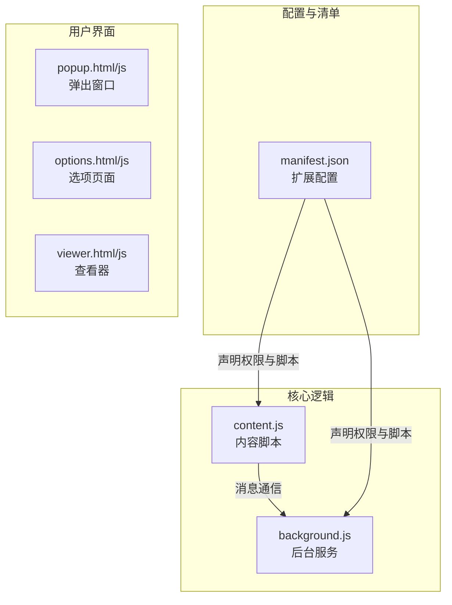
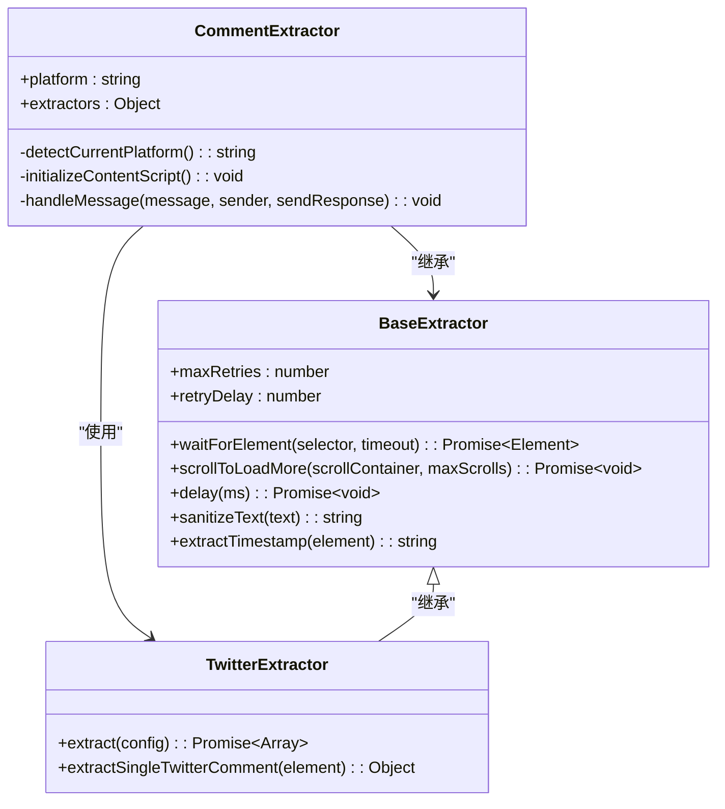
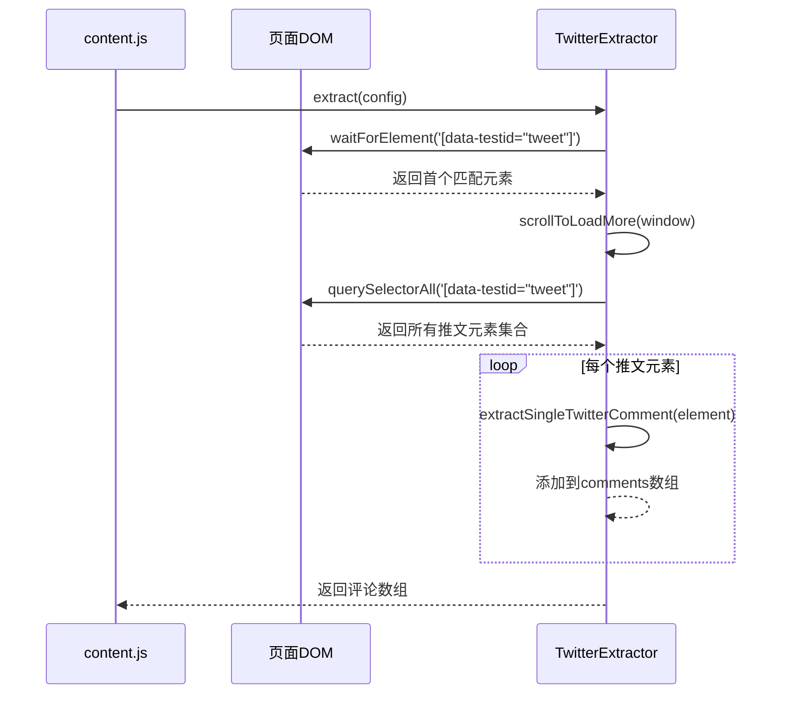
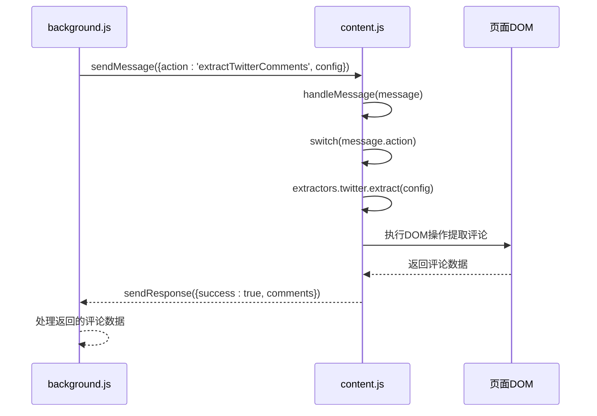

# Twitter/X评论提取

<cite>
**Referenced Files in This Document**   
- [content.js](file://content.js)
- [background.js](file://background.js)
- [manifest.json](file://manifest.json)
</cite>

## 目录
1. [项目结构](#项目结构)
2. [核心组件](#核心组件)
3. [Twitter评论提取机制](#twitter评论提取机制)
4. [DOM解析与数据提取](#dom解析与数据提取)
5. 消息通信协议
6. 可维护性与扩展性设计
7. 总结

## 项目结构

CommentInsight扩展采用标准的Chrome扩展项目结构，包含内容脚本、后台服务、配置文件和用户界面。



**Diagram sources**
- [manifest.json](file://manifest.json#L1-L49)

**Section sources**
- [manifest.json](file://manifest.json#L1-L49)
- [content.js](file://content.js#L1-L560)
- [background.js](file://background.js#L1-L690)

## 核心组件

CommentInsight的核心架构由`CommentExtractor`类驱动，该类在内容脚本中实例化并负责协调不同社交媒体平台的评论提取。系统通过平台检测机制自动识别当前页面所属的社交媒体类型，并初始化相应的提取器实例。



**Diagram sources**
- [content.js](file://content.js#L1-L560)

**Section sources**
- [content.js](file://content.js#L1-L560)

## Twitter评论提取机制

### 基于data-testid的选择器策略

TwitterExtractor利用`data-testid='tweet'`这一稳定标识符作为主要选择器来批量获取推文和回复节点。这种基于测试ID的选择策略相比传统的CSS类名选择器具有更高的稳定性，因为测试ID通常不会随UI样式更新而改变。



**Diagram sources**
- [content.js](file://content.js#L498-L529)
- [content.js](file://content.js#L136-L161)

**Section sources**
- [content.js](file://content.js#L498-L529)

### 无限滚动加载实现

`scrollToLoadMore`方法实现了通用的无限滚动加载机制，通过比较页面高度变化来判断是否还有新内容需要加载。该方法支持自定义滚动容器和最大滚动次数，确保能够充分加载评论内容而不陷入无限循环。

```javascript
async scrollToLoadMore(scrollContainer, maxScrolls = 10) {
    let scrollCount = 0;
    let lastHeight = 0;

    while (scrollCount < maxScrolls) {
        const container = scrollContainer || window;
        const currentHeight = container === window ? 
            document.documentElement.scrollHeight : 
            container.scrollHeight;

        if (currentHeight === lastHeight) {
            break; // 没有新内容加载
        }

        lastHeight = currentHeight;
        
        if (container === window) {
            window.scrollTo(0, document.documentElement.scrollHeight);
        } else {
            container.scrollTop = container.scrollHeight;
        }

        await this.delay(1000); // 等待内容加载
        scrollCount++;
    }
}
```

此机制通过以下步骤工作：
1. 记录当前页面或容器的高度
2. 执行滚动到底部操作
3. 等待1秒让新内容加载
4. 比较新的高度与之前的高度
5. 如果高度未变化则停止（已加载全部内容）
6. 否则继续下一轮滚动，最多执行10次

## DOM解析与数据提取

### 作者名称提取

`extractSingleTwitterComment`方法从嵌套的span结构中提取作者名称，使用`[data-testid="User-Names"] span`选择器定位作者信息。这种方法针对Twitter/X平台特定的数据测试ID进行精确匹配，提高了提取的准确性。

### 时间戳获取

时间戳通过查询`time`元素并读取其`datetime`属性获得，这提供了比文本内容更精确的时间信息。当`time`元素不存在时，系统会回退到使用当前时间作为默认值，确保数据完整性。

```javascript
extractSingleTwitterComment(element) {
    const authorElement = element.querySelector('[data-testid="User-Names"] span');
    const contentElement = element.querySelector('[data-testid="tweetText"]');
    const timeElement = element.querySelector('time');
    
    if (!contentElement) return null;

    const author = authorElement ? this.sanitizeText(authorElement.textContent) : '匿名';
    const text = this.sanitizeText(contentElement.textContent);
    const timestamp = timeElement ? timeElement.getAttribute('datetime') : new Date().toISOString();

    if (!text) return null;

    return {
        id: Date.now().toString() + Math.random().toString(36).substr(2, 9),
        author,
        text,
        timestamp,
        likes: 0, // Twitter的点赞数需要额外解析
        replies: 0
    };
}
```

**Section sources**
- [content.js](file://content.js#L531-L553)

## 消息通信协议

### 内容脚本与后台脚本通信

CommentInsight采用Chrome扩展的标准消息传递机制，在`content.js`和`background.js`之间建立双向通信通道。`CommentExtractor`类通过`chrome.runtime.onMessage.addListener`监听来自后台脚本的消息，并根据`action`指令进行路由处理。



**Diagram sources**
- [content.js](file://content.js#L43-L98)
- [background.js](file://background.js#L100-L130)

**Section sources**
- [content.js](file://content.js#L43-L98)

### action指令验证与路由

消息处理机制包含严格的验证逻辑，确保只有在正确平台上才会执行相应的提取操作。例如，`extractTwitterComments`动作仅在`this.platform === 'twitter'`时才被处理，否则返回错误响应。

```javascript
case 'extractTwitterComments':
    if (this.platform === 'twitter') {
        const comments = await this.extractors.twitter.extract(message.config);
        sendResponse({ success: true, comments });
    } else {
        sendResponse({ success: false, error: '当前页面不是Twitter/X' });
    }
    break;
```

## 可维护性与扩展性设计

### UI迭代对选择器稳定性的影响

尽管`data-testid`选择器相对稳定，但Twitter频繁的UI迭代仍可能影响提取的可靠性。为应对这一挑战，系统采用了以下策略：

1. **多重等待机制**：`waitForElement`方法结合MutationObserver监控DOM变化，确保在动态加载的内容出现后才进行提取。
2. **异常处理**：在提取过程中捕获并记录错误，避免单个失败影响整体提取流程。
3. **灵活的回退机制**：当主要选择器失效时，可快速调整为备用选择器策略。

### 技术权衡：忽略点赞数统计

当前实现中将点赞数字段硬编码为0，这是一种明确的技术权衡：

```javascript
likes: 0, // Twitter的点赞数需要额外解析
```

这种设计决策基于以下考虑：
- **复杂性权衡**：点赞数位于复杂的嵌套结构中，且可能以"1.2K"等格式显示，需要额外的解析逻辑。
- **性能考量**：避免因复杂的DOM遍历影响整体提取性能。
- **数据一致性**：确保基础评论数据的可靠提取，将高级指标作为可选功能。

### 跨平台通用模式

CommentInsight展示了基于DOM解析的通用模式在不同社交媒体平台间的共性与差异：

| 平台 | 共性特征 | 差异特征 |
|------|----------|----------|
| YouTube | 使用BaseExtractor基础功能 | 通过API而非DOM提取 |
| TikTok | DOM解析，滚动加载 | data-e2e测试ID |
| Instagram | DOM解析，滚动加载 | a[role="link"]定位作者 |
| Facebook | DOM解析，滚动加载 | aria-label选择器 |
| Twitter | DOM解析，滚动加载 | data-testid选择器 |

**Section sources**
- [content.js](file://content.js#L1-L560)

## 总结

CommentInsight的Twitter/X评论提取方案体现了现代浏览器扩展开发中的最佳实践。通过利用稳定的`data-testid`选择器、实现智能的无限滚动加载、建立可靠的消息通信协议，系统能够在动态变化的社交媒体环境中稳定运行。

关键设计亮点包括：
- **平台无关的基础架构**：BaseExtractor提供跨平台共享功能
- **针对性的平台适配**：各平台提取器针对特定DOM结构优化
- **健壮的错误处理**：确保部分失败不影响整体功能
- **清晰的关注点分离**：内容脚本负责DOM操作，后台脚本负责业务逻辑

未来改进方向可包括实现点赞数的动态解析、增加对Twitter API的支持作为备选方案，以及引入机器学习模型自动适应UI变化。