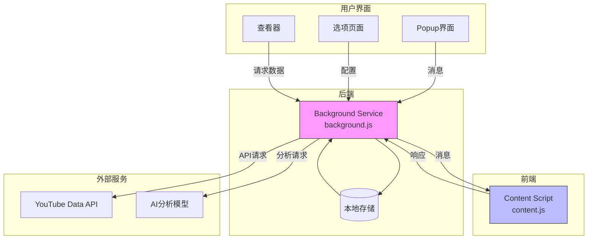
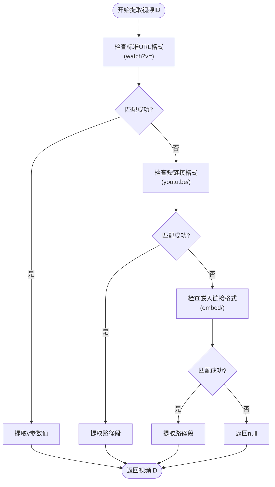
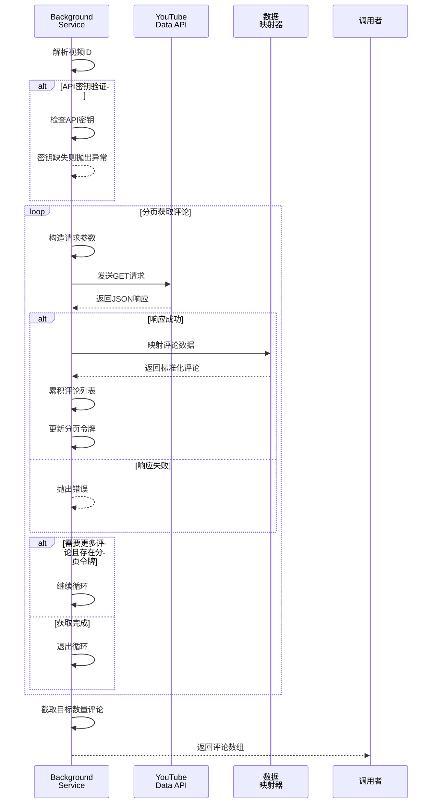
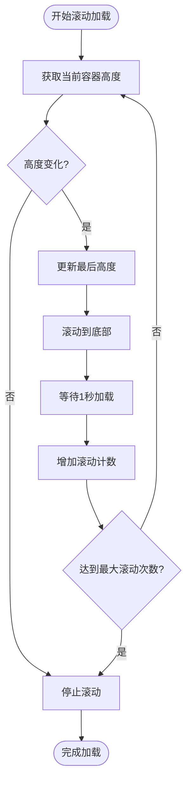
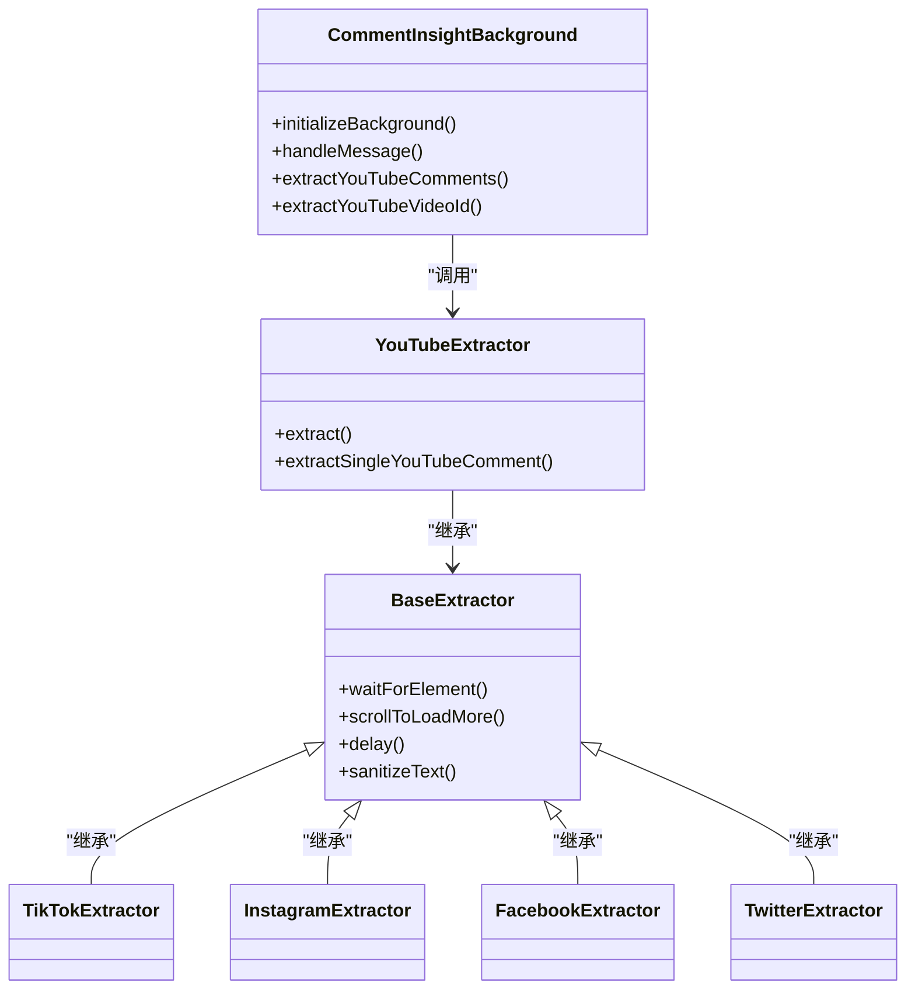

<cite>
**Referenced Files in This Document**  
- [background.js](file://background.js)
- [content.js](file://content.js)
- [manifest.json](file://manifest.json)
</cite>

## 目录
1. [YouTube评论提取](#youtube评论提取)
2. [核心组件](#核心组件)
3. [架构概述](#架构概述)
4. [详细组件分析](#详细组件分析)
5. [依赖分析](#依赖分析)
6. [性能考虑](#性能考虑)
7. [故障排除指南](#故障排除指南)
8. [结论](#结论)

## YouTube评论提取

本技术文档详细阐述CommentInsight扩展如何通过YouTube Data API实现评论提取的技术方案。该方案结合了基于API的高效数据获取与基于DOM解析的备用策略，确保在不同场景下都能成功提取评论数据。

### 技术方案概览

CommentInsight采用分层架构来处理YouTube评论提取任务：
1. **主路径**：优先使用YouTube Data API进行结构化数据获取
2. **备用路径**：当API不可用时，通过内容脚本进行DOM解析

这种双重策略既保证了数据的准确性和完整性，又提供了良好的容错能力。

**Section sources**
- [background.js](file://background.js)
- [content.js](file://content.js)

## 核心组件

系统的核心功能由两个主要组件构成：后台服务`background.js`和内容脚本`content.js`。这两个组件通过Chrome扩展的消息传递机制进行通信，实现了前后端分离的架构模式。

`CommentInsightBackground`类负责处理所有API调用、数据存储和消息路由，而`CommentExtractor`及其子类则负责在页面上下文中执行DOM操作和数据提取。

**Section sources**
- [background.js](file://background.js#L1-L50)
- [content.js](file://content.js#L1-L50)

## 架构概述



**Diagram sources**
- [background.js](file://background.js#L1-L50)
- [content.js](file://content.js#L1-L50)

## 详细组件分析

### YouTube API评论提取分析

#### 视频ID解析机制

系统通过正则表达式模式匹配从多种格式的YouTube URL中提取视频ID。支持的URL格式包括标准播放页、短链接和嵌入式链接。



**Diagram sources**
- [background.js](file://background.js#L247-L259)

#### API请求构造与分页逻辑

`extractYouTubeComments`方法实现了完整的API调用流程，包括请求参数构造、分页处理和响应解析。



**Diagram sources**
- [background.js](file://background.js#L192-L245)

### DOM解析备用方案分析

#### 元素等待机制

`waitForElement`方法使用MutationObserver来监控DOM变化，确保在元素加载完成后才进行操作。

```mermaid
sequenceDiagram
participant Script as 内容脚本
participant Observer as MutationObserver
participant DOM as 页面DOM
Script->>Script : 查询目标元素
alt 元素已存在
Script-->>Script : 立即解析
else 元素不存在
Script->>Observer : 创建观察器并监听body
loop DOM持续变化
DOM->>Observer : 触发mutation事件
Observer->>Script : 查询目标元素
alt 元素出现
Observer->>Observer : 断开连接
Script-->>Script : 开始解析
break 循环
end
end
alt 超时未找到元素
Observer->>Observer : 断开连接
Script-->>Script : 抛出超时异常
end
end
```

**Diagram sources**
- [content.js](file://content.js#L108-L134)

#### 滚动加载机制

`scrollToLoadMore`方法通过模拟用户滚动行为来触发动态内容加载。



**Diagram sources**
- [content.js](file://content.js#L136-L161)

## 依赖分析

系统的主要依赖关系如下：



**Diagram sources**
- [background.js](file://background.js#L1-L50)
- [content.js](file://content.js#L1-L50)

## 性能考虑

在设计评论提取方案时，考虑了以下性能因素：

1. **API配额优化**：通过合理设置`maxResults`参数，减少API调用次数
2. **内存效率**：使用流式处理而非一次性加载所有评论
3. **网络延迟**：异步非阻塞调用避免界面冻结
4. **DOM操作最小化**：批量处理DOM查询和修改

对于大型视频（评论数超过1000条），建议适当调整`maxComments`配置以平衡数据完整性和性能。

## 故障排除指南

### 常见问题及解决方案

| 问题现象 | 可能原因 | 解决方案 |
|--------|--------|--------|
| 无法提取评论 | API密钥未配置 | 在选项页面设置有效的YouTube API密钥 |
| 提取速度慢 | 网络延迟或API限流 | 检查网络连接，稍后重试 |
| 评论数量不足 | 分页令牌失效 | 刷新页面重新尝试 |
| DOM解析失败 | 页面结构变更 | 更新选择器或联系开发者 |

### 错误处理机制

系统实现了多层次的错误处理：

1. **输入验证**：检查URL格式和API密钥
2. **API错误捕获**：处理HTTP状态码和API错误消息
3. **异常传播**：将底层错误封装后向上层传递
4. **用户反馈**：通过popup界面显示友好的错误信息

**Section sources**
- [background.js](file://background.js#L192-L245)
- [content.js](file://content.js#L189-L241)

## 结论

CommentInsight通过结合YouTube Data API和DOM解析两种技术方案，实现了高效、可靠的评论提取功能。后台服务负责API调用和业务逻辑处理，内容脚本作为备用方案确保在各种环境下都能成功获取数据。这种架构设计既保证了数据质量，又提供了良好的用户体验。