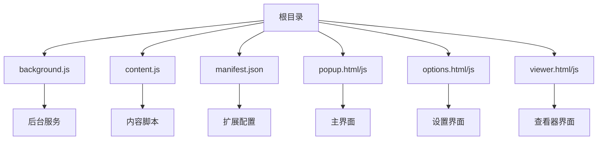
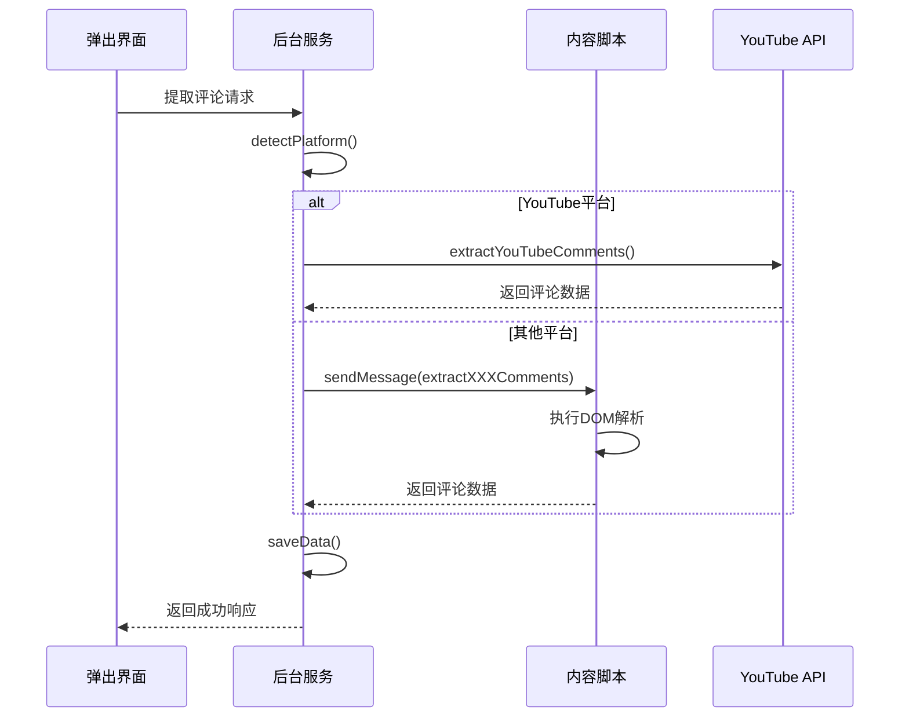
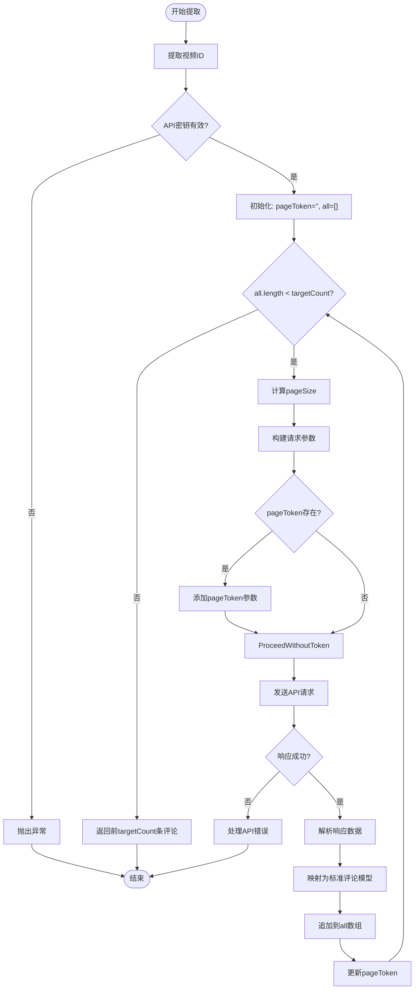
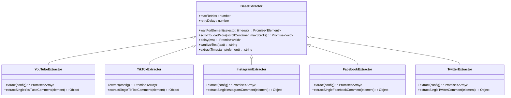
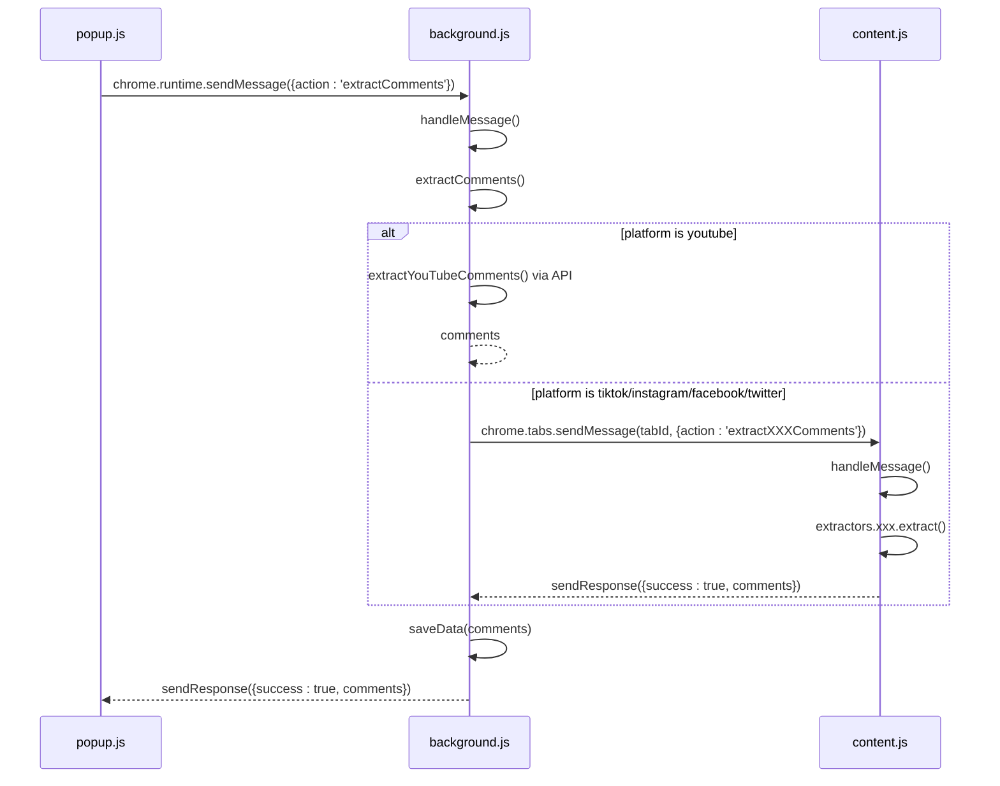
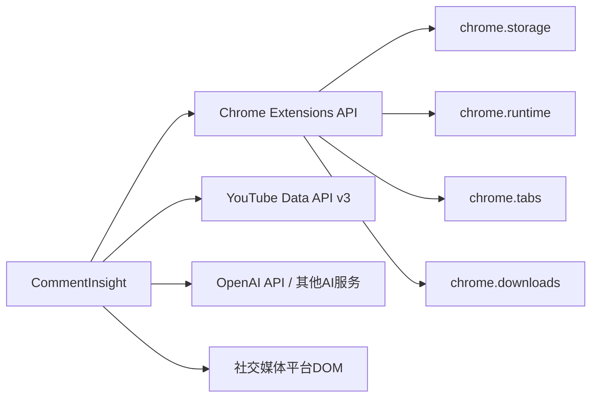

# 评论提取

<cite>
**本文档引用的文件**   
- [background.js](file://background.js)
- [content.js](file://content.js)
- [manifest.json](file://manifest.json)
</cite>

## 目录
1. [简介](#简介)
2. [项目结构](#项目结构)
3. [核心组件](#核心组件)
4. [架构概述](#架构概述)
5. [详细组件分析](#详细组件分析)
6. [依赖分析](#依赖分析)
7. [性能考虑](#性能考虑)
8. [故障排除指南](#故障排除指南)
9. [结论](#结论)

## 简介
本技术文档深入阐述了CommentInsight扩展程序的多平台评论提取机制。该扩展支持从YouTube、TikTok、Instagram、Facebook和Twitter等多个社交媒体平台提取用户评论，并通过AI进行情感分析与洞察生成。系统采用Chrome扩展的三层架构：后台服务（background.js）负责协调控制流，内容脚本（content.js）在目标页面执行DOM解析，弹出界面（popup.js）提供用户交互。对于YouTube平台，系统利用其官方API进行数据获取；而对于其他平台，则通过注入内容脚本并执行动态DOM解析来提取评论数据。整个流程涉及跨上下文消息通信、异步处理、防反爬策略及数据标准化映射。

## 项目结构
CommentInsight是一个标准的Chrome浏览器扩展，其项目结构清晰地划分了不同功能模块。根目录包含核心逻辑文件如`background.js`和`content.js`，以及配置文件`manifest.json`。UI相关文件包括`popup.html`、`options.html`和`viewer.html`及其对应的JavaScript文件，用于实现用户界面和交互逻辑。所有文件协同工作，实现了从评论提取到AI分析再到结果展示的完整工作流。

**Diagram sources**
- [manifest.json](file://manifest.json#L1-L49)

**Section sources**
- [manifest.json](file://manifest.json#L1-L49)

## 核心组件
系统的核心组件主要包括`CommentInsightBackground`类和`CommentExtractor`类，分别运行于后台上下文和内容脚本上下文中。`CommentInsightBackground`负责监听消息、调度任务、管理存储和协调跨平台评论提取流程。`CommentExtractor`则作为内容脚本的主控制器，根据当前页面所属平台实例化相应的具体提取器（如`YouTubeExtractor`、`TikTokExtractor`等），并通过统一接口对外提供服务。两者通过Chrome的消息传递API进行异步通信，确保了功能解耦和安全隔离。

**Section sources**
- [background.js](file://background.js#L1-L686)
- [content.js](file://content.js#L1-L99)

## 架构概述
CommentInsight采用典型的Chrome扩展分层架构，由后台服务、内容脚本和UI界面三部分组成。后台服务作为中央协调者，接收来自弹出界面的操作指令，检测当前标签页所属平台，并调用相应的方法启动评论提取流程。对于YouTube平台，后台服务直接发起API请求；对于其他平台，则通过`chrome.tabs.sendMessage`向内容脚本发送指令，触发DOM解析过程。内容脚本完成数据提取后，将结果回传给后台服务，最终由后台服务保存数据或返回给UI界面展示。

**Diagram sources**
- [background.js](file://background.js#L73-L129)
- [content.js](file://content.js#L43-L98)

## 详细组件分析

### YouTube评论提取机制
YouTube平台的评论提取基于其官方提供的v3 API，避免了复杂的DOM操作和反爬虫限制。系统首先通过正则表达式从视频URL中提取视频ID，然后构造带有API密钥、分页参数和字段选择的HTTP请求。为获取指定数量的评论，系统实现了分页处理逻辑：循环调用API直到达到目标数量或耗尽所有页面。每次请求最多获取100条评论，并使用`nextPageToken`进行翻页。响应数据经过解析后，被映射为统一的评论模型，包含作者、文本、时间戳、点赞数和回复数等字段。

#### YouTube API请求流程

**Diagram sources**
- [background.js](file://background.js#L192-L245)
- [background.js](file://background.js#L247-L259)

**Section sources**
- [background.js](file://background.js#L192-L245)

### TikTok/Instagram/Facebook/Twitter DOM解析机制
对于TikTok、Instagram、Facebook和Twitter等平台，由于其API访问受限或需要复杂的身份验证，系统采用内容脚本注入的方式，通过解析页面DOM结构来提取评论数据。这一过程涉及元素选择器策略、动态内容加载（滚动触发）、MutationObserver监听以及跨平台适配逻辑。

#### DOM解析通用基类
所有平台特定的提取器均继承自`BaseExtractor`基类，该基类提供了通用的辅助方法：
- `waitForElement`: 使用`MutationObserver`监听DOM变化，等待关键元素出现。
- `scrollToLoadMore`: 模拟用户滚动行为，触发无限加载，直至无新内容。
- `sanitizeText`: 清理文本，去除多余空白字符。
- `extractTimestamp`: 尝试从多种可能的选择器中提取时间信息。

**Diagram sources**
- [content.js](file://content.js#L102-L186)

**Section sources**
- [content.js](file://content.js#L102-L186)

#### 平台特定提取策略
各平台的提取器针对其独特的DOM结构实现了具体的解析逻辑：
- **TikTok**: 利用`data-e2e`属性作为主要选择器，如`[data-e2e="comment-list"]`定位评论列表，`[data-e2e="comment-item"]`遍历单条评论，并尝试多种备选选择器以应对DOM变化。
- **Instagram**: 首先尝试点击“查看所有评论”按钮，然后滚动加载更多内容，最后通过`a[role="link"]`识别作者，从多个`span`元素中筛选出评论正文。
- **Facebook**: 使用`[data-testid="UFI2Comment/root"]`等测试ID选择器，结合`aria-label`和类名进行匹配，提取时优先查找链接或强文本标签作为作者名。
- **Twitter**: 基于`[data-testid="tweet"]`选择推文和回复，使用`[data-testid="User-Names"]`获取作者，`[data-testid="tweetText"]`获取内容，并从`time`标签提取时间戳。

这些策略体现了对各平台UI模式的深刻理解，并通过多重选择器和灵活的文本提取逻辑增强了代码的鲁棒性。

**Section sources**
- [content.js](file://content.js#L244-L339)
- [content.js](file://content.js#L342-L425)
- [content.js](file://content.js#L428-L494)
- [content.js](file://content.js#L497-L554)

### 背景服务消息通信机制
后台服务与内容脚本之间的通信是整个系统运作的关键。`background.js`中的`CommentInsightBackground`类通过`chrome.runtime.onMessage.addListener`注册全局消息监听器。当用户在弹出界面点击“提取评论”时，后台服务会根据平台类型决定处理方式：如果是YouTube，则直接调用API；如果是其他平台，则通过`chrome.tabs.sendMessage`向当前标签页的内容脚本发送一条包含`action`（如`extractTikTokComments`）和`config`的指令消息。内容脚本接收到消息后，调用相应的方法执行DOM解析，并将结果通过回调函数返回给后台服务。这种异步消息模式保证了跨上下文的安全通信。

**Diagram sources**
- [background.js](file://background.js#L261-L283)
- [content.js](file://content.js#L33-L41)

**Section sources**
- [background.js](file://background.js#L73-L129)
- [content.js](file://content.js#L43-L98)

## 依赖分析
系统的正常运行依赖于Chrome扩展平台提供的丰富API集。`manifest.json`文件声明了必要的权限，包括`storage`（用于持久化配置和数据）、`activeTab`（允许与当前活动标签页交互）、`scripting`（用于注入脚本）、`tabs`（用于标签页管理和消息传递）和`downloads`（用于导出文件）。同时，系统还声明了对各大社交媒体域名的主机权限，确保内容脚本能正确注入。此外，系统依赖外部AI服务（如OpenAI）进行评论分析，这要求用户提供有效的API密钥。

**Diagram sources**
- [manifest.json](file://manifest.json#L1-L49)

**Section sources**
- [manifest.json](file://manifest.json#L1-L49)

## 性能考虑
系统在设计时充分考虑了性能和用户体验。对于大量评论的AI分析，系统实现了分批处理机制：当评论数量超过阈值时，先将评论分块进行初步总结，再将各块的小结汇总成最终报告，避免单次请求过长导致超时。在DOM解析方面，`scrollToLoadMore`方法设置了最大滚动次数以防止无限加载，`waitForElement`方法设置了超时机制以避免永久阻塞。数据导出功能支持CSV、Markdown和JSON等多种格式，并利用`Blob`和`chrome.downloads.download` API高效生成和下载文件。此外，系统通过本地存储缓存已提取的数据，避免重复提取，提升了响应速度。

## 故障排除指南
常见问题及解决方案：
- **无法提取评论**: 检查是否已在设置页面为对应平台配置了正确的API密钥（YouTube、Instagram、Facebook、Twitter需要，TikTok不需要）。
- **内容脚本未加载**: 确认当前页面URL是否在`manifest.json`的`content_scripts.matches`白名单内。
- **提取结果为空**: 可能是DOM选择器不匹配，请检查目标平台的页面结构是否有变更，或尝试刷新页面。
- **AI分析失败**: 检查AI API密钥是否有效，网络连接是否正常，或尝试更换AI服务端点。
- **滚动加载不完全**: 可能是页面加载延迟较长，可适当增加`BaseExtractor`中的`delay`时间。

**Section sources**
- [background.js](file://background.js#L73-L129)
- [content.js](file://content.js#L108-L134)

## 结论
CommentInsight通过巧妙结合官方API和DOM解析两种技术，实现了对多平台社交媒体评论的高效提取。其模块化的架构设计使得新增平台支持变得简单，而统一的数据模型和灵活的配置系统则保证了良好的可维护性和用户体验。未来可进一步优化的方向包括增强选择器的智能匹配能力、引入更复杂的反反爬策略、以及支持更多社交媒体平台。