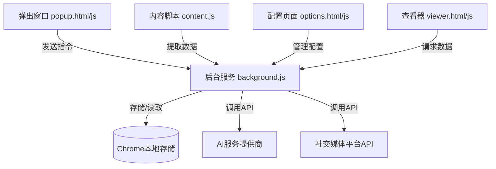

# 项目概述

<cite>
**本文档引用的文件**   
- [README.md](file://README.md)
- [manifest.json](file://manifest.json)
- [popup.js](file://popup.js)
- [background.js](file://background.js)
- [content.js](file://content.js)
- [options.js](file://options.js)
- [viewer.js](file://viewer.js)
</cite>

## 目录
1. [引言](#引言)
2. [核心功能与价值主张](#核心功能与价值主张)
3. [目标用户群体](#目标用户群体)
4. [系统架构概览](#系统架构概览)
5. [组件关系与工作流程](#组件关系与工作流程)
6. [使用场景与操作流程](#使用场景与操作流程)

## 引言

评论洞察（Comment Insight）是一款功能强大的Chrome浏览器扩展，旨在帮助用户从主流社交媒体平台提取评论，并通过人工智能技术进行深度分析。该项目的核心目标是将海量、非结构化的用户评论转化为可读性强、具有行动指导意义的结构化洞察报告。

该扩展支持YouTube、TikTok、Instagram、Facebook和Twitter/X等五大主流社交平台，利用AI技术对评论进行情感分析、主题识别和趋势洞察，为市场分析师、内容创作者和社会媒体管理者提供数据驱动的决策支持。整个项目设计遵循模块化原则，由弹出窗口、后台服务、内容脚本、查看器和配置页面等多个组件协同工作，共同完成从数据采集到智能分析的完整闭环。

**Section sources**
- [README.md](file://README.md#L0-L381)

## 核心功能与价值主张

评论洞察扩展的核心功能围绕“数据获取”、“智能分析”和“结果呈现”三大环节构建，形成了一个完整的数据分析流水线。

在**数据获取**方面，扩展能够根据不同的平台特性采用最合适的策略提取评论。对于拥有开放API的平台如YouTube，它通过官方API进行高效、稳定的调用；而对于API访问受限的平台如TikTok，则采用DOM解析技术，直接从网页中抓取评论内容。这种灵活的适配机制确保了在不同平台上的稳定运行。

在**智能分析**方面，扩展集成了OpenAI兼容的AI服务，能够对提取的评论进行多维度的深度分析。这包括：
- **情感分析**：量化正面、中性、负面情绪的比例。
- **关键洞察**：提炼用户讨论的核心观点和主要反馈。
- **主题识别**：自动发现评论中反复出现的话题和关键词。
- **趋势洞察**：识别新兴的讨论模式和潜在的热点。

在**结果呈现**方面，扩展提供了多种数据管理和导出方式。用户可以方便地搜索、排序和分页浏览大量评论，并将分析结果以CSV、Markdown或JSON等多种格式导出，便于进一步处理或分享。

其核心价值主张在于，它极大地降低了从社交媒体评论中获取商业洞察的门槛，将原本耗时费力的人工阅读和总结过程自动化，使用户能够快速、准确地理解公众舆论。

**Section sources**
- [README.md](file://README.md#L4-L79)

## 目标用户群体

评论洞察扩展主要服务于以下三类专业用户：

1.  **市场分析师**：他们可以利用该工具监控品牌声誉、评估营销活动效果、追踪竞争对手动态以及挖掘消费者需求。通过对产品相关视频或帖子的评论进行分析，分析师能获得第一手的消费者反馈，用于制定更精准的市场策略。

2.  **内容创作者**：无论是YouTuber、TikTok博主还是微博大V，创作者都可以通过分析自己作品下的评论来了解观众的喜好和痛点。这有助于优化内容方向，提高互动率，并建立更紧密的粉丝关系。

3.  **社会媒体管理者**：负责企业社交媒体账号运营的团队可以使用此工具进行大规模的内容审核和舆情监控。它能帮助管理者快速识别重要客户反馈、发现潜在危机并生成定期的分析报告。

这些用户群体的共同特点是需要处理大量的社交媒体数据，并从中提炼出有价值的信息。评论洞察通过自动化和智能化的手段，显著提升了他们的工作效率和分析质量。

**Section sources**
- [README.md](file://README.md#L0-L381)

## 系统架构概览

评论洞察扩展基于Chrome扩展程序的Manifest V3规范构建，采用了典型的分层架构，各组件职责分明，协同工作。

**Diagram sources **
- [manifest.json](file://manifest.json#L1-L49)
- [popup.js](file://popup.js#L1-L546)
- [background.js](file://background.js#L1-L690)
- [content.js](file://content.js#L1-L560)
- [options.js](file://options.js#L1-L575)
- [viewer.js](file://viewer.js#L1-L809)

如上图所示，系统的中心是**后台服务 (background.js)**，它作为消息中枢和业务逻辑处理器，负责协调所有其他组件。**弹出窗口 (popup.js)** 是用户的主要交互界面，用户在此发起评论提取和AI分析等操作。**内容脚本 (content.js)** 被注入到各个社交媒体平台的页面中，负责执行具体的评论提取任务。**配置页面 (options.js)** 允许用户设置AI服务和平台API的密钥。最后，**查看器 (viewer.js)** 提供了一个独立的页面来展示和管理评论及分析结果。所有持久化数据都存储在Chrome的本地存储中。

**Section sources**
- [manifest.json](file://manifest.json#L1-L49)
- [popup.js](file://popup.js#L1-L546)
- [background.js](file://background.js#L1-L690)

## 组件关系与工作流程

各组件之间的协作依赖于Chrome扩展的消息传递机制，形成了一套清晰的工作流程。

当用户点击扩展图标时，**弹出窗口**首先被加载。它会立即向**后台服务**发送一条`detectPlatform`消息，以确定当前标签页所在的社交媒体平台。后台服务收到消息后，执行平台检测逻辑，并将结果返回给弹出窗口，从而更新UI显示。

当用户点击“提取评论”按钮时，弹出窗口会再次向后台服务发送`extractComments`消息。后台服务根据平台类型，决定是直接调用API（如YouTube），还是向当前标签页注入**内容脚本**并发送特定的提取指令（如TikTok）。内容脚本在目标页面上执行DOM操作，收集评论数据，并通过消息通道将结果返回给后台服务，最终再传回弹出窗口。

当用户点击“AI分析”按钮时，弹出窗口将已提取的评论数据发送给后台服务进行`analyzeComments`操作。后台服务会整合用户的AI配置，构造合适的提示词（prompt），然后调用外部AI服务的API。AI服务返回的分析结果经过处理后，同样通过消息链路返回给弹出窗口进行展示。

在整个过程中，**配置页面**和**查看器**也通过相同的消息机制与后台服务通信，分别用于读写配置信息和查询历史数据。这种基于消息的松耦合设计，使得各个组件可以独立开发和维护，提高了代码的可维护性和可扩展性。

**Section sources**
- [popup.js](file://popup.js#L1-L546)
- [background.js](file://background.js#L1-L690)
- [content.js](file://content.js#L1-L560)

## 使用场景与操作流程

评论洞察的使用流程直观且高效，为初学者提供了清晰的操作路径。

一个典型的使用场景如下：一位市场分析师正在研究一款新发布手机的市场反响。他首先打开YouTube上该手机的评测视频页面，然后点击浏览器工具栏中的“评论洞察”扩展图标。

在弹出的窗口中，他会看到平台已被自动识别为“YouTube”，页面标题也被正确显示。接着，他点击“提取评论”按钮，扩展会调用YouTube Data API，获取该视频下的数百条评论，并实时显示评论数量。

随后，他点击“AI分析”按钮。扩展会将这些评论发送至配置好的AI服务（如OpenAI）。几分钟后，AI分析完成，生成一份包含关键洞察、情感比例、主要讨论主题和建议的详细报告。

最后，分析师可以点击“查看分析”按钮，在查看器页面中仔细审阅这份报告，或者点击“导出数据”按钮，将报告保存为Markdown文件，以便在周报中引用。整个过程无需离开浏览器，极大地简化了从数据到洞察的转化链条。

**Section sources**
- [README.md](file://README.md#L205-L241)
- [popup.html](file://popup.html#L1-L117)
- [viewer.html](file://viewer.html#L1-L202)