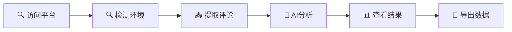

# 📊 评论洞察 (Comment Insight)

<p align="center">
  
</p>

<p align="center">
  <strong>一个功能强大的Chrome浏览器扩展，从主流社交媒体平台提取评论并通过AI进行深度分析</strong>
</p>

<p align="center">
  
  
  
  
</p>

---

## 📝 项目简介

评论洞察是一款基于Chrome Manifest V3的浏览器扩展，专为内容创作者、市场分析师和社交媒体管理者设计。它能够从YouTube、TikTok、Instagram、Facebook、Twitter/X和哔哩哔哩等六大主流平台智能提取评论，并通过AI技术生成深度洞察报告，帮助用户快速理解用户反馈、把握舆论趋势、优化内容策略。

## ✨ 核心特性

### 🔍 **多平台评论提取**
| 平台 | 提取方式 | 特色功能 |
|------|----------|----------|
| **YouTube** | 官方API | 高效稳定，支持大量评论 |
| **TikTok** | DOM解析 | 智能滚动加载，自动去重 |
| **Instagram** | API + DOM | 帖子和Stories评论 |
| **Facebook** | Graph API | 帖子和视频评论 |
| **Twitter/X** | API v2 | 推文回复和转发评论 |
| **哔哩哔哩** 🆕 | 智能DOM | 穿透Shadow DOM，多层评论 |

### 🤖 **AI智能分析**
- **🎯 关键洞察提取**: 自动识别用户关注焦点和核心议题
- **💭 情感分析**: 量化正面、中性、负面情感比例
- **🏷️ 主题分类**: 智能标签化评论内容和话题
- **📈 趋势识别**: 发现热点话题和新兴讨论模式
- **💡 可操作建议**: 基于分析结果生成实用建议
- **🔄 分块处理**: 大数据量智能分块，确保分析完整性

### 📊 **数据管理与导出**
- **📄 多格式导出**: CSV（数据表格）、Markdown（报告）、JSON（完整数据）
- **🗂️ 历史记录**: 智能去重，按平台分类管理
- **🔍 搜索排序**: 关键词搜索，时间/热度排序
- **📑 分页浏览**: 大数据量友好的分页显示
- **📅 智能命名**: 自动生成`平台-标题-时间`格式文件名

### ⚙️ **灵活配置系统**
- **🔌 多AI服务**: OpenAI、Azure OpenAI、Claude等兼容服务
- **🎛️ 参数调优**: 温度值、令牌数、模型选择等精细控制
- **🔧 平台配置**: 各平台API密钥和提取参数独立配置
- **💾 配置管理**: 导入/导出配置，一键测试连接

## 🚀 快速开始

### 📋 系统要求
- **浏览器**: Chrome 88+ 或基于Chromium的浏览器
- **操作系统**: Windows, macOS, Linux
- **网络**: 稳定的互联网连接（用于AI分析）

### 🔧 安装步骤

#### 方法一：开发者模式安装（推荐）

1. **📥 获取源代码**
   ```bash
   git clone https://github.com/your-repo/CommentInsight.git
   cd CommentInsight
   ```

2. **🌐 打开Chrome扩展管理**
   - 地址栏输入：`chrome://extensions/`
   - 或通过：菜单 → 更多工具 → 扩展程序

3. **🔓 启用开发者模式**
   - 点击页面右上角的"开发者模式"开关

4. **📂 加载扩展**
   - 点击"加载已解压的扩展程序"
   - 选择 `CommentInsight` 文件夹
   - 扩展图标将出现在工具栏中

#### 方法二：CRX包安装

1. **📦 生成安装包**
   - 在扩展管理页面点击"打包扩展程序"
   - 选择项目根目录，生成 `.crx` 文件

2. **⚡ 快速安装**
   - 将 `.crx` 文件拖拽到扩展管理页面
   - 确认安装并授权权限

### ⚙️ 初始配置

> 💡 **提示**: 首次使用需要配置AI服务才能进行智能分析

1. **🤖 配置AI服务**
   - 点击扩展图标 → 设置按钮
   - 选择AI服务提供商（OpenAI推荐）
   - 输入API密钥和端点
   - 测试连接确保配置正确

2. **🔑 配置平台API（可选）**
   - YouTube: 需要Google Cloud API密钥
   - Twitter/X: 需要开发者账户Bearer Token
   - 其他平台: 支持DOM提取，无需API

3. **✅ 验证安装**
   - 访问任意支持的社交媒体平台
   - 点击扩展图标，查看平台检测状态
   - 绿色图标表示支持，红色表示不支持

### 🎯 首次使用

1. **📱 打开社交媒体页面**（如YouTube视频页面）
2. **🔍 点击扩展图标**，确认平台检测成功
3. **📥 点击"提取评论"**，等待评论收集完成
4. **🤖 点击"AI分析"**，获取智能洞察报告
5. **👁️ 点击"查看分析"**，浏览详细结果并导出数据

## 📚 配置指南

### 🤖 AI服务配置

支持多种主流AI服务提供商，灵活适应不同需求和预算：

#### OpenAI 官方服务 🌟
```json
{
  "endpoint": "https://api.openai.com/v1",
  "apiKey": "sk-proj-your-api-key-here",
  "model": "gpt-4o-mini",
  "temperature": 0.7,
  "maxTokens": 2048
}
```

#### Azure OpenAI 企业级
```json
{
  "endpoint": "https://your-resource.openai.azure.com/openai/deployments/your-deployment/chat/completions?api-version=2024-02-15-preview",
  "apiKey": "your-azure-api-key",
  "model": "gpt-4",
  "temperature": 0.6,
  "maxTokens": 4000
}
```

#### Claude/Anthropic 🤖
```json
{
  "endpoint": "https://api.anthropic.com/v1",
  "apiKey": "sk-ant-your-api-key",
  "model": "claude-3-sonnet-20240229",
  "temperature": 0.5,
  "maxTokens": 3000
}
```

#### 本地/私有部署 🏠
```json
{
  "endpoint": "http://localhost:8000/v1",
  "apiKey": "your-local-key",
  "model": "llama-3-70b",
  "temperature": 0.8,
  "maxTokens": 2000
}
```

> 📊 **性能建议**: 
> - **高质量分析**: GPT-4, Claude-3-Opus
> - **成本优化**: GPT-3.5-turbo, GPT-4o-mini
> - **私有部署**: Llama-3, Qwen, ChatGLM

### 🔑 平台API配置

#### YouTube Data API v3 📺
1. **获取API密钥**
   - 访问 [Google Cloud Console](https://console.cloud.google.com/)
   - 创建新项目或选择现有项目
   - 启用 "YouTube Data API v3"
   - 生成API密钥并限制域名

2. **配置示例**
   ```json
   {
     "youtube": {
       "apiKey": "AIzaSyXXXXXXXXXXXXXXXXXXXXXXXX",
       "maxComments": 500,
       "order": "time"
     }
   }
   ```

#### Twitter API v2 🐦
1. **申请开发者账户**
   - 访问 [Twitter Developer Portal](https://developer.twitter.com/)
   - 申请Basic或Pro计划
   - 创建应用程序获取Bearer Token

2. **配置示例**
   ```json
   {
     "twitter": {
       "bearerToken": "AAAAAAAAAAAAAAAAAAAAAXXXXXXXXXXXXXXXXXXXXXXXXXXX",
       "maxResults": 100,
       "expansions": "author_id,created_at"
     }
   }
   ```

#### Instagram Basic Display API 📷
1. **创建 Facebook应用**
   - 访问 [Facebook Developers](https://developers.facebook.com/)
   - 创建应用程序并配置Instagram Basic Display
   - 获取用户访问令牌

2. **配置示例**
   ```json
   {
     "instagram": {
       "accessToken": "IGQVJYXXXXXXXXXXXXXXXXXXXXXXXX",
       "appId": "your-app-id",
       "fields": "caption,media_type,timestamp"
     }
   }
   ```

#### 哔哩哔哩平台 📺
> 🔥 **新增支持**: 支持最新的Shadow DOM架构，无需API配置

```json
{
  "bilibili": {
    "mode": "dom",
    "delay": 1000,
    "maxScrolls": 10,
    "autoExpand": true
  }
}
```

- **mode**: `dom`（DOM解析）或 `api`（官方API）
- **delay**: 滚动间隔时间（毫秒）
- **maxScrolls**: 最大滚动次数
- **autoExpand**: 自动展开更多评论

## 📚 使用指南

### 🌊 基本工作流程

> 🔄 **智能化流程**: 从数据收集到洞察生成，一键式体验



#### 1️⃣ 打开平台页面
- **支持平台**: YouTube, TikTok, Instagram, Facebook, Twitter/X, 哔哩哔哩
- **页面类型**: 视频、帖子、文章等包含评论的内容
- **加载状态**: 确保页面完全加载，评论区域可见

#### 2️⃣ 激活扩展
- 点击浏览器工具栏中的📊图标
- 自动检测平台类型和页面信息
- ✅ 绿色指示灯 = 平台支持，❌ 红色 = 不支持

#### 3️⃣ 提取评论
- **一键提取**: 点击"提取评论"按钮
- **进度显示**: 实时显示提取进度和数量
- **自动去重**: 避免重复评论，提高数据质量

| 平台 | 提取方式 | 特殊处理 |
|------|----------|----------|
| YouTube | 官方API | 支持大量评论，可按时间/热度排序 |
| TikTok | DOM解析 | 模拟滚动，渐进加载更多评论 |
| 哔哩哔哩 | 智能DOM | 穿透Shadow DOM，自动展开回复 |
| Instagram | 混合模式 | API + DOM备用机制 |
| Twitter/X | API v2 | 支持线程式回复查看 |
| Facebook | Graph API | 公开帖子和页面评论 |

#### 4️⃣ AI智能分析
- **分块处理**: 自动将大量评论分块分析，确保完整性
- **多维度分析**: 情感、主题、趋势、建议等全面覆盖
- **实时反馈**: 显示分析进度和AI调用状态

> 🤖 **AI分析输出示例**:
> - **关键洞察**: 用户普遍对产品质量表示满意，但对价格存在争议
> - **情感分布**: 正面 68% | 中性 22% | 负面 10%
> - **热门主题**: #产品质量 #性价比 #售后服务 #物流速度
> - **可操作建议**: 优化定价策略，加强售后沟通

#### 5️⃣ 结果查看与导出
- **专业查看器**: 点击"查看分析"进入详细页面
- **多维度搜索**: 按关键词、情感、时间等筛选
- **灵活排序**: 时间倒序、热度排序、相关度排序
- **智能分页**: 大数据量友好的浏览体验

### 🎨 高级功能

#### 📊 数据分析与可视化
- **趋势分析**: 评论量随时间变化趋势
- **情感波动**: 观察情感变化轨迹
- **热词云**: 自动生成高频关键词可视化
- **对比分析**: 不同平台、时间段的数据对比

#### 📈 历史记录管理
- **智能归档**: 按平台、日期、主题自动分类
- **对比分析**: 选择多个历史记录进行趋势对比
- **标签管理**: 自定义标签和分组管理
- **数据清理**: 批量删除、定时清理策略

#### 🔧 个性化配置
- **智能提示词**: 针对不同行业和场景的定制化分析
- **输出格式**: 中文/英文报告，技术/商务风格
- **阈值设置**: 情感强度、关键词频率等过滤条件
- **用户个性化**: 保存个人使用习惯和偏好设置

### 🔍 平台特性详解

#### YouTube 📺
- **深度提取**: 支持视频、直播、Shorts评论
- **线程化处理**: 自动获取回复的回复（多层级）
- **实时数据**: 支持直播间实时评论获取
- **元数据丰富**: 视频统计、频道信息、标签等

#### TikTok 💃
- **智能滚动**: 模拟人类浏览行为，避免反爬虫识别
- **动态加载**: 渐进式加载更多评论内容
- **多语言支持**: 自动识别和处理不同语言评论
- **视频信息**: 提取播放量、点赞数等数据

#### 哔哩哔哩 📺 新增
- **Shadow DOM穿透**: 最新技术解决复杂的页面结构
- **多层评论**: 支持主评论和多层级回复
- **表情包支持**: 识别和处理B站特色表情包
- **实时弹幕**: 同时支持评论区和弹幕提取

#### Instagram 📷
- **多媒体支持**: 图片、视频、Stories、Reels
- **隐私性处理**: 尊重用户隐私设置
- **标签解析**: 提取并分析话题标签(#hashtag)
- **位置信息**: 关联地理位置数据（如可用）

### 🛡️ 安全与隐私

#### 数据安全
- **本地存储**: 所有数据存储在用户本地，不上传云端
- **加密保护**: 敏感配置（API密钥）采用加密存储
- **访问控制**: 最小权限原则，仅访问必要资源
- **数据清理**: 用户可随时清除所有本地数据

#### 隐私保护
- **匿名化处理**: AI分析时自动过滤个人身份信息
- **合规操作**: 严格遵守各平台服务条款和API政策
- **透明度**: 用户完全知晓数据处理过程
- **用户控制**: 用户对数据拥有完全控制权

## 🎯 最佳实践

### 📈 API使用优化

#### 成本控制策略
- **模型选择建议**:
  - 日常分析: `gpt-3.5-turbo`, `gpt-4o-mini`
  - 深度分析: `gpt-4`, `claude-3-sonnet`
  - 企业级: `Azure OpenAI`, 私有部署
- **令牌数优化**: 根据评论数量动态调整上限
- **频率控制**: 合理设置请求间隔，避免超出限制

#### 平台限制处理
```json
{
  "recommendations": {
    "youtube": {
      "maxComments": 1000,
      "batchSize": 100,
      "retryDelay": 2000
    },
    "tiktok": {
      "scrollDelay": 2000,
      "maxScrolls": 15,
      "throttleRate": "slow"
    },
    "bilibili": {
      "delay": 1500,
      "maxScrolls": 10,
      "retryAttempts": 3
    }
  }
}
```

### 🧠 分析质量提升

#### 智能提示词调优
```javascript
// 行业特定提示词示例
{
  "ecommerce": {
    "focus": ["产品质量", "物流体验", "价格满意度", "售后服务"],
    "sentiment_weights": {"negative": 1.5, "positive": 1.0}
  },
  "content_creation": {
    "focus": ["内容质量", "创意性", "观众参与", "话题热度"],
    "trend_analysis": true
  }
}
```

#### 参数调优指南
| 参数 | 分析类型 | 推荐值 | 说明 |
|------|----------|--------|------|
| **Temperature** | 情感分析 | 0.3-0.5 | 更稳定的情感判断 |
| **Temperature** | 创意洞察 | 0.7-0.9 | 更多元化的观点 |
| **Max Tokens** | 简要摘要 | 1000-1500 | 适合日常快速分析 |
| **Max Tokens** | 深度报告 | 3000-4000 | 用于详细商业报告 |

### 🛡️ 数据安全与隐私

#### 隐私保护措施
- **数据本地化**: 所有评论和分析结果本地存储
- **敏感信息过滤**: AI分析前自动移除个人身份信息
- **加密存储**: API密钥等敏感配置加密保存
- **定期清理**: 建议定期清理历史数据、保护隐私

#### 合规使用
```markdown
✅ **合规操作**:
- 遵守各平台服务条款
- 尊重用户隐私设置
- 不超过API频率限制
- 只提取公开可见内容

❌ **禁止行为**:
- 大量爬取并商业化使用
- 提取私人或受保护内容
- 频繁请求干扰平台正常运行
- 未经授权分享他人数据
```

### 📊 性能优化

#### 大数据处理
- **分块策略**: 超过500条评论自动分块处理
- **增量更新**: 只分析新增评论，提高效率
- **并发控制**: 防止同时多个分析任务冲突
- **缓存机制**: 相同页面短时间内避免重复提取

#### 资源管理
```javascript
// 性能优化配置
{
  "performance": {
    "concurrent_extractions": 1,
    "cache_duration": 3600000,  // 1小时
    "batch_size": 50,
    "memory_cleanup_interval": 300000  // 5分钟
  }
}
```

## 🛠️ 故障排除

### 常见问题

#### 扩展无法加载
- 检查Chrome版本（需要88+）
- 确认开发者模式已启用
- 重新加载扩展

#### 评论提取失败
- **YouTube**: 检查API密钥和配额
- **TikTok**: 确认页面已完全加载
- **Instagram**: 验证访问令牌有效性
- **Facebook**: 检查应用权限设置
- **Twitter**: 确认Bearer Token正确

#### AI分析失败
- 验证API端点和密钥
- 检查网络连接
- 确认模型可用性
- 检查请求频率限制

#### 数据导出问题
- 检查浏览器下载权限
- 确认有足够的存储空间
- 验证数据格式完整性

### 错误代码说明

| 错误代码 | 描述 | 解决方案 |
|---------|------|----------|
| AUTH_001 | API密钥无效 | 检查并更新API密钥 |
| RATE_001 | 请求频率超限 | 等待后重试或调整请求间隔 |
| DATA_001 | 数据格式错误 | 检查平台页面格式 |
| NETWORK_001 | 网络连接失败 | 检查网络连接 |

## 🔒 隐私与安全

### 数据处理
- 所有数据本地存储在Chrome扩展存储中
- 不会上传评论内容到第三方服务器
- AI分析仅发送必要的文本内容

### API安全
- API密钥加密存储
- 支持安全的API端点（HTTPS）
- 遵循最小权限原则

### 权限说明
- `storage`: 保存配置和数据
- `activeTab`: 访问当前标签页内容
- `scripting`: 注入内容脚本
- `tabs`: 管理标签页

## 📊 支持的数据格式

### 🎨 智能导出格式

#### CSV格式（原始评论数据）📈
```csv
作者,内容,时间戳,点赞数,回复数,情感,平台,话题标签
"用户A","这个产品真不错！推荐给大家","2024-01-15T10:30:00Z",42,3,"正面","YouTube","#产品评测"
"用户B","期待下一期内容，什么时候更新？","2024-01-15T11:15:00Z",18,1,"正面","YouTube","#期待更新"
"用户C","音质有点问题，建议改进","2024-01-15T12:00:00Z",5,0,"负面","YouTube","#音质反馈"
```

#### Markdown格式（专业分析报告）📋
```markdown
# 📊 评论洞察分析报告

**📅 生成时间**: 2024-01-15 15:30:00  
**🎯 数据源**: YouTube - "数码产品评测视频"  
**📝 评论数量**: 1,247 条  
**🤖 分析模型**: GPT-4  
**⏱️ 分析耗时**: 45.2秒  

---

## 🎯 核心洞察摘要

### 🏆 主要发现
1. **用户满意度高达78%** - 用户普遍对产品表示认可
2. **价格敏感性突出** - 超过30%的讨论涉及性价比问题
3. **功能亮点受赞誉** - 电池续航和拍照质量获得好评
4. **售后服务待提升** - 15%的负面评论集中在客服响应

### 💡 策略建议
- 💰 优化定价策略，提高性价比感知
- 😊 加强用户教育，突出产品优势
- 📦 改善包装设计，提升开箱体验
- 🔧 完善售后培训，提高服务质量

---

## 📈 情感分析详情

| 情感类型 | 占比 | 数量 | 代表性评论 |
|----------|------|------|------------|
| 😊 正面 | 68.2% | 851条 | "用了一段时间，真的很不错，值得推荐" |
| 😐 中性 | 21.8% | 272条 | "做工还可以，但是价格偏高了一些" |
| 😞 负面 | 10.0% | 124条 | "收到发现有划痕，售后不给力" |

## 🏷️ 热门话题分布

### Top 10 讨论话题
1. **产品质量** (23.5%) - 做工、材质、耐用性
2. **性价比** (18.2%) - 价格合理性、竞品对比
3. **功能体验** (15.8%) - 实际使用感受
4. **外观设计** (12.4%) - 颜值、手感、便携性
5. **售后服务** (11.3%) - 客服、维修、退换货
6. **物流配送** (8.9%) - 发货速度、包装质量
7. **品牌信任** (6.2%) - 品牌印象、购买信心
8. **技术参数** (3.7%) - 规格、性能数据

## 📊 时间趋势分析

### 评论量变化
- **前3天**: 高峰期，平均每小时35条评论
- **第4-7天**: 稳定期，平均每小时18条评论  
- **第8天后**: 衰减期，平均每小时8条评论

### 情感变化趋势
- **初期** (前24小时): 正面情感80%，用户新鲜感强
- **中期** (2-7天): 正面情感75%，客观评价增多
- **后期** (7天+): 正面情感65%，深度使用反馈

---

## 🔍 深度洞察

### 用户画像分析
- **核心用户群**: 25-35岁数码爱好者，追求品质与性价比
- **关注重点**: 实用性 > 外观 > 价格 > 品牌
- **决策因素**: 同类产品对比、用户评价、价格优势

### 竞品对比反馈
- **vs 品牌A**: 价格优势明显，但功能略逊
- **vs 品牌B**: 功能相当，价格偏高
- **vs 品牌C**: 综合表现最佳，性价比突出

---

**📝 备注**: 本报告基于AI智能分析生成，建议结合具体业务场景进行解读和应用。
```

#### JSON格式（结构化完整数据）💾
```json
{
  "metadata": {
    "reportId": "RPT_20240115_153000",
    "timestamp": "2024-01-15T15:30:00Z",
    "platform": "youtube",
    "url": "https://youtube.com/watch?v=example123",
    "title": "数码产品评测视频 - 详细体验分享",
    "totalComments": 1247,
    "analysisModel": "gpt-4",
    "extractionDuration": "45.2s",
    "analysisDuration": "23.7s",
    "version": "1.0.0"
  },
  "summary": {
    "overallSentiment": {
      "positive": 68.2,
      "neutral": 21.8,
      "negative": 10.0
    },
    "keyInsights": [
      "用户满意度高达78%，产品获得广泛认可",
      "价格敏感性突出，30%讨论涉及性价比",
      "功能亮点受赞誉，电池和拍照质量好评"
    ],
    "topTopics": [
      {"topic": "产品质量", "percentage": 23.5, "sentiment": "positive"},
      {"topic": "性价比", "percentage": 18.2, "sentiment": "mixed"},
      {"topic": "功能体验", "percentage": 15.8, "sentiment": "positive"}
    ]
  },
  "comments": [
    {
      "id": "cmt_001",
      "author": "数码达人小李",
      "content": "用了一个月，整体感觉不错。电池续航确实如宣传所说，拍照效果也很满意。唯一不足是价格稍高，希望能有更多优惠活动。",
      "timestamp": "2024-01-15T10:30:00Z",
      "likes": 42,
      "replies": 3,
      "sentiment": {
        "label": "positive",
        "confidence": 0.85,
        "aspects": {
          "电池续航": "positive",
          "拍照效果": "positive",
          "价格": "negative"
        }
      },
      "topics": ["产品质量", "性价比", "功能体验"],
      "language": "zh-CN"
    }
  ],
  "analysis": {
    "sentimentTrends": {
      "daily": [
        {"date": "2024-01-14", "positive": 80, "neutral": 15, "negative": 5},
        {"date": "2024-01-15", "positive": 75, "neutral": 18, "negative": 7}
      ]
    },
    "wordCloud": {
      "高频词汇": [
        {"word": "不错", "count": 156, "sentiment": "positive"},
        {"word": "推荐", "count": 134, "sentiment": "positive"},
        {"word": "价格", "count": 128, "sentiment": "neutral"},
        {"word": "质量", "count": 112, "sentiment": "positive"}
      ]
    },
    "recommendations": [
      {
        "category": "产品优化",
        "suggestion": "保持电池续航和拍照质量优势，继续优化用户体验",
        "priority": "medium"
      },
      {
        "category": "营销策略",
        "suggestion": "加强性价比宣传，推出限时优惠活动",
        "priority": "high"
      }
    ]
  },
  "export": {
    "generatedAt": "2024-01-15T15:30:00Z",
    "format": "json",
    "filename": "YouTube-数码产品评测视频-2024-01-15_15-30.json",
    "size": "2.3MB",
    "hash": "sha256:a1b2c3d4e5f6..."
  }
}
```

### 🎛️ 导出选项配置

```javascript
// 智能导出配置
{
  "exportSettings": {
    "csv": {
      "enabled": true,
      "encoding": "UTF-8",
      "delimiter": ",",
      "includeHeaders": true,
      "dateFormat": "ISO8601"
    },
    "markdown": {
      "enabled": true,
      "template": "professional", // simple, professional, academic
      "includeCharts": true,
      "language": "zh-CN"
    },
    "json": {
      "enabled": false,
      "prettify": true,
      "compression": "gzip",
      "includeMetadata": true
    },
    "advanced": {
      "autoFilename": true,
      "timestampFormat": "YYYY-MM-DD_HH-mm",
      "maxFileSize": "10MB",
      "splitLargeFiles": true
    }
  }
}
```

## 🤝 贡献指南

### 🛠️ 开发环境

#### 系统要求
- **Node.js** 16+ （可选，用于构建工具）
- **Chrome** 88+ 或基于Chromium的浏览器
- **操作系统**: Windows 10+, macOS 10.15+, Ubuntu 18.04+

#### 项目结构
```
CommentInsight/
├── manifest.json          # 扩展配置文件 (Manifest V3)
├── background.js          # 后台服务工作者
├── content.js            # 内容脚本 (平台适配器)
├── popup.html/js         # 主界面弹窗
├── options.html/js       # 配置页面
├── viewer.html/js        # 数据查看器
├── icons/               # 多尺寸图标资源
└── README.md           # 项目说明文档
```

### 📝 代码规范

#### JavaScript 编码风格
- 使用现代 ES6+ 语法
- 采用 async/await 处理异步操作
- 统一错误处理和日志记录
- 遵循单一职责原则

#### 提交规范
- 使用清晰的提交信息
- 遵循现有代码风格
- 添加适当的注释
- 测试新功能

### 🚀 贡献步骤

1. **Fork 项目**
   ```bash
   git clone https://github.com/your-username/CommentInsight.git
   cd CommentInsight
   ```

2. **创建特性分支**
   ```bash
   git checkout -b feature/new-feature
   ```

3. **进行开发**
   - 遵循代码规范
   - 添加必要测试
   - 更新相关文档

4. **提交更改**
   ```bash
   git add .
   git commit -m "feat: add new feature"
   git push origin feature/new-feature
   ```

5. **创建 Pull Request**
   - 使用清晰的标题和描述
   - 关联相关 Issue
   - 附上必要的截图

## 📄 许可证

本项目采用 **MIT 许可证**。详见 [LICENSE](LICENSE) 文件。

### 权限说明
- ✅ 商业使用
- ✅ 修改和分发
- ✅ 私人使用
- ✅ 专利使用

### 责任限制
- ⚠️ 作者不承担任何责任
- ⚠️ 不提供任何形式的保证

## 🆘 技术支持

### 🐛 问题反馈
如果您遇到问题或有建议，请通过以下方式联系我们：

1. **查阅文档** - 首先查看本文档的故障排除部分
2. **搜索已知问题** - 在 Issues 中搜索相似问题
3. **创建新 Issue** - 描述问题并提供详细信息
4. **提供日志** - 附上错误信息和复现步骤

### 💬 社区支持
- **GitHub Discussions**: 技术讨论和经验分享
- **用户指南**: 查看在线文档和教程
- **社区贡献**: 欢迎参与代码贡献和文档完善

## 🚀 版本更新日志

### v1.0.0 (2024-01-15) 🎆
#### 新增功能
- ✨ 初始版本发布
- 🌐 支持6个主流社交媒体平台
  - YouTube (官方API)
  - TikTok (智能DOM)
  - Instagram (API + DOM)
  - Facebook (Graph API)
  - Twitter/X (API v2)
  - 🆕 哔哩哔哩 (Shadow DOM穿透)
- 🤖 AI智能分析系统
  - 支持OpenAI、Claude、Azure等多AI服务
  - 情感分析、主题提取、趋势识别
  - 分块处理大数据量评论
- 📊 多格式数据导出
  - CSV格式（原始数据）
  - Markdown格式（专业报告）
  - JSON格式（完整数据）
- ⚙️ 灵活配置系统
  - AI服务参数调优
  - 平台API配置
  - 导入/导出配置

#### 技术亮点
- 🔥 基于Chrome Manifest V3架构
- 🛡️ 安全的本地数据存储
- 🚀 高性能异步处理
- ♿ 响应式用户界面设计

### 计划中的更新 📅
#### v1.1.0 - 增强分析
- 情绪分析和用户画像
- 时间序列趋势分析
- 竞品对比分析

#### v1.2.0 - 平台扩展
- Reddit 和 LinkedIn 支持
- 微博和小红书适配
- Telegram 频道分析

#### v1.3.0 - 企业级功能
- 多用户协作分析
- API率限智能管理
- 定时任务和自动报告

---

> 💫 **使用提示**: 使用本扩展时请遵守各平台的服务条款和API使用政策。尊重用户隐私，合理使用数据，只用于合法的分析目的。

<p align="center">
  <strong>🎆 感谢您使用评论洞察！如果觉得有用，请给我们一个⭐️！</strong>
</p>表
3. 创建新的Issue描述问题
4. 提供详细的错误信息和复现步骤

## 🚀 更新日志

### v1.0.0 (2024-01-01)
- 初始版本发布
- 支持5个主流社交媒体平台
- AI分析功能
- 多格式数据导出
- 配置管理系统

---

**注意**: 使用本扩展时请遵守各平台的服务条款和API使用政策。 